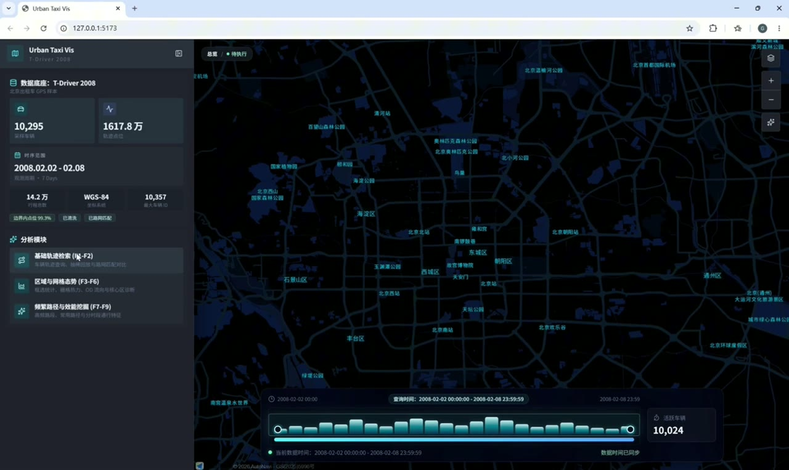
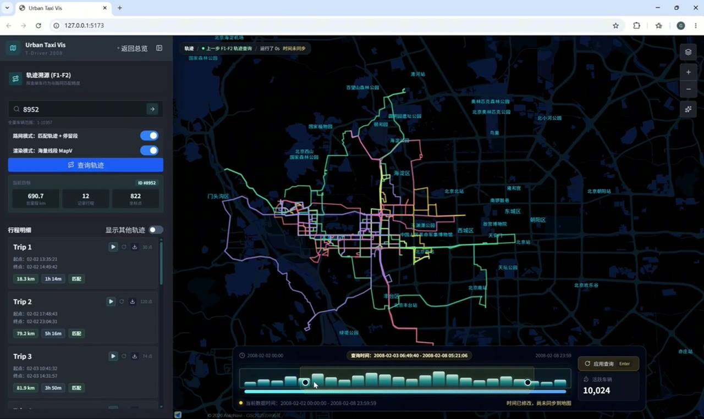
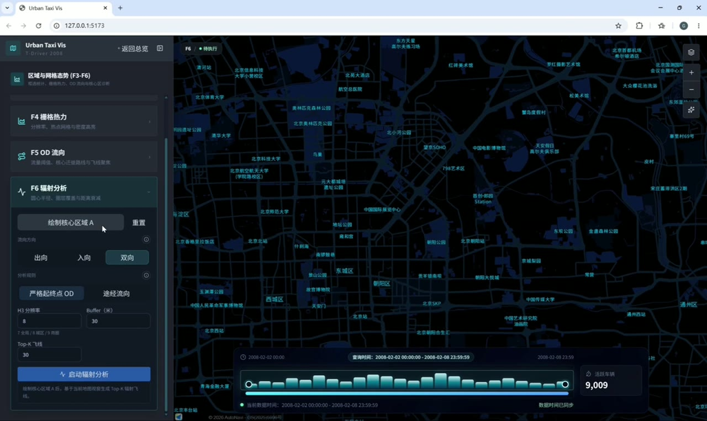
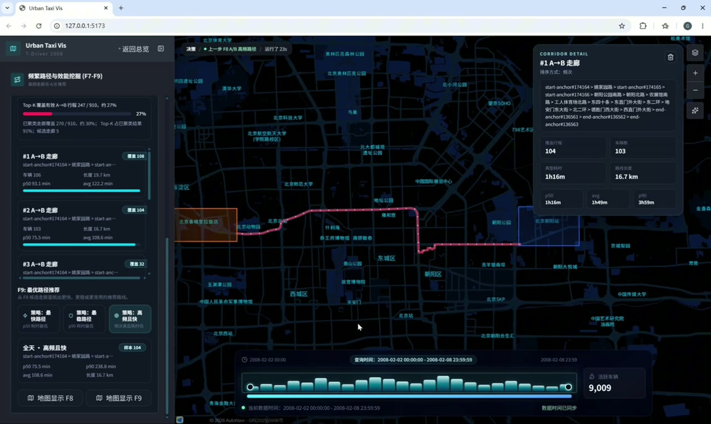

# Urban Taxi Vis 北京出租车轨迹分析与可视化系统

Urban Taxi Vis 是一个面向北京出租车 GPS 数据的轨迹分析与可视化系统，支持轨迹查询、空间统计、道路匹配、路径挖掘、路线推荐和 AI 项目助手。项目采用前后端分离架构：前端基于 React/Vite 构建地图分析工作台，后端基于 FastAPI 提供 API 服务，数据层使用 PostgreSQL/PostGIS 存储轨迹点、路网、匹配结果和派生缓存表。

## 快速入口

- [在线 Demo 模式（GitHub Pages）](https://vergissxie.github.io/Urban_Taxi_Vis/)
- [观看完整前端演示视频](./docs/media/demo-video.mp4)
- [下载原始数据包](https://github.com/vergissxie/Urban_Taxi_Vis/releases/download/v1.0.0/urban-taxi-vis-raw-data.zip)
- [文档总览](./docs/README.md)
- [快速启动](./docs/getting-started.md)
- [功能说明](./docs/feature-guide.md)
- [系统架构](./docs/architecture.md)
- [数据处理流程](./docs/data-pipeline.md)

## 界面预览

### 数据概览



### 轨迹查询与地图匹配



### 区域与网格分析



### 高频路线挖掘与策略推荐



## 功能范围

| 编号 | 功能 |
|---|---|
| F1 | 原始轨迹查询与折线展示 |
| F2 | 离线地图匹配轨迹展示 |
| F3 | 多矩形区域活跃车辆查询 |
| F4 | 米制网格密度分析 |
| F5 | A/B 区域流向与阈值推荐 |
| F6 | 区域辐射流分析 |
| F7 | 高频道路走廊挖掘 |
| F8 | A/B 高频路线挖掘 |
| F9 | 基于 F8 结果的前端策略推荐 |
| AI | Markdown RAG + 可选 OpenAI-compatible LLM 项目助手 |

## 技术栈

| 层次 | 技术 |
|---|---|
| 前端 | React 18、Vite、TypeScript、Ant Design、高德地图 JS API |
| 后端 | FastAPI、SQLAlchemy、Pydantic Settings、Uvicorn |
| 数据库 | PostgreSQL、PostGIS |
| 缓存/辅助服务 | Redis、进程内 TTL 缓存 |
| 数据处理 | Pandas、GeoPandas、pyrosm、H3、HMM/Viterbi |
| 容器 | Docker、Docker Compose |

## 运行模式

项目面向 GitHub 发布只保留两种运行模式：

| 模式 | 需要启动 | 是否需要原始数据 | 适用场景 |
|---|---|---:|---|
| Demo 模式 | 前端 | 否 | 快速预览界面和内置演示样例，无需导入数据库 |
| 完整模式 | 前端 + 后端 + PostGIS + Redis + 数据脚本 | 是 | 使用真实 GPS 和 OSM 路网重建数据库，完整运行 F1-F9 |

`scripts/start-dev.ps1` 只负责启动后端、PostGIS 和 Redis，不会自动导入 GPS、抽取 OSM 路网、运行地图匹配或构建 F7/F8 派生表。完整模式需要额外运行 `data_scripts/` 中的数据处理脚本。

## 环境准备

建议环境：

- Windows 10/11 或兼容 PowerShell 的开发环境
- Docker Desktop 与 Docker Compose
- Node.js 18+
- Python 3.10+

创建本地环境变量文件：

```powershell
Copy-Item .env.example .env
```

至少需要填写高德地图配置：

```env
VITE_AMAP_KEY=your_amap_web_js_key_here
VITE_AMAP_SECURITY_JS_CODE=your_amap_security_js_code_here
```

可选的 AI 助手大模型配置：

```env
OPENAI_API_KEY=
OPENAI_BASE_URL=https://api.openai.com/v1
OPENAI_MODEL=gpt-4o-mini
```

`.env` 和 `backend/.env` 不应提交到 Git。仓库只保留 `.env.example`。

## Demo 模式

Demo 模式只需要前端和高德地图 Key。页面内置只读演示数据，适合快速查看系统界面和主要交互。

```powershell
cd frontend
npm install
npm run dev
```

默认访问：

```text
http://localhost:5173
```

如果希望所有 axios 请求也走前端 mock，可以在 `.env` 中设置：

```env
VITE_DEMO_MODE=true
```

也可以从项目根目录运行：

```powershell
./scripts/start-frontend.ps1
```

## 完整模式

完整模式会启动后端、PostGIS、Redis，并使用原始 GPS 数据和 OSM 路网重建实验数据库。

### 1. 下载并解压原始数据

从 Release 下载：

```text
https://github.com/vergissxie/Urban_Taxi_Vis/releases/download/v1.0.0/urban-taxi-vis-raw-data.zip
```

解压到项目根目录后应得到：

```text
data/raw/taxi_log_2008_by_id/
data/beijing-260401.osm.pbf
```

### 2. 启动后端服务

```powershell
./scripts/start-dev.ps1 -Detach
```

等价于：

```powershell
docker compose up -d --build
```

默认服务地址：

| 服务 | 地址 |
|---|---|
| 前端页面 | http://localhost:5173 |
| 后端 Swagger | http://localhost:8000/docs |
| 健康检查 | http://localhost:8000/health |

### 3. 构建完整数据链路

全量数据处理耗时较长，建议先用小样本参数冒烟验证。

清洗原始 GPS，并按时间间隔切分 trip：

```powershell
docker compose exec backend python data_scripts/clean_to_folder_speed_filter.py `
  --input-dir /app/taxi_log_2008_by_id `
  --output-dir /app/cleaned_data `
  --trip-gap-minutes 30 `
  --max-speed-kmh 130 `
  --speed-filter-rounds 3 `
  --overwrite
```

导入 `taxi_points`：

```powershell
docker compose exec backend sh -lc 'python data_scripts/to_postgis.py --input-dir /app/cleaned_data --schema /app/data_scripts/schema.sql --host postgis --port 5432 --db "$POSTGRES_DB" --user "$POSTGRES_USER" --password "$POSTGRES_PASSWORD" --truncate'
```

抽取 OSM 路网：

```powershell
docker compose exec backend python data_scripts/extract_road_network.py `
  --pbf-file /app/data/beijing-260401.osm.pbf
```

离线地图匹配，生成 `matched_trips`：

```powershell
docker compose exec backend python data_scripts/batch_map_match.py `
  --workers 8 `
  --auto-downgrade-workers `
  --min-workers 2
```

小样本测试可先加 `--limit 20`。

构建 F6/F7/F8/F9 上游派生表：

```powershell
docker compose exec backend python data_scripts/build_trip_od_cache.py --rebuild
docker compose exec backend python data_scripts/build_matched_trip_edges.py --rebuild
docker compose exec backend python data_scripts/build_matched_trip_road_passes.py --rebuild
docker compose exec backend python data_scripts/build_matched_road_hourly_counts.py --rebuild
docker compose exec backend python data_scripts/build_matched_road_group_hourly_counts.py --rebuild
docker compose exec backend python data_scripts/build_f8_trip_caches.py --rebuild
```

完成后确保 `.env` 中：

```env
VITE_DEMO_MODE=false
```

然后启动前端：

```powershell
./scripts/start-frontend.ps1
```

## 常用脚本

| 脚本 | 作用 |
|---|---|
| `scripts/start-dev.ps1 -Detach` | 后台启动 backend、PostGIS、Redis |
| `scripts/start-frontend.ps1` | 启动 Vite 前端，默认端口 5173 |
| `scripts/stop-dev.ps1` | 停止容器，不删除 PostGIS 数据卷 |
| `scripts/reset-dev.ps1` | 停止并删除数据卷，会清空数据库 |
| `scripts/load-image-env.ps1` | 从 `.env` 加载 OpenAI-compatible 相关环境变量 |

## 数据脚本与功能对应

更详细的脚本说明见 [data_scripts/README.md](./data_scripts/README.md)。

| 阶段 | 脚本 | 主要支撑 |
|---|---|---|
| 清洗 | `clean_to_folder_speed_filter.py` | F1-F6 基础数据；F2/F7/F8/F9 上游 |
| 导入 | `to_postgis.py` | `taxi_points` |
| 路网 | `extract_road_network.py` | F2、F7、F8 |
| 匹配 | `batch_map_match.py`、`map_match_taxi_id1.py` | F2、F7、F8 |
| OD 缓存 | `build_trip_od_cache.py` | F6、F7、F8 |
| 道路边序列 | `build_matched_trip_edges.py` | F7、F8 |
| 道路聚合 | `build_matched_trip_road_passes.py`、`build_matched_road_hourly_counts.py`、`build_matched_road_group_hourly_counts.py` | F7 |
| 路线缓存 | `build_f8_trip_caches.py` | F6 through-flow、F8、F9 |

## 验证命令

前端构建：

```powershell
cd frontend
npm run build
cd ..
```

后端语法检查：

```powershell
python -m py_compile backend/app/api/analytics.py backend/app/api/trajectory.py backend/app/api/matched.py backend/app/api/assistant.py
```

服务状态：

```powershell
docker compose ps
```

数据表快速检查：

```powershell
docker compose exec postgis psql -U taxi_user -d taxi_vis -c "SELECT COUNT(*) FROM taxi_points;"
docker compose exec postgis psql -U taxi_user -d taxi_vis -c "SELECT COUNT(*) FROM matched_trips;"
docker compose exec postgis psql -U taxi_user -d taxi_vis -c "SELECT COUNT(*) FROM matched_trip_edges;"
```

## 项目结构

```text
driver_system/
├─ backend/              # FastAPI 后端
├─ frontend/             # React/Vite 前端
├─ data_scripts/         # 清洗、导入、地图匹配、派生表构建脚本
├─ docs/                 # 中文项目文档、演示视频和用户指南
├─ scripts/              # Windows PowerShell 启停脚本
├─ docker-compose.yml    # backend / PostGIS / Redis 编排
├─ .env.example          # 环境变量示例
└─ README.md             # GitHub 项目首页
```

`data/` 为本地数据目录，已在 `.gitignore` 中排除。下载原始数据包并解压后会生成 `data/raw/taxi_log_2008_by_id/` 和 `data/beijing-260401.osm.pbf`。

## 文档入口

- [文档总览](./docs/README.md)
- [快速启动](./docs/getting-started.md)
- [项目介绍](./docs/01-overview/project-introduction.md)
- [功能清单](./docs/01-overview/feature-list.md)
- [用户操作说明](./docs/02-user-guide/user-manual.md)
- [开发环境搭建](./docs/03-developer-guide/environment-setup.md)
- [配置说明](./docs/03-developer-guide/configuration.md)
- [API 接口说明](./docs/03-developer-guide/api-reference.md)
- [构建与运行说明](./docs/03-developer-guide/build-and-run.md)
- [系统架构说明](./docs/04-architecture/system-architecture.md)
- [技术说明总览](./docs/05-technical-notes/README.md)
- [用户指南 PDF](./docs/user_guide.pdf)

## 数据与提交说明

- 原始 GPS 和 OSM 文件不直接提交到仓库，见 [Release 数据包](https://github.com/vergissxie/Urban_Taxi_Vis/releases/tag/v1.0.0)。
- `frontend/node_modules/`、`frontend/dist/`、`.env`、`data/`、缓存文件和本地运行产物均不提交。
- 演示视频已压缩后提交到 [docs/media/demo-video.mp4](./docs/media/demo-video.mp4)。
