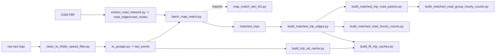

# data_scripts 完整部署脚本

本目录只保留完整真实数据部署会用到的主链路脚本，以及主链路脚本运行时必须 import 的核心算法文件。重跑诊断、噪声点补救、快照恢复、进度监控等辅助脚本已删除，避免交付时让目录显得有多条不清晰的数据路线。

数据库相关脚本会优先读取容器环境变量 `DATABASE_URL`；在 `docker compose exec backend ...` 中运行时通常不需要手写数据库连接串。

如果脱离后端 Docker 容器单独运行数据脚本，可先安装：

```powershell
pip install -r data_scripts/requirements.txt
```

## 完整部署顺序



## 保留文件

| 文件 | 是否直接执行 | 作用 | 支撑功能 |
|---|---:|---|---|
| `schema.sql` | 是，由 `to_postgis.py` 读取 | PostGIS 基础表、索引和派生表定义 | F1-F9 |
| `clean_to_folder_speed_filter.py` | 是 | 清洗原始 GPS、速度异常过滤、trip 切分 | F1-F6 基础数据；F2/F7/F8/F9 上游 |
| `to_postgis.py` | 是 | 导入清洗 CSV 到 `taxi_points` | F1、F3、F4、F5 直接使用；F2/F6/F7/F8/F9 上游 |
| `extract_road_network.py` | 是 | 从 OSM PBF 写入 `road_edges`、`road_nodes` | F2、F7、F8；F9 间接 |
| `map_match_taxi_id1.py` | 否，被 import | HMM/Viterbi 候选点、发射概率、转移概率、Dijkstra 拼接等核心地图匹配算法 | F2；F7/F8/F9 上游 |
| `batch_map_match.py` | 是 | 批量调用地图匹配，写入 `matched_trips` 和 `map_match_trip_status` | F2；F3 匹配轨迹；F7/F8/F9 上游 |
| `build_trip_od_cache.py` | 是 | 构建 `trip_od_cache` | F6 strict OD；F7 时间窗口；F8 候选；F9 间接 |
| `build_matched_trip_edges.py` | 是 | 将 `matched_trips` 展开为 `matched_trip_edges` | F7、F8；F9 间接 |
| `build_matched_trip_road_passes.py` | 是 | 构建道路经过事实表 | F7；F9 间接 |
| `build_matched_road_hourly_counts.py` | 是 | 按 road edge + hour 聚合 | F7；F9 间接 |
| `build_matched_road_group_hourly_counts.py` | 是 | 按 road group + hour 聚合 | F7；F9 间接 |
| `build_f8_trip_caches.py` | 是 | 构建 `trip_spatial_index`、`trip_grid_points`、token/edge/road feature 缓存 | F6 through-flow；F8；F9 间接 |
