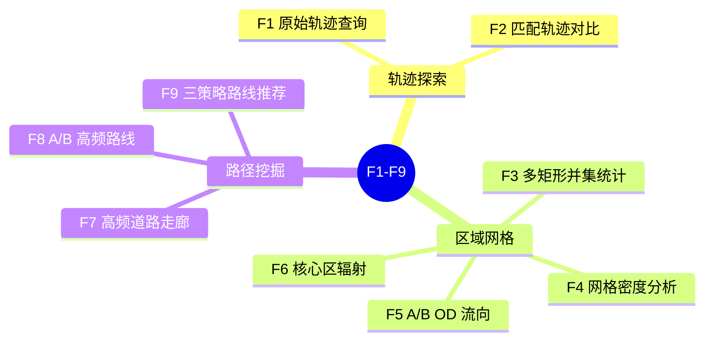
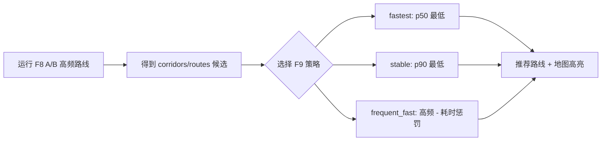

# 功能清单

本文快速说明 Urban Taxi Vis 的 F1-F9 功能边界、用户价值和验收口径。详细操作见 `docs/02-user-guide/user-manual.md`，当前真实代码级逻辑见 `docs/feature-guide.md`。

> 当前口径：F9 是基于 F8 结果的三策略路径推荐，不是按固定时间桶输出“早高峰/晚高峰/平峰最优路径”的后端接口。

## 功能总览

| 功能编号 | 功能名称 | 当前说明 |
|---|---|---|
| F1 | 原始轨迹查询 | 按车辆编号、时间范围和可选 bbox 查询 `taxi_points`，切分异常段后返回轨迹折线。 |
| F2 | 匹配轨迹对比与缩放抽稀 | 展示 `matched_trips.matched_geom` 离线地图匹配结果，并随地图 zoom 控制抽稀。 |
| F3 | 多矩形区域统计 | 绘制一个或多个矩形，统计并集去重后的活跃车辆与命中明细。 |
| F4 | 经纬度/投影桶网格密度 | 当前主接口是 `f4-grid-density`，按网格聚合轨迹点和可选车辆数。 |
| F5 | A/B OD 流向分析 | 用状态机统计区域 A 与 B 之间的双向转移、净流量和耗时。 |
| F6 | 核心区辐射分析 | 支持 `strict_od` 和 `through_flow`，把核心区外部来源/去向聚合为 H3 区域。 |
| F7 | 高频道路走廊挖掘 | 基于匹配道路通行记录和小时聚合表识别高频道路组。 |
| F8 | A/B 高频路线挖掘 | 筛选 A/B 候选 trip，构建道路 token、相似聚类和代表路线。 |
| F9 | 三策略路径推荐 | 在 F8 候选路线中按 `fastest`、`stable`、`frequent_fast` 推荐并高亮一条路线。 |

## 功能分组与答辩关注点

| 分组 | 覆盖功能 | 面向用户的价值 | 答辩关注点 |
|---|---|---|---|
| 轨迹探索 | F1-F2 | 找到某辆车、某段时间的历史轨迹，并对比原始 GPS 与道路匹配结果。 | GPS 点如何变成折线；地图匹配为什么不是实时导航；抽稀如何降低前端渲染压力。 |
| 区域与网格分析 | F3-F6 | 从框选区域、网格热力、OD 流向和核心区辐射理解局部交通活动。 | PostGIS 空间查询、多框并集去重、状态机 OD、H3 外部聚合和缓存加速。 |
| 路径挖掘与推荐 | F7-F9 | 找到高频道路、A/B 常用路线，并从候选路线中选择推荐方案。 | 道路边序列、token 相似度、连通分量、代表路线、F9 前端策略排序。 |

## F1 原始轨迹查询

用户输入出租车编号与时间范围后，系统从 `taxi_points` 查询 GPS 点，并按 trip、时间间隔、跳变距离和速度阈值切分有效 segment。每个有效 segment 使用 PostGIS `ST_MakeLine` 生成折线，前端在地图中绘制。

验收重点：

- 能按车辆编号和时间范围查询。
- 能在地图中显示一条或多条轨迹折线。
- 能解释异常点、断点和超速跳变不会被简单连成一条线。
- 能说明 F1 是历史轨迹展示，不是实时定位服务。

## F2 匹配轨迹对比与缩放抽稀

F2 展示离线地图匹配结果，核心数据来自 `matched_trips.matched_geom`。这些匹配线由 `data_scripts/batch_map_match.py` 调用 `map_match_taxi_id1.py` 中的核心算法提前生成，不是在接口请求时现场跑导航最短路。

验收重点：

- 能同时解释原始 GPS 轨迹和道路匹配轨迹的差异。
- 能说明 zoom 变化时为什么要做抽稀。
- 能说明匹配失败或缺失时会 fallback 到原始点/原始轨迹展示。

## F3 多矩形区域统计

用户绘制一个或多个矩形区域后，系统统计时间范围内命中的活跃车辆。当前核心统计口径是多矩形并集去重：同一车辆命中多个矩形时，总活跃车辆数只计一次，明细中保留命中的区域编号。

验收重点：

- 能绘制多个矩形。
- 能返回每个矩形单独命中数和并集去重车辆数。
- 能点击车辆查看匹配轨迹或原始轨迹 fallback。

## F4 经纬度/投影桶网格密度

F4 当前主路径是 `GET /api/v1/analytics/f4-grid-density`。后端按 bbox、时间范围和 `grid_size_m` 聚合轨迹点，返回每个网格的边界、中心、点数、可选车辆数和密度。前端可用热力图或分级着色显示。

验收重点：

- 能选择网格大小和渲染模式。
- 能展示热点区域。
- 能解释密度来自 `taxi_points` 的空间聚合。
- 能说明当前 F4 后端主路径不是旧 H3 基础密度接口。

## F5 A/B OD 流向分析

用户选择区域 A 与区域 B 后，系统按时间顺序识别车辆进入/离开两个区域的状态变化，统计 A→B、B→A、净流量、平均耗时和时间粒度聚合。`f5-transition-threshold-recommendation` 可根据区域距离给出最大转移时间建议。

验收重点：

- 能绘制或选择两个区域。
- 能展示 A→B、B→A、净流量和耗时统计。
- 能说明缓冲距离和最大转移时间用于减少误判。

## F6 核心区辐射分析

F6 围绕一个核心区域，分析其与外部区域之间的流入、流出和净流量。当前支持两种模式：`strict_od` 更强调起终点关系，`through_flow` 更强调经过核心区的流量。外部区域使用 H3 聚合，便于在地图上展示来源和去向热点。

验收重点：

- 能设置核心区、方向、模式和 Top-K。
- 能区分流入、流出、净流量。
- 能解释 `strict_od` 与 `through_flow` 的差异。

## F7 高频道路走廊挖掘

F7 基于匹配后的道路通行记录统计高频道路或道路组。后端优先使用 `matched_road_group_hourly_counts`、`matched_road_hourly_counts` 等聚合表；缺表或不满足条件时回退到 `matched_trip_road_passes`、`matched_trip_edges` 等基础表。

验收重点：

- 能返回 Top-K 高频道路组。
- 能在地图上高亮道路走廊。
- 能说明高频道路来自匹配轨迹与道路表的关联统计。
- 能解释 frequency 与 length_weighted 排序口径。

## F8 A/B 高频路线挖掘

F8 根据区域 A/B 筛选候选 trip，支持 `strict_od` 和 `pass_through` 两种候选模式。后端构建道路 token 序列，计算路线相似度，聚类相似路线，并返回候选走廊、代表几何、trip 数、耗时分布和质量指标。

验收重点：

- 能设置区域 A、区域 B、候选模式、支持度和 Top-K。
- 能返回候选路线列表。
- 能展示路线频次、长度、p50/p90/avg 耗时等指标。
- 能说明 token、相似度、聚类和代表路线的作用。

## F9 三策略路径推荐

F9 不再调用独立后端接口。当前前端在 F8 返回的 `corridors` 或兼容字段 `routes` 中排序，选择当前策略下推荐的一条路线，并复用 F8 几何在地图上高亮。

三种策略如下：

| 策略 | 排序逻辑 | 适合说明 |
|---|---|---|
| `fastest` | p50 耗时最低优先；p50 相同则 trip_count 高者优先。 | 典型情况下最快。 |
| `stable` | p90 耗时最低优先；再比较 p50。 | 高尾部耗时更低，稳定性更好。 |
| `frequent_fast` | `tripScore * 1.35 - timePenalty`；频次越高越好，p50/avg 耗时越高惩罚越大。 | 避免低样本偶然最快，兼顾常用与速度。 |

验收重点：

- 先运行 F8，确保有候选路线。
- 切换三种 F9 策略时，推荐路线可以随排序结果变化。
- 能解释 F9 不是时间桶接口，也不是实时路径规划。
- 能说明 F9 的可信度取决于 F8 候选质量和历史样本量。
