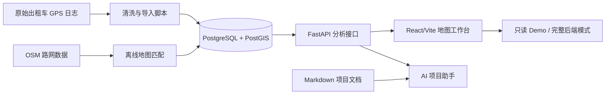

# 项目介绍

Urban Taxi Vis 是一个面向北京出租车 GPS 轨迹数据的轨迹分析、空间统计、路径挖掘与可视化系统。系统以地图工作台为核心入口，把原始 GPS 点、离线道路匹配结果、PostGIS 空间查询和派生缓存表组织成 F1-F9 九个功能，服务于课程设计答辩、数据处理流程展示和城市交通样例分析。

> 当前口径：F9 不是“按早高峰/晚高峰/平峰等时间桶分类的最优路径接口”。当前 F9 复用 F8 的 A/B 候选路线，在前端按 `fastest`、`stable`、`frequent_fast` 三种策略排序推荐路线。

## 项目定位

本项目不是实时导航系统，也不承诺给出当前道路实时通行状态。系统输出来自历史出租车轨迹、离线地图匹配和统计派生表，更适合回答以下问题：

- 某辆出租车在某段历史时间内经过哪里？
- 原始 GPS 折线与道路匹配结果有什么差异？
- 某个区域或多个区域内活跃车辆有多少？
- 城市局部区域的轨迹点密度、OD 流向和辐射关系如何分布？
- 哪些道路或 A/B 区域之间的路线被频繁使用？
- 在已有 A/B 高频路线候选中，如何按“最快、最稳、兼顾高频和速度”选择推荐路线？

## 系统闭环

当前工程由五部分组成：

| 层级 | 作用 | 关键位置 |
|---|---|---|
| 前端工作台 | 地图交互、参数输入、F1-F9 图层展示、只读 Demo | `frontend/src/pages/GeoSpatialWorkbench.tsx`、`frontend/src/components/` |
| 后端接口 | 轨迹查询、区域统计、网格密度、流向分析、路径挖掘、AI 助手接口 | `backend/app/api/` |
| 数据库 | 存储轨迹点、匹配轨迹、道路边、OD 缓存、道路聚合缓存 | PostgreSQL/PostGIS |
| 缓存与加速 | 数据集摘要、短时查询结果、派生表、内存缓存 | Redis、PostGIS 索引、后端内存缓存 |
| 数据脚本 | 清洗、导入、路网抽取、地图匹配、派生表构建和重跑分析 | `data_scripts/` |

## 项目目标

1. 提供可运行的前后端分离轨迹分析系统。
2. 支持 F1-F9 从轨迹查看、区域统计到路径挖掘和策略推荐的完整演示链路。
3. 使用 PostgreSQL/PostGIS 管理轨迹点、道路网络、匹配路径和空间索引。
4. 使用离线脚本完成原始日志清洗、数据导入、地图匹配、道路边序列和聚合缓存构建。
5. 提供面向课程答辩的文档、最终报告、PPT、演示视频和核心代码逻辑说明。
6. 通过 AI 项目助手把本地文档检索、自然语言解释和 F1-F9 功能说明串联起来。

## 功能范围

| 分组 | 功能 | 当前真实能力 |
|---|---|---|
| 轨迹探索 | F1-F2 | 原始轨迹折线查询、噪声切段、缩放抽稀、离线地图匹配轨迹对比。 |
| 区域网格 | F3-F6 | 多矩形并集统计、经纬度/投影桶网格密度、A/B OD 流向、核心区辐射。 |
| 路径挖掘 | F7-F9 | 高频道路走廊、A/B 高频路线聚类、基于 F8 候选的三策略推荐。 |
| 辅助能力 | AI 助手、Demo | 文档检索问答、只读 Demo、axios mock adapter、完整后端模式切换。 |

## 适用场景

- 城市交通运行态势展示。
- 出租车轨迹数据教学实验。
- 地理空间数据库与地图可视化课程设计。
- 轨迹清洗、地图匹配、路径挖掘流程演示。
- 面向课程验收的前后端综合项目展示。

## 系统边界

当前版本重点面向本地开发、课程演示和研究型分析流程，不包含以下能力：

- 不提供实时交通状态和在线导航规划。
- 不提供用户登录、权限管理、计费支付等业务系统能力。
- 不保证所有原始 GPS 都能成功地图匹配；异常 trip 会在离线处理阶段被跳过、记录或重跑。
- 不把 AI 助手作为事实来源；AI 回答需要基于项目文档和接口结果。
- 不把 F9 作为独立后端路径规划服务；F9 是前端对 F8 历史候选路线的策略化选择。

## 数据说明

项目数据围绕北京出租车 GPS 轨迹展开，主要目录包括：

| 位置 | 内容 |
|---|---|
| `data/raw/` | 原始出租车轨迹文本数据。 |
| `data/processed/` | 清洗后的中间数据。 |
| `data/final/` | 进一步筛选或处理后的数据。 |
| `data/beijing-260401.osm.pbf` | 北京区域 OSM 路网数据。 |
| `data_scripts/` | 清洗、导入、路网抽取、地图匹配、缓存构建脚本。 |

数据用于课程设计演示时，应注意数据来源、使用范围和隐私合规说明。更详细的数据链路见 `docs/data-pipeline.md`。

## 延伸阅读

- 功能清单：`docs/01-overview/feature-list.md`
- 需求规格：`docs/01-overview/requirements-specification.md`
- 快速启动：`docs/getting-started.md`
- F1-F9 详细说明：`docs/feature-guide.md`
- 数据处理流程：`docs/data-pipeline.md`
