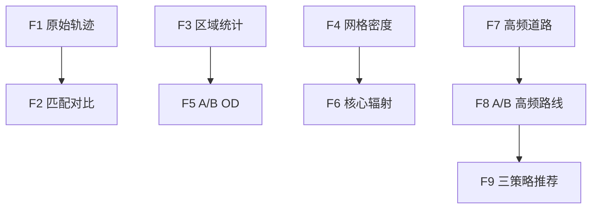

# 需求规格说明书

本文档说明 Urban Taxi Vis 的目标、用户、功能需求、数据需求、非功能需求和验收口径。更细的操作步骤见 `docs/02-user-guide/user-manual.md`，更细的当前代码逻辑见 `docs/feature-guide.md` 和 `docs/05-technical-notes/f1-f9-code-logic.md`。

> 当前口径：F9 是前端基于 F8 候选路线的策略推荐，不要求也不使用独立的 time-bucket 后端接口。

## 1. 项目定位

Urban Taxi Vis 是一个面向北京出租车 GPS 轨迹数据的历史轨迹分析、空间统计、频繁路径挖掘与智能解释系统。系统以地图工作台为入口，把原始 GPS 点、道路网络、地图匹配结果和派生缓存表组织成 F1-F9 九个功能，帮助用户完成车辆轨迹查看、区域活动统计、OD 流向分析、高频道路识别、A/B 高频路线挖掘和策略化路径推荐。

项目不是实时导航系统，也不承诺给出当前道路交通状态；系统输出来自历史轨迹数据、离线地图匹配和统计分析结果，适合课程答辩、数据结构与算法展示、城市交通样例分析和可视化演示。

## 2. 用户与使用场景

| 角色 | 关注点 | 典型问题 |
|---|---|---|
| 普通使用者 | 能否快速查询、看懂地图结果 | 某辆车在某段时间怎么走？两个区域之间哪条路线更常见？ |
| 数据分析者 | 统计口径是否清晰、参数是否可控 | 区域活跃车辆怎么算？OD 转移时间阈值是否合理？ |
| 答辩老师 | 系统是否有完整工程闭环和算法支撑 | 数据怎么来？F8/F9 为什么可信？缓存表和索引起什么作用？ |
| 开发维护者 | 接口、表结构、模块边界是否可维护 | 哪些表支撑 F7/F8？F9 为什么没有后端接口？缺表时如何排查？ |

## 3. 总体目标

1. 提供可运行的前后端分离轨迹分析系统。
2. 支持 F1-F9 从基础轨迹查询到路径挖掘和推荐展示的完整演示链路。
3. 使用 PostgreSQL/PostGIS 管理轨迹点、道路网络、匹配路径和空间索引。
4. 使用离线脚本完成清洗、导入、地图匹配、道路边序列和缓存构建。
5. 提供面向答辩的文档、最终报告、PPT、演示视频和核心代码逻辑说明。
6. 通过 AI 项目助手把文档检索、自然语言解释和 F1-F9 功能说明串联起来。

## 4. 功能需求

| 编号 | 功能名称 | 用户输入 | 系统输出 | 验收标准 |
|---|---|---|---|---|
| F1 | 原始轨迹查询 | 车辆编号、时间范围、可选地图 bbox、抽稀参数 | 原始轨迹 segment、GeoJSON 折线、起止时间、点数 | 能按车辆和时间返回轨迹，并在地图绘制；能解释断点、跳变和超速过滤。 |
| F2 | 匹配轨迹对比 | F1 查询参数、trip id、地图 zoom | 匹配道路轨迹、原始轨迹对比、抽稀后几何 | 缩放变化时显示流畅；能说明原始轨迹与匹配轨迹区别。 |
| F3 | 多矩形区域统计 | 一个或多个矩形区域、时间范围、车辆范围 | 并集去重车辆数、每框命中数、命中 taxi/trip 明细 | 多区域并集去重，同一车辆不重复计数；能查看命中轨迹。 |
| F4 | 网格密度分析 | 时间范围、地图 bbox、网格大小、渲染模式 | 网格/热力密度、点数、可选车辆数、图例元信息 | 能展示热点区域，并说明密度来自轨迹点聚合。 |
| F5 | A/B OD 流向分析 | 区域 A、区域 B、时间范围、缓冲距离、最大转移时间、粒度 | A→B、B→A、净流量、平均耗时、时间粒度序列 | 能统计双向流量，并通过阈值过滤过长或不连续转移。 |
| F6 | 核心区辐射分析 | 核心区、方向、模式、H3 分辨率、Top-K | 流入、流出、净流量、外部 H3 区域 | 能区分 `strict_od` 和 `through_flow` 两种分析口径。 |
| F7 | 高频道路走廊挖掘 | 时间范围、分析范围、Top-K、排序模式 | 高频道路组、方向、trip 数、车辆数、道路几何 | 能从匹配后的道路通行记录统计高频道路并高亮地图。 |
| F8 | A/B 高频路线挖掘 | 区域 A、区域 B、候选模式、支持度、Top-K、长度阈值 | 高频路线簇、代表真实 trip、耗时分布、路线标签、几何 | 能说明 token、相似图、连通分量和代表路线。 |
| F9 | 三策略路径推荐 | F8 候选结果、推荐策略 | 当前策略推荐路线、p50/p90/avg、trip_count、地图高亮 | 不调用独立后端；能在 `fastest`、`stable`、`frequent_fast` 间切换并解释排序逻辑。 |

## 5. 数据需求

| 数据对象 | 来源 | 用途 |
|---|---|---|
| 原始出租车 GPS 日志 | `data/raw/` | 轨迹清洗和导入基础。 |
| 清洗后轨迹点 | `taxi_points` | F1、F3-F6 统计基础。 |
| OSM 道路网络 | `road_nodes`、`road_edges` | 地图匹配、F7/F8 道路分析。 |
| 匹配轨迹 | `matched_trips` | F2 匹配轨迹展示，F3 明细回放，F8 候选几何。 |
| 道路边序列 | `matched_trip_edges` | F7/F8 路径挖掘基础。 |
| OD 与空间缓存 | `trip_od_cache`、`trip_spatial_index`、`trip_grid_points` | F6 与 F8 候选筛选加速。 |
| 道路聚合缓存 | `matched_trip_road_passes`、`matched_road_hourly_counts`、`matched_road_group_hourly_counts` | F7 高频道路快速查询。 |
| 路线语义缓存 | `trip_edge_sequence_cache`、`road_edge_feature_cache`、`trip_token_sequence` | F8 路线聚类加速与解释。 |
| F8 候选路线结果 | F8 后端接口返回 | F9 前端三策略推荐的直接输入。 |

F9 不要求独立数据表或独立派生结果；它依赖 F8 返回的候选路线质量、样本量和耗时统计。

## 6. 非功能需求

| 类型 | 需求 |
|---|---|
| 可用性 | 前端以地图工作台作为第一屏，F1-F9 按轨迹、区域网格、路径决策分组。 |
| 性能 | 大范围或长时间查询通过 bbox 限制、Top-K、小小时聚合表、短时内存缓存和前端 Web Worker 控制响应时间。 |
| 可解释性 | 每个功能输出统计口径、数据来源和 `meta` 信息，便于答辩追溯。 |
| 可维护性 | 后端路由按 `trajectory.py`、`matched.py`、`analytics.py` 分层；离线脚本按清洗、导入、匹配、缓存构建分层。 |
| 可靠性 | 参数由 FastAPI/Pydantic 校验；时间范围、bbox、Top-K、缓冲距离等参数设有上下限。 |
| 可部署性 | Docker Compose 管理后端、PostGIS、Redis，前端使用 Vite 本地启动。 |
| 安全边界 | 当前为课程演示系统，未实现登录、角色权限和公网多租户安全控制。 |

## 7. 接口需求

后端接口需要满足以下原则：

1. 所有空间分析接口都接收明确的时间范围。
2. 涉及地图区域的接口使用 `min_lon`、`min_lat`、`max_lon`、`max_lat` 或 `BBoxPayload`。
3. 结果返回可视化所需几何、统计指标和元信息。
4. 当依赖表缺失时，接口应返回可读错误，提示需要运行的构建脚本。
5. Swagger 文档可通过 `http://localhost:8000/docs` 查看。

当前主要接口表面如下：

| 分组 | 当前接口 |
|---|---|
| 健康检查 | `GET /health` |
| 数据总览 | `GET /api/v1/analytics/dataset-summary`、`GET /api/v1/analytics/active-vehicles` |
| F1 | `GET /api/v1/trajectories/polylines` |
| F2/F3 明细 | `GET /api/trajectory/matched`、`GET /api/trajectory/matched/spatial`、`GET /api/trajectory/{trip_id}` |
| F3 | `POST /api/v1/analytics/active-vehicles-union`、`POST /api/v1/analytics/active-vehicles-union-detail` |
| F4 | `GET /api/v1/analytics/f4-grid-density` |
| F5 | `POST /api/v1/analytics/f5-ab-flow`、`POST /api/v1/analytics/f5-transition-threshold-recommendation` |
| F6 | `POST /api/v1/analytics/f6-radiation-flow` |
| F7 | `POST /api/v1/analytics/f7-frequent-paths`、`POST /api/v1/analytics/f7-road-detail` |
| F8 | `POST /api/v1/analytics/f8-ab-frequent-routes` |
| F9 | 无独立后端接口；前端复用 F8 返回结果排序。 |
| AI 助手 | `POST /api/v1/assistant/chat` |

## 8. 验收需求

答辩或课程验收建议至少准备以下证据：

| 证据 | 证明内容 |
|---|---|
| 前端工作台截图 | 系统已完成可交互 UI。 |
| Swagger 截图 | 后端接口可访问，路由与当前 API 表面一致。 |
| F1-F9 功能截图或录屏 | 九个功能均可演示；F9 以三策略推荐方式演示。 |
| 数据库核心表截图 | 轨迹点、道路、匹配和缓存表真实存在。 |
| 数据处理脚本目录截图 | 数据从原始日志到分析缓存有完整流程。 |
| 最终报告与演示视频 | 启动、接口和核心功能经过验证。 |
| 核心技术文档 | 能回答数据结构、算法、缓存和实现逻辑问题。 |

最终提交材料统一放在仓库根目录的 `final/` 文件夹。

## 9. 系统边界

当前版本不包含以下能力：

- 不提供实时交通状态和在线导航规划。
- 不提供用户登录、权限审计和公网生产安全方案。
- 不自动保证所有原始 GPS 都能成功地图匹配；异常 trip 会在离线处理阶段跳过、记录或重跑。
- 不把 AI Agent 作为事实来源；AI 回答需要基于项目文档和接口结果。
- 不提供独立 F9 time-bucket 后端接口；F9 是 F8 候选上的前端策略推荐。

## 10. 需求到实现的追踪

| 需求范围 | 主要前端文件 | 主要后端文件 | 主要数据/脚本 |
|---|---|---|---|
| F1-F2 | `GeoSpatialWorkbench.tsx`、`GeoWorkbenchTrajectoryPanel.tsx` | `backend/app/api/trajectory.py`、`backend/app/api/matched.py` | `taxi_points`、`matched_trips`、地图匹配脚本 |
| F3-F6 | `GeoWorkbenchRegionPanel.tsx`、`GeoWorkbenchMapStage.tsx` | `backend/app/api/analytics.py` | `taxi_points`、`trip_od_cache`、`trip_grid_points` |
| F7-F8 | `GeoWorkbenchDecisionPanel.tsx`、`GeoWorkbenchMapStage.tsx` | `backend/app/api/analytics.py` | `matched_trip_edges`、F7/F8 派生缓存表 |
| F9 | `GeoWorkbenchDecisionPanel.tsx` | 无独立后端接口 | F8 返回的 `corridors` 或 `routes` |
| AI 助手 | `GeoWorkbenchAssistant.tsx` | `assistant.py`、`assistant_retrieval.py`、`assistant_llm.py` | `README.md`、`docs/` Markdown 文档 |
