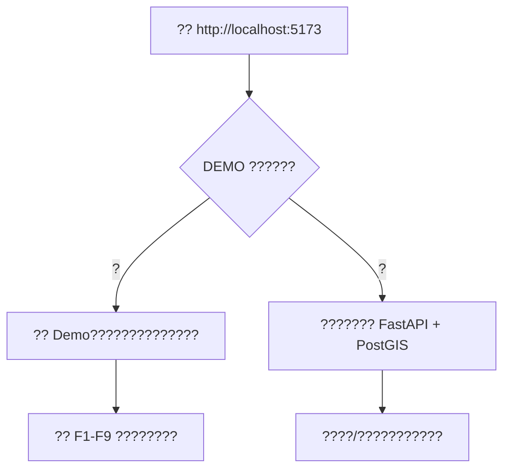

# ????

???????????????????????????????????????????????????????????? Demo???????????????????

## ??????????



| ?? | ???? | ?????? | ???? |
|---|---|---|---|
| ?? Demo | ?????????????????? | ??? | ???? `DEMO` ??????????????????? |
| ???? | ????????????????? | ?? | ?? Docker?PostGIS?Redis ?????????? |
| axios mock Demo | ???????? | ??? | ?? `VITE_DEMO_MODE=true` ?????? `mockApi.ts` ??? |

## ????????

???????

| ?? | ?? |
|---|---|
| ???? | Windows + PowerShell |
| Node.js | 18 ????? |
| npm | ? Node.js ?? |
| Docker Desktop | ????????? |
| ?? | ??????????????? |

?????????

```powershell
Copy-Item .env.example .env
```

?? `.env`??????

```env
VITE_API_BASE_URL=http://localhost:8000
VITE_DEMO_MODE=false
VITE_AMAP_KEY=your_amap_web_js_key_here
VITE_AMAP_SECURITY_JS_CODE=your_amap_security_js_code_here
```

??????????? `VITE_AMAP_KEY` ? `VITE_AMAP_SECURITY_JS_CODE`??? `.env` ????????

## ????????

???????????

```powershell
cd frontend
npm install
cd ..
```

?????

```powershell
./scripts/start-frontend.ps1
```

??????

```text
http://localhost:5173
```

?? 5173 ????????????

```powershell
./scripts/start-frontend.ps1 -Port 5174
```

## ???????? Demo ????

??????????? Demo ??????????? `DEMO` ???????????????

1. ?????????????????????
2. ????????? (F1-F2)??
3. ????/????????????????????
4. ???????????????? (F3-F6)??
5. ???? F3?F4?F5?F6 ???/???????????
6. ????Frequent Paths & Recommendations (F7-F9)??
7. ??? F7 ? F8??? F9 ???????????????????
8. ??????? F9???????????

?? Demo ?????????????????????????? UI ??????

## ????????????

???????????????????

```powershell
./scripts/start-dev.ps1 -Detach
```

?????

- `taxi-backend`?FastAPI ???
- `taxi-postgis`?PostgreSQL/PostGIS ????
- `taxi-redis`?Redis ???

???????

```powershell
docker compose ps
```

?????????

```text
http://localhost:8000/health
```

???????

```text
http://localhost:8000/docs
```

## ????? Demo ???????

1. ????????? Redis ????
2. ???????
3. ???????? `DEMO` ??????? Demo?
4. ???????????????
5. ????????/?????

?? Demo ?????????????????????????F1-F9 ??????????????

## ????

| ?? | ?? | ?? |
|---|---|---|
| ????? | `http://localhost:5173` | ?????? F1-F9 ??? |
| ?????? | `http://localhost:8000/health` | ?????????Redis ??? |
| Swagger ???? | `http://localhost:8000/docs` | ????? FastAPI ??? |

## ????

?????????? Redis?

```powershell
./scripts/stop-dev.ps1
```

?????????????? `start-frontend.ps1` ???? `Ctrl+C`?

> ???? `scripts/reset-dev.ps1`????? Docker ????PostGIS ?????????????
