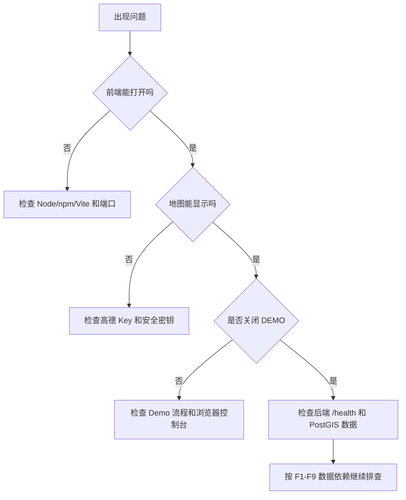

# 故障排查

本文按“页面打不开、地图不显示、后端异常、功能无结果、AI 助手异常”的顺序给出排查步骤。

## 排查流程



## 1. 前端打不开

启动命令：

```powershell
./scripts/start-frontend.ps1
```

常见原因：

| 现象 | 原因 | 处理 |
|---|---|---|
| `npm` 不是命令 | Node.js 未安装或未加入 PATH | 安装 Node.js 18+，重新打开 PowerShell |
| Vite 报依赖缺失 | 未安装前端依赖 | `cd frontend && npm install` |
| 端口占用 | 5173 已被占用 | `./scripts/start-frontend.ps1 -Port 5174` |
| 页面 404 | 地址不对 | 打开 `http://localhost:5173` 或实际端口 |

## 2. 地图空白

检查 `.env`：

```env
VITE_AMAP_KEY=your_amap_web_js_key_here
VITE_AMAP_SECURITY_JS_CODE=your_amap_security_js_code_here
```

处理步骤：

1. 确认 Key 是高德 Web JavaScript API Key。
2. 确认安全密钥填写正确。
3. 修改 `.env` 后重启前端。
4. 打开浏览器开发者工具，查看 AMap SDK 是否加载失败。

## 3. 后端或数据库异常

启动后端服务：

```powershell
./scripts/start-dev.ps1 -Detach
```

检查容器：

```powershell
docker compose ps
docker compose logs backend
docker compose logs postgis
docker compose logs redis
```

检查健康状态：

```text
http://localhost:8000/health
```

常见处理：

| 现象 | 处理 |
|---|---|
| `postgis` 不健康 | 检查 `POSTGRES_PORT` 是否冲突，查看 postgis 日志 |
| `redis` 不健康 | 检查 `REDIS_PORT` 是否冲突，查看 redis 日志 |
| `backend` 启动失败 | 查看 backend 日志，确认依赖安装和环境变量 |
| Swagger 打不开 | 确认 `APP_PORT` 和 `VITE_API_BASE_URL` 是否一致 |

## 4. 关闭 Demo 后没有数据

真实模式必须具备真实数据表。先检查基础表和派生表：

```powershell
docker compose exec postgis psql -U taxi_user -d taxi_vis -c "SELECT COUNT(*) FROM taxi_points;"
docker compose exec postgis psql -U taxi_user -d taxi_vis -c "SELECT COUNT(*) FROM matched_trips;"
docker compose exec postgis psql -U taxi_user -d taxi_vis -c "SELECT COUNT(*) FROM matched_trip_edges;"
```

如果表为空，需要按 `README.md` 运行 `data_scripts/` 数据链路。

## 5. F1/F2 无结果

检查项：

- taxi ID 是否存在。
- 时间范围是否覆盖数据，例如北京出租车样例通常在 2008 年 2 月附近。
- `taxi_points` 是否有数据。
- F2 是否已构建 `matched_trips`。
- 前端是否仍处于 Demo 模式。

## 6. F3 无车辆

可能原因：

- 矩形区域没有覆盖轨迹点。
- 时间范围过窄。
- 数据库中没有 `taxi_points`。
- 多框查询时区域顺序或范围不符合预期。

建议先放大区域或使用 Demo 预设流程验证。

## 7. F4 网格密度无颜色

检查项：

- bbox 或地图视窗是否覆盖数据。
- 网格大小是否过小或过大。
- 时间范围是否有 GPS 点。
- 后端 `/api/v1/analytics/f4-grid-density` 是否返回数据。

建议先使用 500m 或 1000m 网格测试。

## 8. F5 A/B 流向为 0

检查项：

- A/B 区域是否画反或重叠过多。
- 最大转移时间是否过小。
- 时间范围是否覆盖出行。
- A/B 区域是否都覆盖轨迹点。

可先扩大 A/B 区域，再逐步缩小。

## 9. F6 辐射流无结果

检查项：

- `strict_od` 是否已构建 `trip_od_cache`。
- `through_flow` 是否已构建 `trip_grid_points`。
- 核心区域是否覆盖真实轨迹。
- H3 或外部区域粒度是否过细。
- Top-K 是否设置过小。

## 10. F7/F8 无结果

F7/F8 依赖离线匹配和派生表。检查：

- `matched_trips`
- `matched_trip_edges`
- `matched_trip_road_passes`
- `matched_road_hourly_counts`
- `matched_road_group_hourly_counts`
- `trip_spatial_index`
- `trip_grid_points`
- `trip_token_sequence`
- `trip_edge_sequence_cache`
- `road_edge_feature_cache`

如果缺表或为空，请重新运行 `data_scripts` 中对应构建脚本。

## 11. F9 没有推荐

F9 必须先有 F8 候选路线。处理步骤：

1. 先运行 F8。
2. 确认 F8 返回 `corridors` 或 `routes`。
3. 再选择 F9 的 `fastest`、`stable` 或 `frequent_fast` 策略。
4. 如果 F8 没结果，先按 F8 排查。

## 12. AI 助手异常

检查项：

- 后端是否启动。
- `/api/v1/assistant/chat` 是否可访问。
- `docs/` 和 `README.md` 是否存在。
- 如果启用 LLM，检查 `OPENAI_API_KEY`、`OPENAI_BASE_URL`、`OPENAI_MODEL`。
- 没有 LLM Key 时，本地 RAG fallback 仍应可用。

## 13. 不小心 reset 了数据库

`reset-dev.ps1` 会删除 Docker 数据卷。如果已执行，需要重新导入数据并构建派生表。以后只想停止服务，请使用：

```powershell
./scripts/stop-dev.ps1
```
