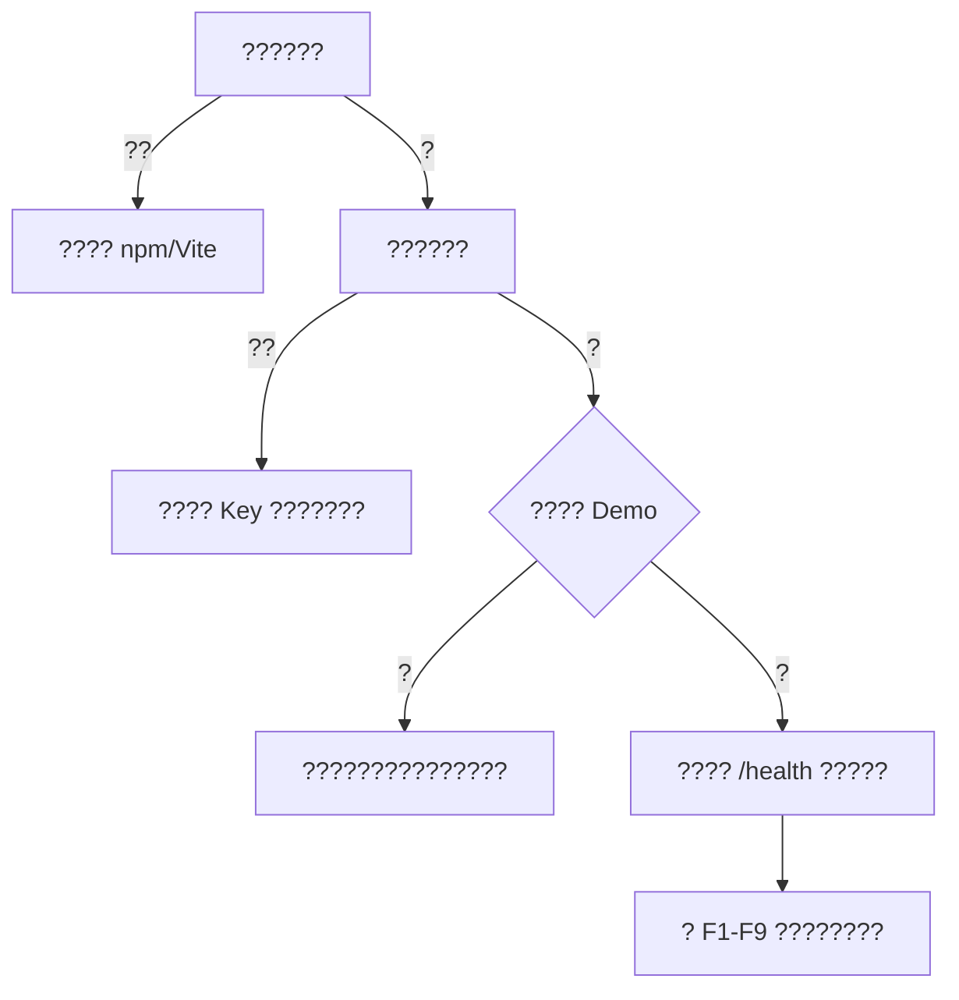

# ????

??????????????????????????????????????????????????????????????????????

## ???????



## 1. ????????

???

```powershell
./scripts/start-frontend.ps1
```

????????

```powershell
./scripts/start-frontend.ps1 -Port 5174
```

?????

| ?? | ???? | ?? |
|---|---|---|
| `npm` ????? | Node.js ??????? PATH | ?? Node.js 18+ ????? PowerShell? |
| Vite ???? | ????? | ? `frontend/` ?? `npm install`? |
| ?? 404 ????? | ???? 5173 | ??????????????? |

## 2. ??????

?? `.env`?

```env
VITE_AMAP_KEY=your_amap_web_js_key_here
VITE_AMAP_SECURITY_JS_CODE=your_amap_security_js_code_here
```

?????

1. ?? Key ?? Web JavaScript API?
2. ??????? Key ???
3. ?? `.env` ??????
4. ?????????????? AMap ?????

## 3. Demo ???????

???? `DEMO` ???

- ????? Demo????????????? F1-F9 ??????????
- ????????????????????

???? Demo ??????

1. ?????
2. ???????????????
3. ?? `frontend/src/demo/readonlyFixture.json` ???

## 4. ????????

???

```text
http://localhost:8000/health
```

??????????

```powershell
docker compose ps
docker compose logs backend
docker compose logs postgis
docker compose logs redis
```

?????

| ?? | ???? | ?? |
|---|---|---|
| `postgis` ???? | 5432 ????? | ?? `.env` ? `POSTGRES_PORT`? |
| `redis` ???? | 6379 ????? | ?? `.env` ? `REDIS_PORT`? |
| `backend` ???? | ??????? | ?? `docker compose up -d --build`? |
| `/health` ?? degraded | ???? Redis ???????? | ??????? `.env` ????? |

## 5. ?????????

?????????????

```env
VITE_API_BASE_URL=http://localhost:8000
```

?????

- ?? `VITE_API_BASE_URL` ???????
- ?? `.env` ??????
- ???????
- ???????
- ?? Top-K?
- ??? Swagger ????????

## 6. F1/F2 ????

| ??? | ???? |
|---|---|
| ???? | ?? `2008-02-02` ? `2008-02-08` ?????? |
| ?? ID | ???????????? taxi_id? |
| bbox | ??????????????????????? |
| F1 ??F2 ? | ???? `matched_trips` ?? trip ???????? |
| ???? | ??????????? trip ?? |

## 7. F3 ??????

?????

- ??????????
- ?????????????????
- ??????????
- ????? `taxi_points` ???????????

???????????????????????

## 8. F4 ?????????

?????

- ???? bbox ??????
- ???????
- ?????????????
- ?????????? `taxi_points` ????

?????

1. ?????????
2. ?????????? 500m ? 1000m?
3. ???????????????
4. ???????????

## 9. F5 OD ??????

?????

- A/B ??????????
- A/B ??????????
- ???????????
- ?????????????????

?????

- ???????
- ??????????????
- ? A/B ????????????
- ?? A/B ?????

## 10. F6 ????????

?????

- ????????????
- `strict_od` ???????
- H3 ??????????????
- ?? `trip_od_cache` ? `trip_grid_points` ????????

?????

- ??????????
- ? `strict_od` ? `through_flow` ???????
- ?? H3 ????
- ?? Top-K ???????????

## 11. F7 ????????

F7 ??????????????????

- `matched_trip_edges`
- `matched_trip_road_passes`
- `matched_road_hourly_counts`
- `matched_road_group_hourly_counts`

??????

- ????????? bbox?
- ??????????
- ???????
- ??????????????

## 12. F8 A/B ????????

?????

- A/B ????????????
- `strict_od` ???
- ????????????????????
- ?? `matched_trip_edges`?`trip_spatial_index`?`trip_token_sequence` ????

?????

1. ??? A?B ?????????
2. ?? `pass_through`?
3. ?? Top-K ????????
4. ?? A/B ???
5. ??????????????

## 13. F9 ??????

F9 ?? F8 ????????????????

- ????? F8?
- F8 ??????????
- ?? F8 ????????????

?????

1. ??? F8?
2. ?? F8 ?????????
3. ??? F9 ???
4. ??????? F9??

???F9 ???????????????/???/????????????

## 14. AI ???????????

?????

- ???? `/api/v1/assistant/chat` ????
- ?????????F9 frequent_fast ???????
- ???????????????
- ??????? LLM??? `OPENAI_API_KEY`?`OPENAI_BASE_URL` ? `OPENAI_MODEL`?
- ???????? LLM?????????? fallback?????????

## 15. ???????

- `http://localhost:5173` ????
- ????????
- ?? Demo ? F1-F9 ???????
- ????????`docker compose ps` ????PostGIS?Redis ????
- `http://localhost:8000/health` ?????
- F1 ?????????????????
- F7/F8 ?????????????
- F9 ?????? F8?????????
