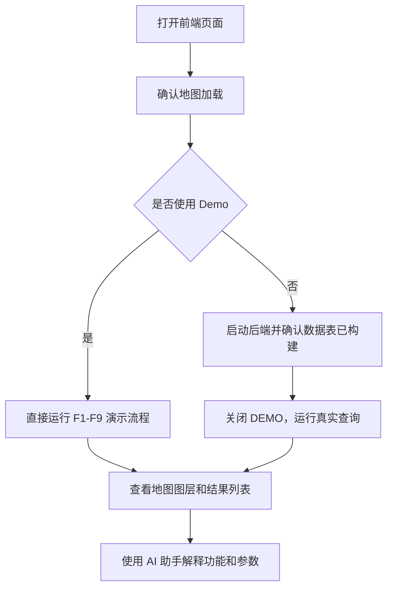

# 用户操作手册

本文说明 Urban Taxi Vis 工作台的主要界面和 F1-F9 功能操作。系统支持 Demo 演示和真实后端两种使用方式；Demo 适合快速验收，真实模式适合查看完整数据计算结果。

## 界面组成

| 区域 | 作用 |
|---|---|
| 左侧模式栏 | 切换 F1-F2、F3-F6、F7-F9、AI 助手等工作区 |
| 顶部/时间控件 | 设置全局时间范围、查看当前运行状态 |
| 参数面板 | 输入 taxi ID、区域框、Top-K、阈值、模式等参数 |
| 地图区域 | 显示轨迹、区域框、网格、道路走廊、路线结果 |
| 结果列表 | 展示车辆、网格、OD、道路、路线和推荐策略结果 |
| `DEMO` 开关 | 打开时使用固定演示数据；关闭时调用真实后端 |

## 推荐演示流程



## F1 原始轨迹查询

F1 用于按出租车编号和时间范围查询原始 GPS 轨迹，并在地图上绘制折线。

操作步骤：

1. 进入 F1/F2 轨迹工作区。
2. 输入出租车 ID；Demo 中可使用预设 ID。
3. 选择时间范围。
4. 点击查询按钮。
5. 在地图上查看轨迹折线、分段和方向。
6. 在结果列表中选择某个 trip，可定位到对应轨迹。

结果含义：

| 字段/图层 | 说明 |
|---|---|
| 原始轨迹线 | 由 `taxi_points` 中的 GPS 点按时间连接形成 |
| segment | 系统按时间间隔、跳点或速度规则切出的轨迹段 |
| trip | 清洗阶段切分得到的一次行程 |
| 点数/距离 | 用于判断轨迹是否完整、是否有明显异常 |

## F2 地图匹配轨迹

F2 展示离线 HMM/Viterbi 地图匹配后的道路轨迹。接口只读取 `matched_trips`，不会在页面请求时实时跑地图匹配。

操作步骤：

1. 先执行 F1 查询，确认有对应 trip。
2. 打开匹配轨迹显示开关或点击匹配轨迹查询。
3. 地图上会同时显示原始轨迹和道路匹配轨迹。
4. 对比两条线的偏移，观察 GPS 漂移被纠正后的效果。

注意事项：

- 如果没有匹配线，通常是该 trip 尚未离线匹配。
- 匹配结果来自 `data_scripts/batch_map_match.py`，核心算法在 `map_match_taxi_id1.py`。

## F3 多区域车辆查询

F3 用于在地图上绘制一个或多个矩形区域，统计时间窗口内命中的活跃车辆。

操作步骤：

1. 进入 F3-F6 区域分析工作区。
2. 选择 F3 功能。
3. 在地图上绘制一个或多个矩形区域。
4. 设置时间范围。
5. 点击查询。
6. 查看命中车辆数量、车辆列表和地图高亮。

使用建议：

- 区域太小可能没有车辆命中。
- 区域太大可能查询较慢，建议先用 Demo 或小范围测试。
- F3 使用多框并集逻辑，同一车辆不会因命中多个框而重复计数。

## F4 网格密度分析

F4 将地图视窗或选定区域划分为米制网格，统计每个网格中的 GPS 点密度和车辆数量。

操作步骤：

1. 进入 F3-F6 区域分析工作区。
2. 选择 F4 网格密度。
3. 设置网格大小，如 250m、500m、1000m。
4. 设置时间范围。
5. 点击计算。
6. 查看地图上的热力网格和右侧统计结果。

结果字段：

| 字段 | 说明 |
|---|---|
| `density` | 单位面积或网格内的相对密度指标 |
| `point_count` | 网格内 GPS 点数量 |
| `vehicle_count` | 网格内涉及的车辆数量 |
| 网格颜色 | 颜色越深表示密度越高 |

说明：当前 F4 后端主接口是 `/api/v1/analytics/f4-grid-density`，不是旧版 H3 base-density 接口。

## F5 A/B 流向分析

F5 用于分析 A 区域与 B 区域之间的车辆流向，包括 A 到 B、B 到 A 以及阈值推荐。

操作步骤：

1. 进入 F3-F6 区域分析工作区。
2. 选择 F5 A/B OD。
3. 在地图上绘制 A 区域。
4. 绘制 B 区域。
5. 设置最大转移时间窗口。
6. 可先点击阈值推荐，查看系统建议。
7. 点击流向分析。
8. 查看 A→B、B→A、总量和路线示意。

使用建议：

- A/B 区域不要完全重叠，否则方向意义会变弱。
- 最大转移时间过小会漏掉真实出行，过大可能混入无关行程。

## F6 区域辐射流分析

F6 用于分析某个核心区域与外部区域之间的流入、流出和经过关系。

模式说明：

| 模式 | 说明 |
|---|---|
| `strict_od` | 依据 trip 起点/终点判断流入或流出，依赖 `trip_od_cache` |
| `through_flow` | 依据轨迹是否经过核心区域判断穿行，依赖 `trip_grid_points` 等缓存 |

操作步骤：

1. 进入 F3-F6 区域分析工作区。
2. 选择 F6 辐射分析。
3. 绘制核心区域。
4. 选择方向：流入、流出或双向。
5. 选择模式：`strict_od` 或 `through_flow`。
6. 设置外部聚合粒度、Top-K 和时间范围。
7. 点击计算。
8. 查看外部区域排名、流量大小和地图连线。

## F7 高频道路走廊

F7 用于从地图匹配后的道路数据中统计高频道路边和道路组，形成道路走廊、主干和分支。

操作步骤：

1. 进入 F7-F9 决策分析工作区。
2. 选择 F7 高频道路。
3. 设置时间范围、Top-K、统计范围。
4. 点击计算。
5. 查看道路走廊列表和地图上的高亮道路。
6. 点击某条道路可查看道路详情。

数据依赖：

- `matched_trip_edges`
- `matched_trip_road_passes`
- `matched_road_hourly_counts`
- `matched_road_group_hourly_counts`

## F8 A/B 高频路线

F8 用于分析 A 区域和 B 区域之间的高频路线，并通过道路 token、Jaccard 相似度和聚类得到代表路线。

操作步骤：

1. 进入 F7-F9 决策分析工作区。
2. 选择 F8 A/B 高频路线。
3. 绘制 A 区域和 B 区域。
4. 选择候选模式：`strict_od` 或 `pass_through`。
5. 设置 Top-K、相似度阈值、时间范围。
6. 点击计算。
7. 查看路线簇、代表轨迹、p20/p50/p90 时间和质量指标。
8. 点击路线可在地图上查看对应走廊和代表轨迹。

使用建议：

- 如果候选太少，可放大 A/B 区域或切换为 `pass_through`。
- 如果路线簇过碎，可适当降低相似度阈值。

## F9 路线推荐

F9 没有独立后端接口，也不单独按时间桶计算。它基于 F8 返回的 `corridors` 或 `routes`，在前端按三种策略排序推荐。

策略说明：

| 策略 | 推荐倾向 |
|---|---|
| `fastest` | 优先 p50 时间更短的路线 |
| `stable` | 优先 p90 与 p50 差距较小、稳定性更好的路线 |
| `frequent_fast` | 综合频次和速度，优先常用且较快的路线 |

操作步骤：

1. 先运行 F8 并得到候选路线。
2. 切换到 F9 推荐区。
3. 选择推荐策略。
4. 查看推荐排名、路线指标和地图高亮。

## AI 助手

AI 助手用于回答项目使用、功能解释、算法说明和排错问题。它会优先检索项目 Markdown 文档；如果配置了 OpenAI-compatible LLM，会在检索结果基础上生成更自然的回答。

常见问题示例：

```text
F4 网格密度怎么用？
F8 strict_od 和 pass_through 有什么区别？
F9 frequent_fast 策略是什么意思？
为什么 F7/F8 没有结果？
HMM 地图匹配用了哪些参数？
```
