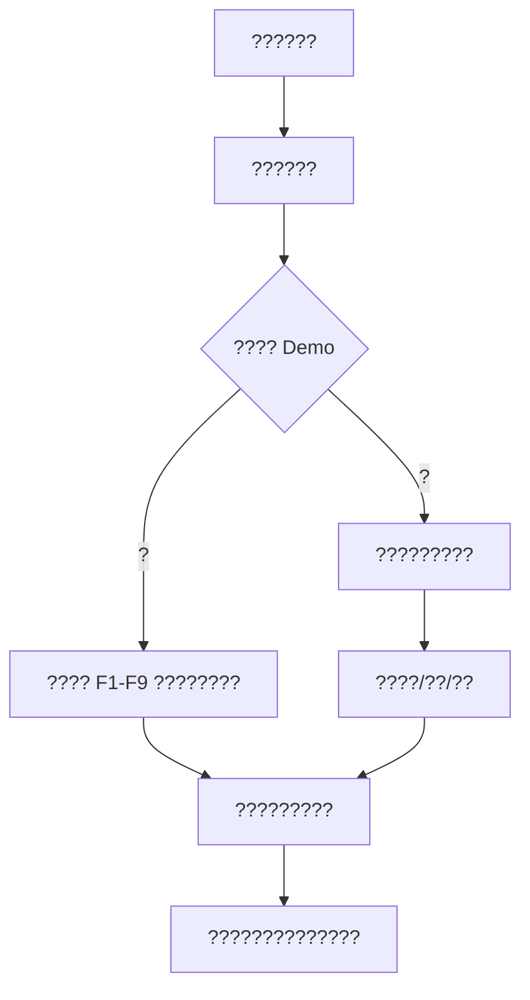

# ????????

??????????????????????????????????????????????????????????????? Demo ????????????????????? `DEMO` ????????????

## ???????

????????

```text
http://localhost:5173
```

????????????????????

| ?? | ????? |
|---|---|
| ????? | ??????? Demo ???????????? |
| ?????? | ???? ID??? F3-F9 ?????????? Top-K ???? |
| ???? | ???????????????????????????? |
| ??/????? | ???????????????????? |

## ??????



???? F1-F2?F3-F6?F7-F9 ???????????????????? F7/F8?

## Demo ??????

?????? `DEMO` ????????????? Demo?

- ????????????????????
- ????????? `frontend/src/demo/readonlyFixture.json` ??????
- ?????????? Redis ???
- ??????????

???????????

1. ????????????
2. ???? `DEMO` ????????????
3. ????????????

## F1-F2?????

### ?????

????????????????????????????? GPS ??????????? F1-F2?

### ????

1. ???????????? (F1-F2)????????
2. ??????????????? Demo ???? `8952`?
3. ?????????????????? `2008-02-02` ? `2008-02-08`?
4. ??????/?????
5. ???????????????
6. ?????????? trip??????????????
7. ??????????????????????????
8. ???????? zoom ???????? zoom ??????

### ?????

| ?????? | ?? |
|---|---|
| ????? | GPS ???????????? segment? |
| ????? | ????????????????????? |
| trip ?? | ????????????????? |
| ?? | ? segment ? trip ???? GPS ???? |
| ???? | ????????????? GPS ????? |

### ????

- F1 ???????????? GPS ???
- F2 ??????????????????????
- ??????????????????????????????? ID?

## F3????????

### ?????

??????????????????????????????????????? F3?

### ????

1. ?????????? (F3-F6)??
2. ?? F3 ???????
3. ???????????
4. ???????????????
5. ????????????????
6. ???????
7. ??????????????????????
8. ????????????????????????????
9. ???????/????????????

### ?????

- ??????????????????????????????????
- ???????????????????
- ???????????????????????

### ????

- ?????????????
- ??????????????????????????????????? fallback?

## F4???????

### ?????

????????????????????????? F4?

### ????

1. ?????????? (F3-F6)??
2. ?? F4 ?????
3. ????????????????
4. ???????????????????????????
5. ???????
   - ????????????????
   - ??????????????????
6. ????????????????????Jenks ????
7. ???????????
8. ????????????/?????

### ?????

| ?? | ?? |
|---|---|
| density | ?????????????????????? |
| point_count | ????????? |
| vehicle_count | ??????????????????? |
| ???? | ????????????????? |

### ????

- F4 ????????? `f4-grid-density`???? H3 ???????
- ??????????????????????????

## F5?A/B OD ????

### ?????

????????????????????? A ? B ??? B ? A ???? F5?

### ????

1. ?????????? (F3-F6)??
2. ?? F5 OD ???
3. ??????? A??????????????
4. ??????? B??????????????
5. ??????????????????? GPS ???
6. ?????????????????? A/B ???????????????????
7. ????? OD ????
8. ?? A?B?B?A?????????????????
9. ???????????????????

### ?????

- A?B ??????? A ????? B ????
- B?A ?????????
- ?????????????????
- ??????????????????

### ????

- ??????????????????????????????????????
- ??????????OD ????????

## F6????????

### ?????

???????????????????????????? F6?

### ????

1. ?????????? (F3-F6)??
2. ?? F6 ??????
3. ????????? A????????????
4. ??????????????
5. ???????
   - `strict_od`??????/??????????
   - `through_flow`??????????????
6. ?? H3 ???????????????
7. ?? Buffer?Top-K ???????????
8. ???????????
9. ????????? H3 ????????

### ?????

- ????????????????
- ?????????????????
- ?????????????????????
- Top-K ??????????????????

### ????

- H3 ? F6 ????????????
- `strict_od` ? `through_flow` ?????????????????????????

## F7?????????

### ?????

??????????????????????????? F7?

### ????

1. ???Frequent Paths & Recommendations (F7-F9)??
2. ? F7 ???? Top-K ???
3. ??????????
4. ?????????????????
5. ??????????????????
6. ???????????
7. ?????????
8. ??????????????????
9. ????????????????????????

### ?????

| ?? | ?? |
|---|---|
| trip ? | ???????????? |
| vehicle ? | ?????????? |
| ?? | ???????????? |
| ???/?? | ?????????????? |

### ????

- F7 ???????????????
- ?????????????????????????????

## F8?A/B ??????

### ?????

?????????????????????? F8?F8 ????? F9 ??????

### ????

1. ???Frequent Paths & Recommendations (F7-F9)??
2. ? F8/F9 ??????? A??
3. ?????????? A?
4. ????? B??
5. ?????????? B?
6. ?? Top-K?
7. ???????
   - `strict_od`???????????? A/B?
   - `pass_through`????? A/B ??????????
8. ???????????????????????
9. ????? A?B ?????? (F8)??
10. ?????????
11. ??????????????????????????
12. ??????? F8??? F8 ?????????????

### ?????

- `trip_count` ???????????????
- p50 ????????????
- p90 ??????????????????
- avg ??????????????????
- ?????????????

### ????

- F8 ????????????????? `pass_through`?
- F8 ?????? A?B ?????
- F9 ???? F8 ?????

## F9????????

### ?????

?????? F8 ???? A/B ??????????????????????????????????? F9?

### ????

1. ??? F8 ?????????????????
2. ? F9 ???????????
3. ???????????????? p50 ????????? p50 ??????????????
4. ???????????????? p90 ????????? p90 ?????? p50?
5. ??????????????????????????????
6. ??????????????p50?p90?avg ????
7. ??????? F9????????????????
8. ???????????????????????????????

### ?????

| ?? | ???????? |
|---|---|
| ???? | ????????????????? |
| ???? | ??????????????????? |
| ???? | ???????????????????? |

### ????

- F9 ????????????????????
- F9 ??????????????????????
- F9 ?????????? F8 ????????????

## AI ????

### ?????

??????????????????????????????????????? AI ?????

### ????

1. ?????????????? AI ?????
2. ????????
   - `F4 ????????????`
   - `F8 ??? A/B ?????`
   - `F9 ?????????`
   - `F7-F9 ??????????`
3. ???????
4. ??????????????
5. ???????????????????????????

### ????

- AI ???????????????? LLM ?????????????
- ??????????????????????

## ???????

???????

1. ??????????
2. F1/F2 ??????????
3. F3 ?????????????
4. F4 ??????????
5. F5 A/B OD ???
6. F6 ??????
7. F7 ???????
8. F8 A/B ????????????
9. F9 ?????????????
10. AI ??????????

## ??????

- ??????????????? Key?
- ?????????????????????? Top-K ????
- F7/F8 ??????????????????? Demo ?????
- F9 ???? F8 ?????
- ???????????????? F1-F9 ????????????
