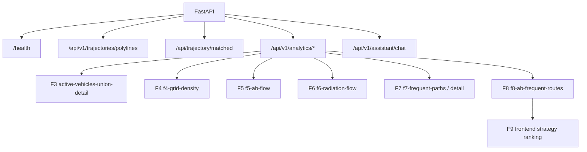

# API 接口说明

本文面向前端开发、后端维护和接口联调，列出当前真实 FastAPI 路由、请求口径和功能边界。当前接口表面以 `backend/app/api/` 中的代码为准。

> 重要口径：当前没有独立 F9 后端接口。F9 是前端在 F8 返回的 `corridors` 或 `routes` 候选中按 `fastest`、`stable`、`frequent_fast` 三种策略排序推荐路线。

## 访问入口

| 项目 | 地址 |
|---|---|
| 后端根路径 | `GET /` |
| 健康检查 | `GET /health` |
| Swagger | `http://localhost:8000/docs` |
| OpenAPI JSON | `http://localhost:8000/openapi.json` |

根路径返回后端运行提示；健康检查用于确认数据库和 Redis 连接状态。

## 当前路由总览



| 分组 | 方法 | 路径 | 当前用途 |
|---|---|---|---|
| 健康检查 | GET | `/health` | 检查后端、PostGIS、Redis 状态。 |
| 根路径 | GET | `/` | 返回后端运行提示。 |
| F1 | GET | `/api/v1/trajectories/polylines` | 原始轨迹折线、切段和缩放抽稀。 |
| F2/F3 明细 | GET | `/api/trajectory/matched` | 按车辆或 trip 查询匹配轨迹。 |
| F2/F3 明细 | GET | `/api/trajectory/matched/spatial` | 按空间范围查询匹配轨迹。 |
| Fallback | GET | `/api/trajectory/{trip_id}` | 查询指定 trip 的原始轨迹点。 |
| 总览 | GET | `/api/v1/analytics/dataset-summary` | 数据集摘要。 |
| 总览 | GET | `/api/v1/analytics/active-vehicles` | 活跃车辆数。 |
| F3 | POST | `/api/v1/analytics/active-vehicles-union` | 多矩形并集车辆数。 |
| F3 | POST | `/api/v1/analytics/active-vehicles-union-detail` | 多矩形并集车辆明细。 |
| F4 | GET | `/api/v1/analytics/f4-grid-density` | 经纬度/投影桶网格密度。 |
| F5 | POST | `/api/v1/analytics/f5-transition-threshold-recommendation` | A/B 最大转移时间建议。 |
| F5 | POST | `/api/v1/analytics/f5-ab-flow` | A/B OD 流向统计。 |
| F6 | POST | `/api/v1/analytics/f6-radiation-flow` | 核心区辐射分析。 |
| F7 | POST | `/api/v1/analytics/f7-frequent-paths` | 高频道路走廊。 |
| F7 | POST | `/api/v1/analytics/f7-road-detail` | 高频道路详情。 |
| F8 | POST | `/api/v1/analytics/f8-ab-frequent-routes` | A/B 高频路线挖掘。 |
| AI | POST | `/api/v1/assistant/chat` | 项目助手问答。 |

已清理或不应再调用的旧接口包括：`/api/v1/analytics/f9-ab-time-bucket-best-paths`、`/api/v1/analytics/f4-h3-base-density`、`/api/v1/analytics/f3-region-analysis`、`/api/v1/analytics/taxi-ids`、`/api/v1/analytics/dataset-summary/refresh`、`/api/v1/trajectories/map-match/latest`、`/api/trajectory/spatial_query`。

## F1 轨迹折线接口

```text
GET /api/v1/trajectories/polylines
```

常用查询参数：

| 参数 | 类型 | 说明 |
|---|---|---|
| `taxi_id` | int | 可选。指定车辆编号。 |
| `start_time` / `end_time` | datetime | 查询时间范围。 |
| `min_lon` / `min_lat` / `max_lon` / `max_lat` | float | 可选 bbox。 |
| `zoom` | int | 地图缩放级别，影响默认抽稀容差。 |
| `simplify_tolerance` | float | 可选，显式指定 `ST_Simplify` 容差。 |
| `max_trips` | int | 最多返回 segment/trip 数。 |
| `max_gap_minutes` | int | 超过该时间间隔切新 segment。 |
| `max_jump_km` | float | 超过该相邻距离切新 segment。 |
| `max_speed_kmh` | float | 超过该推算速度切新 segment。 |

返回 GeoJSON `FeatureCollection`。后端从 `taxi_points` 取 GPS 点，按时间排序，使用断点、跳点和速度阈值切 segment，再用 `ST_MakeLine` 生成折线。

## F2/F3 轨迹明细接口

| 方法 | 路径 | 说明 |
|---|---|---|
| GET | `/api/trajectory/matched` | 按 `taxi_id`、可选 `trip_id` 查询 `matched_trips.matched_geom`。 |
| GET | `/api/trajectory/matched/spatial` | 按 bbox 和车辆范围查询匹配轨迹，适合 F3 命中明细展示。 |
| GET | `/api/trajectory/{trip_id}` | 查询指定 trip 原始点，作为匹配轨迹缺失时的 fallback。 |

匹配轨迹不是接口实时计算的最短路径，而是离线地图匹配脚本提前写入 `matched_trips`。

## Analytics 接口

所有 analytics 路由挂载在：

```text
/api/v1/analytics
```

### 总览接口

| 方法 | 路径 | 说明 |
|---|---|---|
| GET | `/dataset-summary` | 读取或构建数据集摘要缓存。 |
| GET | `/active-vehicles` | 在可选时间和 bbox 条件下统计活跃车辆数。 |

### F3 多矩形并集统计

| 方法 | 路径 | 说明 |
|---|---|---|
| POST | `/active-vehicles-union` | 返回多矩形并集去重车辆数。 |
| POST | `/active-vehicles-union-detail` | 返回每框命中数、车辆明细、trip 明细。 |

请求体核心字段：`bboxes`、`start_time`、`end_time`、`taxi_id_min`、`taxi_id_max`、`row_limit`。

### F4 网格密度

```text
GET /api/v1/analytics/f4-grid-density
```

参数：`start_time`、`end_time`、`grid_size_m`、bbox、`include_vehicle_count`、`max_cells`、`format`。

当前真实实现是经纬度/投影桶网格聚合，返回 `cells` 和 `meta`。前端可以渲染为热力图或离散色块图。F4 当前不再使用旧的 H3 基础密度后端接口。

### F5 A/B OD 流向

| 方法 | 路径 | 说明 |
|---|---|---|
| POST | `/f5-transition-threshold-recommendation` | 根据 A/B 距离估算最大转移时间。 |
| POST | `/f5-ab-flow` | 统计 A→B、B→A、净流量和耗时。 |

`f5-ab-flow` 请求体核心字段：`start_time`、`end_time`、`granularity`、`buffer_meters`、`max_transition_seconds`、`area_a`、`area_b`。

### F6 核心区辐射

```text
POST /api/v1/analytics/f6-radiation-flow
```

请求体核心字段：`core_area`、`start_time`、`end_time`、`direction`、`analysis_mode`、`h3_resolution`、`buffer_meters`、`max_transition_seconds`、`top_k`。

`analysis_mode` 支持：

| 值 | 说明 |
|---|---|
| `strict_od` | 基于 trip 起终点关系分析核心区流入/流出。 |
| `through_flow` | 基于经过核心区的行程分析前后外部区域。 |

### F7 高频道路

| 方法 | 路径 | 说明 |
|---|---|---|
| POST | `/f7-frequent-paths` | 返回 Top-K 高频道路组或走廊。 |
| POST | `/f7-road-detail` | 针对某个道路组返回组成路段和详情。 |

F7 优先使用 `matched_road_group_hourly_counts`、`matched_road_hourly_counts`，必要时回退到 `matched_trip_road_passes` / `matched_trip_edges`。

### F8 A/B 高频路线

```text
POST /api/v1/analytics/f8-ab-frequent-routes
```

请求体核心字段：

| 字段 | 说明 |
|---|---|
| `start_time` / `end_time` | 分析时间范围。 |
| `area_a` / `area_b` | A/B 区域 bbox。 |
| `top_k` | 返回候选路线数量。 |
| `candidate_mode` | `strict_od` 或 `pass_through`。 |
| `buffer_meters` | 区域命中缓冲。 |
| `min_support` | 路线簇最小样本数。 |
| `min_edge_length_m` | 道路边最小长度过滤。 |
| `min_route_length_m` | 路线最小长度过滤。 |
| `max_candidate_trips` | 候选 trip 上限。 |
| `start_hour_filter` / `start_minute_filter_*` | 可选的出发时间过滤，用于前端进一步限制 F8 候选。 |

返回中优先读取 `corridors`，同时保留 `routes` 兼容字段。F9 前端推荐直接使用这些候选。

## F1-F9 输入输出口径

| 功能 | 输入 | 输出 | 口径 |
|---|---|---|---|
| F1 | 车辆、时间、bbox、zoom | 原始轨迹 segment | GPS 点切段后连线。 |
| F2 | 车辆、trip | 匹配轨迹 | 离线地图匹配结果。 |
| F3 | 多个 bbox、时间 | 并集车辆数和明细 | 多框并集去重。 |
| F4 | 时间、bbox、grid size | 网格 cell、密度 | 经纬度/投影桶聚合。 |
| F5 | A/B bbox、时间、阈值 | 双向流量、耗时 | 状态机 OD 转移。 |
| F6 | 核心区、模式、方向 | H3 外部区域流入/流出 | `strict_od` 或 `through_flow`。 |
| F7 | 时间、范围、Top-K | 高频道路组 | 匹配道路通行统计。 |
| F8 | A/B bbox、候选模式、阈值 | 高频路线簇 | token、相似度、代表路线。 |
| F9 | F8 候选、策略 | 推荐路线 | 前端策略排序，无独立后端接口。 |

## 错误与排查

常见错误来源：

- 后端、PostGIS 或 Redis 未启动。
- `.env` 中数据库连接与容器配置不一致。
- 数据表未导入，例如缺少 `taxi_points` 或 `matched_trips`。
- F7/F8 派生缓存表未构建或 `pipeline_build_status` 未标记为 ready。
- 查询 bbox、时间范围或 Top-K 参数过大导致超时。

排查建议：先访问 `/health`，再用 Swagger 单独测试对应接口，最后检查数据库表和脚本构建状态。
