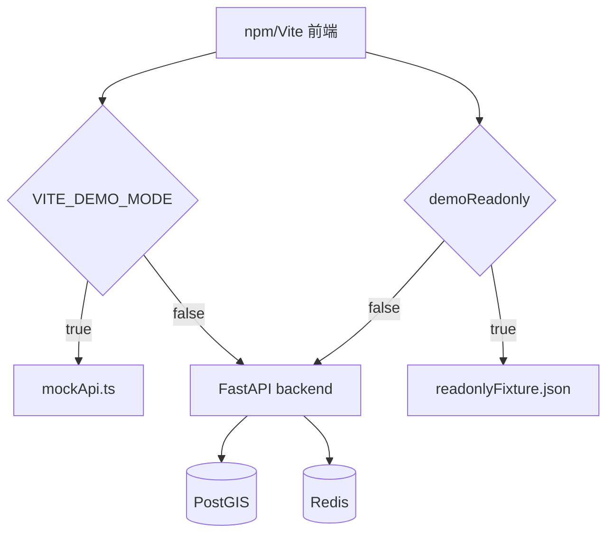

# 构建与运行说明

本文面向开发者说明如何启动、停止、验证和调试项目。普通演示用户可优先阅读 `docs/getting-started.md` 和 `docs/02-user-guide/quick-start.md`。

## 运行方式总览

项目采用混合运行方式：

- 后端、PostGIS、Redis 使用 Docker Compose 启动。
- 前端使用本机 Node.js + Vite 启动。
- 数据处理脚本通常在后端容器或具备 Python 依赖的本地环境中执行。
- 只读 Demo 可以只启动前端，不需要后端和数据库。



## Docker Compose 服务

根目录 `docker-compose.yml` 定义三个服务：

| 服务 | 容器名 | 端口 | 作用 |
|---|---|---|---|
| `backend` | `taxi-backend` | `${APP_PORT:-8000}:8000` | FastAPI 接口服务。 |
| `postgis` | `taxi-postgis` | `${POSTGRES_PORT:-5432}:5432` | PostgreSQL/PostGIS 数据库。 |
| `redis` | `taxi-redis` | `${REDIS_PORT:-6379}:6379` | Redis 缓存。 |

后端容器挂载了 `backend/app`、`docs`、`README.md`、`data_scripts` 和 `data`，因此接口、AI 助手检索和脚本运行都能访问项目文件。

## 启动完整后端

在项目根目录执行：

```powershell
./scripts/start-dev.ps1 -Detach
```

等价于后台执行：

```powershell
docker compose up -d --build
```

查看状态：

```powershell
docker compose ps
```

查看日志：

```powershell
docker compose logs backend
docker compose logs postgis
docker compose logs redis
```

## 启动前端

第一次运行安装依赖：

```powershell
cd frontend
npm install
cd ..
```

启动：

```powershell
./scripts/start-frontend.ps1
```

默认地址：

```text
http://localhost:5173
```

指定端口：

```powershell
./scripts/start-frontend.ps1 -Port 5174
```

## 只读 Demo 运行

只读 Demo 是前端工作台默认状态。只要前端启动并且地图 Key 可用，就能查看固定样例：

1. 打开 `http://localhost:5173`。
2. 确认左侧 `DEMO` 标识亮起。
3. 进入 F1-F9 各模块。
4. 点击原有查询/计算/挖掘按钮加载固定结果。

只读 Demo 使用 `frontend/src/demo/readonlyFixture.json`，不访问后端数据库。

## axios mock Demo

如果要让 axios 请求也完全走前端模拟接口，可以设置：

```env
VITE_DEMO_MODE=true
```

然后重启前端。此时 `frontend/src/services/request.ts` 会使用 `frontend/src/demo/mockApi.ts` 的 adapter。

## 健康检查与接口文档

后端启动后访问：

```text
http://localhost:8000/health
http://localhost:8000/docs
```

`/health` 应返回数据库和 Redis 状态。Swagger 中应能看到当前真实接口，例如：

- `/api/v1/trajectories/polylines`
- `/api/trajectory/matched`
- `/api/v1/analytics/f4-grid-density`
- `/api/v1/analytics/f8-ab-frequent-routes`
- `/api/v1/assistant/chat`

看不到 F9 独立接口是正常的；F9 在前端基于 F8 结果排序。

## 常用验证命令

前端类型检查：

```powershell
cd frontend
npm run typecheck
cd ..
```

后端语法检查：

```powershell
python -m py_compile backend/app/api/analytics.py backend/app/api/trajectory.py backend/app/api/matched.py backend/app/api/assistant.py
```

Docker 服务检查：

```powershell
docker compose ps
```

## 数据脚本运行提示

数据脚本位于 `data_scripts/`。常见阶段：

1. 初始化 schema 和导入 `taxi_points`。
2. 抽取 OSM 路网到 `road_edges`、`road_nodes`。
3. 运行地图匹配生成 `matched_trips`。
4. 构建 `matched_trip_edges`。
5. 构建 `trip_od_cache`。
6. 构建 F7 道路聚合表。
7. 构建 F8 空间、token 和语义缓存。

F9 不需要额外脚本；它使用 F8 接口返回结果。

## 停止和重置

停止服务，不删除数据卷：

```powershell
./scripts/stop-dev.ps1
```

重置容器和数据卷：

```powershell
./scripts/reset-dev.ps1
```

注意：重置会删除 PostGIS 数据卷，已导入数据会丢失。演示前不要随意执行。

## 常见运行问题

| 现象 | 处理 |
|---|---|
| 前端页面打不开 | 检查 Vite 是否启动，端口是否是 5173。 |
| 地图空白 | 检查 `VITE_AMAP_KEY` 和 `VITE_AMAP_SECURITY_JS_CODE`。 |
| `/health` 异常 | 查看 `backend`、`postgis`、`redis` 日志。 |
| 完整模式 F1 没数据 | 检查 `taxi_points` 和时间范围。 |
| F7/F8 没数据 | 检查地图匹配和派生缓存表。 |
| F9 没推荐 | 先运行 F8，确保有候选路线。 |
