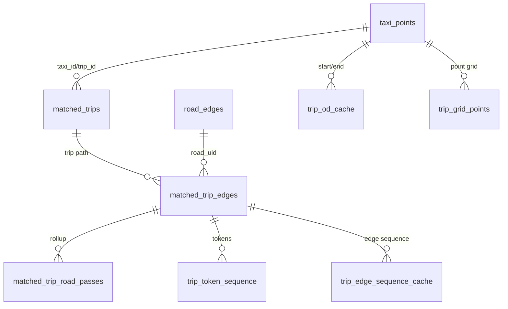

# 数据库设计说明

本文说明当前项目使用的 PostgreSQL/PostGIS 表结构、索引作用和 F1-F9 数据依赖。建表定义主要位于 `data_scripts/schema.sql`，部分离线脚本也会按需补建派生表和索引。

> 当前口径：F9 不需要独立数据库表，也不复用旧 time-bucket 后端逻辑；它直接读取 F8 接口返回的候选路线结果。

## 数据库类型

项目使用 PostgreSQL + PostGIS。PostGIS 提供 `geometry` 类型、GiST 空间索引和空间函数，适合存储和查询 GPS 点、道路节点、道路边和匹配轨迹。

## 核心表总览

| 表名 | 说明 | 主要用途 |
|---|---|---|
| `taxi_points` | 出租车 GPS 轨迹点表 | F1 原始轨迹，F3-F6 区域统计。 |
| `road_edges` | OSM 道路边表 | 地图匹配、道路空间查询、F7/F8 道路解释。 |
| `road_nodes` | OSM 道路节点表 | 路网构建和地图匹配。 |
| `matched_trips` | 离线地图匹配后的 trip 几何 | F2 匹配轨迹展示，F3/F8 明细几何。 |
| `matched_trip_edges` | trip 经过的道路边序列 | F7/F8 路径挖掘基础输入。 |
| `trip_od_cache` | trip 起终点、时间、耗时缓存 | F6 `strict_od`、F8 候选过滤。 |
| `trip_spatial_index` | trip 命中空间网格索引 | F8 A/B 候选快速筛选。 |
| `trip_grid_points` | trip 点级网格缓存 | F6 `through_flow`、F8 空间筛选。 |
| `trip_token_sequence` | trip 道路 token 序列 | F8 路线相似度和聚类。 |
| `trip_edge_sequence_cache` | trip 道路边序列缓存 | F8 路线切片和代表路线加速。 |
| `road_edge_feature_cache` | 道路边特征缓存 | F8 道路归一化、标签和几何解释。 |
| `matched_trip_road_passes` | trip 对道路段的通行记录 | F7 明细和回退统计。 |
| `matched_road_hourly_counts` | 道路小时聚合表 | F7 高频道路快速统计。 |
| `matched_road_group_hourly_counts` | 道路组小时聚合表 | F7 高频走廊优先统计。 |
| `pipeline_build_status` | 派生表构建状态 | 判断缓存是否 ready。 |
| `dataset_summary_cache` | 数据集摘要缓存 | 首页总览和 `/dataset-summary`。 |

## 基础轨迹表

### `taxi_points`

典型字段：`taxi_id`、`trip_id`、`gps_time`、`lon`、`lat`、`geom`。

常见索引：

| 索引 | 作用 |
|---|---|
| `idx_taxi_points_taxi_time` | 按车辆和时间查询 F1 轨迹。 |
| `idx_taxi_points_trip_time` | 按 trip 和时间排序。 |
| `idx_taxi_points_taxi_trip_time` | 车辆 + trip + 时间联合查询。 |
| `idx_taxi_points_geom_gist` | bbox 空间过滤。 |

F1 从该表读取点并连线；F3/F4/F5 也会直接或间接使用该表做空间统计。

## 路网与匹配表

### `road_edges` / `road_nodes`

来自 OSM 路网抽取脚本。`road_edges` 保存道路几何、方向、道路名称或类型等信息；`road_nodes` 保存节点坐标。它们支撑地图匹配和道路级解释。

### `matched_trips`

保存离线地图匹配结果，核心字段包括 `taxi_id`、`trip_id`、`matched_geom`、`distance_km` 等。F2 直接展示该表中的匹配轨迹。

### `matched_trip_edges`

保存每个 trip 经过的道路边序列，是 F7/F8 路径挖掘的重要基础。构建脚本为 `data_scripts/build_matched_trip_edges.py`。

## OD 与空间缓存

### `trip_od_cache`

保存 trip 起点、终点、起止时间、点数和耗时。F6 `strict_od` 使用它判断核心区流入/流出；F8 使用它做时间范围和候选 trip 过滤。

构建脚本：`data_scripts/build_trip_od_cache.py`。

### `trip_spatial_index`

把 trip 与粗网格 key 关联起来，用于快速判断 trip 是否触达 A/B 区域，减少 F8 候选扫描成本。

### `trip_grid_points`

保存 trip 中点级网格、经纬度、点序号和时间。F6 `through_flow` 用它查找经过核心区前后的外部点；F8 也可用它做候选筛选。

## F7 道路聚合缓存

| 表 | 作用 |
|---|---|
| `matched_trip_road_passes` | 把 trip 经过道路的记录标准化，适合 F7 详情和回退统计。 |
| `matched_road_hourly_counts` | 按道路和小时聚合通行次数。 |
| `matched_road_group_hourly_counts` | 按道路组、方向和小时聚合，F7 优先使用。 |

推荐构建顺序：

1. `build_matched_trip_edges.py`
2. `build_matched_trip_road_passes.py`
3. `build_matched_road_hourly_counts.py`
4. `build_matched_road_group_hourly_counts.py`

## F8 路线挖掘缓存

`data_scripts/build_f8_trip_caches.py` 会构建以下表：

| 表 | 用途 |
|---|---|
| `trip_spatial_index` | A/B 区域候选 trip 快速筛选。 |
| `trip_grid_points` | 点级空间关系和 F6 through_flow 支撑。 |
| `trip_token_sequence` | 路线 token 相似度计算。 |
| `trip_edge_sequence_cache` | 道路边序列缓存。 |
| `road_edge_feature_cache` | 道路标签、方向、几何等特征缓存。 |

F8 的依赖链可以理解为：

## F1-F9 表依赖速查

| 功能 | 主要表 | 说明 |
|---|---|---|
| F1 | `taxi_points` | 原始轨迹查询、切段和连线。 |
| F2 | `matched_trips` | 展示离线匹配轨迹。 |
| F3 | `taxi_points`、`matched_trips` | 区域车辆统计和点击明细轨迹。 |
| F4 | `taxi_points` | 网格密度聚合。 |
| F5 | `taxi_points` | A/B 状态机 OD 流向。 |
| F6 | `trip_od_cache`、`trip_grid_points` | strict_od 和 through_flow。 |
| F7 | `matched_trip_road_passes`、`matched_road_hourly_counts`、`matched_road_group_hourly_counts`、`matched_trip_edges` | 高频道路和详情。 |
| F8 | `matched_trip_edges`、`trip_spatial_index`、`trip_grid_points`、`trip_token_sequence`、`trip_edge_sequence_cache`、`road_edge_feature_cache` | A/B 高频路线。 |
| F9 | 无独立表；读取 F8 返回结果 | 前端按策略排序推荐。 |

## 构建状态表

`pipeline_build_status` 用于记录派生表构建进度。建议构建脚本写入：

| 字段 | 说明 |
|---|---|
| `pipeline_name` | 构建任务名称，例如 `trip_spatial_index`。 |
| `status` | `building`、`ready`、`failed` 等。 |
| `details` | JSONB 详情，例如行数、耗时、错误信息。 |
| `updated_at` | 更新时间。 |

后端在部分路径中会检查该表，以判断缓存是否存在且可用。

## 设计边界

- 当前系统偏向课程演示和本地分析，不包含多租户权限模型。
- 大部分查询围绕历史数据，不表示实时交通状态。
- F4 当前使用经纬度/投影桶网格；H3 主要在 F6 外部区域聚合中出现。
- F9 是 F8 结果上的前端策略推荐，不是数据库派生表，也不是独立后端路由。
