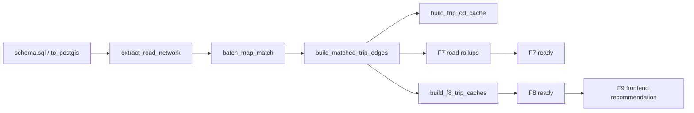

# 项目目录结构说明

本文面向开发者说明仓库目录、关键源码位置和数据脚本分工。当前结构以 `E:\Projects\driver_system` 下的真实文件为准。

## 顶层结构

```text
driver_system/
├─ backend/              # FastAPI 后端
├─ frontend/             # React/Vite 前端
├─ data/                 # 原始数据、中间数据和 OSM 路网数据
├─ data_scripts/         # 数据清洗、导入、地图匹配和缓存构建脚本
├─ docs/                 # 项目文档
├─ final/                # 报告、PPT、视频等提交材料
├─ scripts/              # Windows PowerShell 启停脚本
├─ docker-compose.yml    # 后端、PostGIS、Redis 编排
├─ .env.example          # 环境变量模板
└─ README.md             # 仓库入口说明
```

## `backend/`

FastAPI 后端服务目录。

```text
backend/
├─ Dockerfile
├─ requirements.txt
└─ app/
   ├─ main.py
   ├─ api/
   ├─ core/
   ├─ db/
   └─ services/
```

| 路径 | 说明 |
|---|---|
| `backend/app/main.py` | FastAPI 应用入口，注册 health、trajectory、matched、analytics、assistant 路由。 |
| `backend/app/api/health.py` | `/health` 健康检查。 |
| `backend/app/api/trajectory.py` | F1 原始轨迹折线接口 `/api/v1/trajectories/polylines`。 |
| `backend/app/api/matched.py` | F2/F3 匹配轨迹和 trip fallback 接口。 |
| `backend/app/api/analytics.py` | 总览、F3-F8 分析接口；F9 不在后端单独实现。 |
| `backend/app/api/assistant.py` | AI 项目助手接口。 |
| `backend/app/core/config.py` | `.env` 配置读取。 |
| `backend/app/db/session.py` | SQLAlchemy 连接和 session 管理。 |
| `backend/app/services/assistant_retrieval.py` | Markdown 文档检索。 |
| `backend/app/services/assistant_llm.py` | 可选 OpenAI-compatible LLM 调用。 |

## `frontend/`

React + Vite + TypeScript 前端目录。

```text
frontend/
├─ package.json
├─ vite.config.ts
└─ src/
   ├─ components/
   ├─ config/
   ├─ demo/
   ├─ features/
   ├─ pages/
   ├─ services/
   └─ workers/
```

| 路径 | 说明 |
|---|---|
| `frontend/src/pages/GeoSpatialWorkbench.tsx` | 主工作台页面，管理模式切换、地图图层、F1-F9 运行逻辑。 |
| `frontend/src/components/GeoWorkbenchOverviewPanel.tsx` | 首页概览卡片和三大模式入口。 |
| `frontend/src/components/GeoWorkbenchTrajectoryPanel.tsx` | F1-F2 轨迹参数面板。 |
| `frontend/src/components/GeoWorkbenchRegionPanel.tsx` | F3-F6 区域与网格参数面板。 |
| `frontend/src/components/GeoWorkbenchDecisionPanel.tsx` | F7-F9 决策面板；F9 三策略排序在这里完成。 |
| `frontend/src/components/GeoWorkbenchMapStage.tsx` | 地图容器和部分地图交互承载。 |
| `frontend/src/components/GeoWorkbenchAssistant.tsx` | AI 项目助手 UI。 |
| `frontend/src/services/trajectoryService.ts` | F3-F8 等分析接口封装和类型定义。 |
| `frontend/src/services/request.ts` | axios 实例，按 `VITE_DEMO_MODE` 决定是否使用 mock adapter。 |
| `frontend/src/demo/readonlyFixture.json` | 只读 Demo 固定样例。 |
| `frontend/src/demo/mockApi.ts` | axios mock Demo 响应。 |
| `frontend/src/workers/f4H3AggregationWorker.ts` | F4 相关前端聚合遗留/辅助 Worker，不是当前 F4 后端主接口。 |

## `data_scripts/`

数据处理脚本目录。脚本可按阶段理解：

| 阶段 | 代表脚本 | 作用 |
|---|---|---|
| 清洗 | `clean_to_folder_speed_filter.py` | 清洗、trip 切分、速度异常过滤。 |
| 导入 | `to_postgis.py`、`schema.sql` | 建表、导入 `taxi_points` 和路网基础表。 |
| 路网抽取 | `extract_road_network.py` | 从 OSM PBF 抽取道路节点和道路边。 |
| 地图匹配 | `batch_map_match.py`、`map_match_taxi_id1.py` | 生成 `matched_trips`；`map_match_taxi_id1.py` 提供核心 HMM/Viterbi 算法。 |
| 道路边序列 | `build_matched_trip_edges.py` | 生成 `matched_trip_edges`。 |
| F7 聚合 | `build_matched_trip_road_passes.py`、`build_matched_road_hourly_counts.py`、`build_matched_road_group_hourly_counts.py` | 生成 F7 高频道路所需聚合表。 |
| F6/F8 缓存 | `build_trip_od_cache.py`、`build_f8_trip_caches.py` | 生成 OD、空间索引、token 和路线语义缓存。 |

推荐构建顺序：



## `docs/`

文档目录按读者和用途分层：

| 目录 | 用途 |
|---|---|
| `docs/README.md` | 文档总览和阅读顺序。 |
| `docs/01-overview/` | 项目介绍、功能清单、术语和需求。 |
| `docs/02-user-guide/` | 面向用户的启动、操作、FAQ、排障。 |
| `docs/03-developer-guide/` | 本目录，面向开发者的接口、配置、数据库、结构。 |
| `docs/04-architecture/` | 更详细的架构、模块和核心流程。 |
| `docs/05-technical-notes/` | 技术细节、算法、F1-F9 代码逻辑、RAG 检索。 |

## `scripts/`

Windows PowerShell 脚本：

| 脚本 | 用途 |
|---|---|
| `scripts/start-dev.ps1` | 启动 Docker Compose 后端、PostGIS、Redis。 |
| `scripts/stop-dev.ps1` | 停止 Docker Compose 服务，不删除数据卷。 |
| `scripts/reset-dev.ps1` | 重置容器和数据卷，谨慎使用。 |
| `scripts/start-frontend.ps1` | 进入 `frontend/` 并启动 Vite。 |
| `scripts/load-image-env.ps1` | 读取镜像相关环境配置。 |

## F1-F9 代码入口速查

| 功能 | 前端入口 | 后端入口 | 数据依赖 |
|---|---|---|---|
| F1 | `GeoWorkbenchTrajectoryPanel.tsx`、`GeoSpatialWorkbench.tsx` | `trajectory.py` | `taxi_points` |
| F2 | `GeoSpatialWorkbench.tsx` | `matched.py` | `matched_trips` |
| F3 | `GeoWorkbenchRegionPanel.tsx` | `analytics.py`、`matched.py` | `taxi_points`、`matched_trips` |
| F4 | `GeoWorkbenchRegionPanel.tsx` | `analytics.py` `/f4-grid-density` | `taxi_points` |
| F5 | `GeoWorkbenchRegionPanel.tsx` | `analytics.py` `/f5-ab-flow` | `taxi_points` |
| F6 | `GeoWorkbenchRegionPanel.tsx` | `analytics.py` `/f6-radiation-flow` | `trip_od_cache`、`trip_grid_points` |
| F7 | `GeoWorkbenchDecisionPanel.tsx` | `analytics.py` `/f7-frequent-paths`、`/f7-road-detail` | F7 道路聚合表、`matched_trip_edges` |
| F8 | `GeoWorkbenchDecisionPanel.tsx` | `analytics.py` `/f8-ab-frequent-routes` | `matched_trip_edges`、F8 缓存表 |
| F9 | `GeoWorkbenchDecisionPanel.tsx` | 无独立后端接口 | F8 返回的 `corridors` / `routes` |

## 维护提示

- 删除或新增后端接口后，同步更新 `api-reference.md` 和前端 service 封装。
- 修改 F9 逻辑时，优先检查 `GeoWorkbenchDecisionPanel.tsx` 中的 `F9Strategy`、`recommendedF9Item` 和排序函数。
- 修改数据脚本后，同步更新 `database-design.md` 和 `data-pipeline.md`。
- 不要把已删除的 F9 time-bucket、F4 H3 基础密度、F3 region-analysis 等旧接口重新写入当前接口表。
