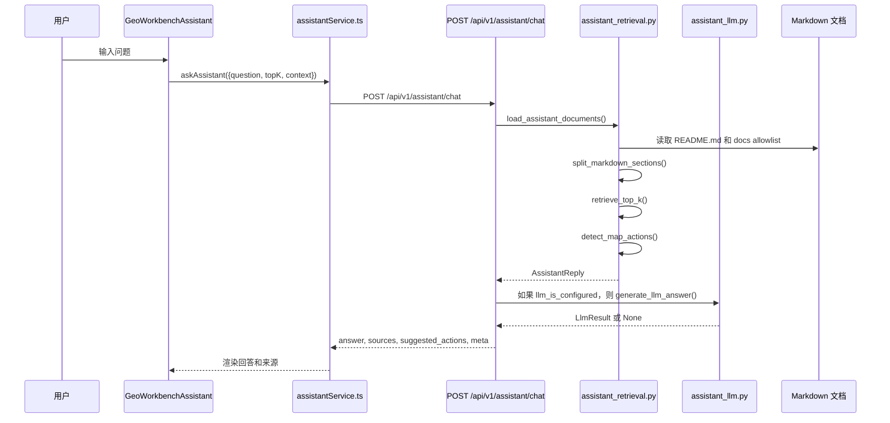
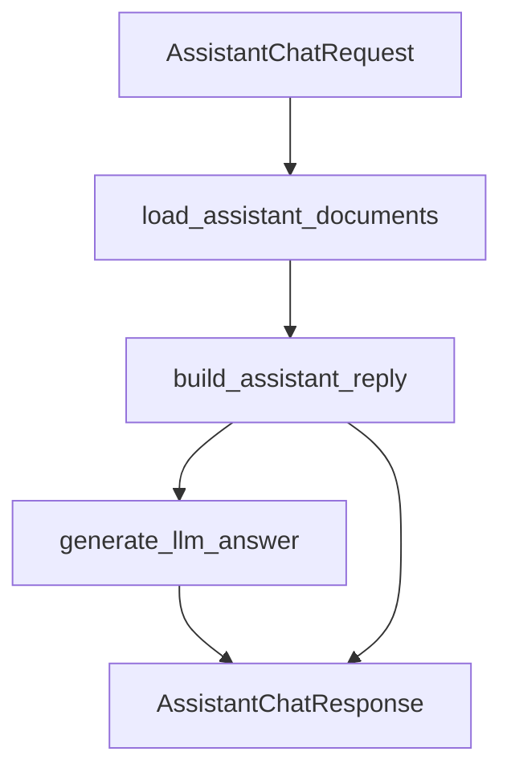
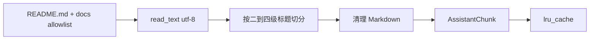
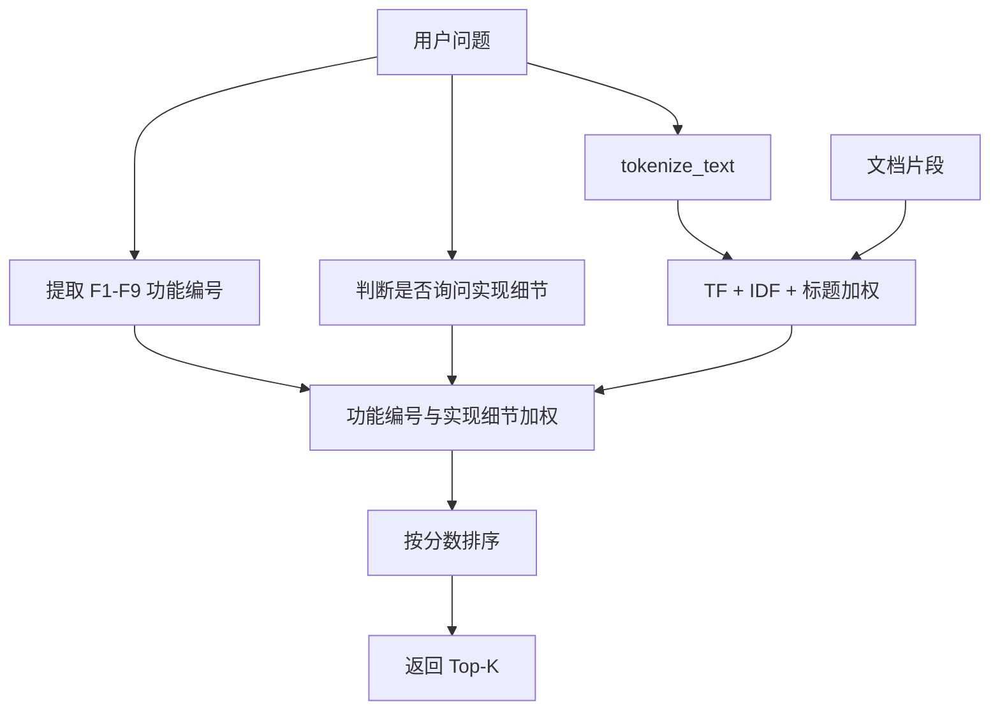
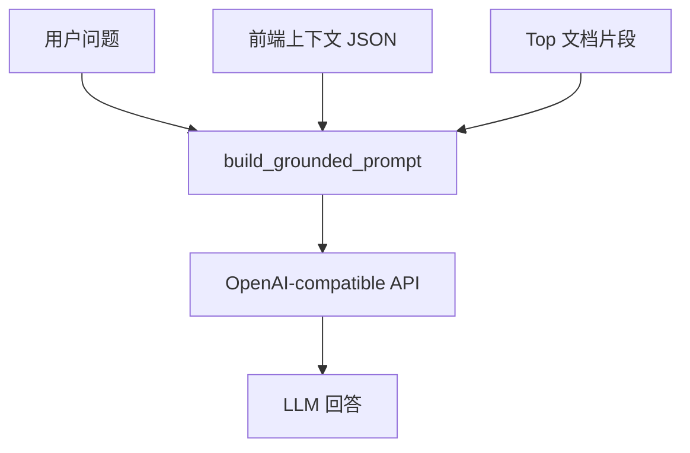
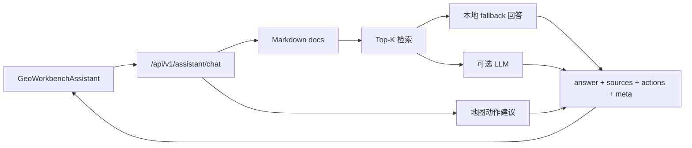

# AI 助手工作流

本文说明当前 AI 助手的真实架构。它不是自动操作代码或数据库的 Agent，而是“前端聊天入口 + 后端 Markdown 检索 + 可选 LLM 生成 + 少量地图动作建议”。

## 当前能力边界

| 能力 | 当前状态 |
|---|---|
| 基于项目文档回答问题 | 已实现，读取 `README.md` 和 `docs/` 允许目录 |
| 返回引用来源 | 已实现，返回标题、路径、标题层级和检索分数 |
| 调用大模型生成回答 | 可选，只有配置 `OPENAI_API_KEY` 时启用 |
| 无 Key 时回答 | 已实现，本地检索结果拼接回答 |
| 地图动作建议 | 已实现少量关键词识别，如放大、缩小、切换底图 |
| 自动运行 F1-F9 分析 | 未实现 |
| 自动修改代码或数据库 | 未实现 |
| 长期会话记忆 | 未实现 |

## 端到端链路



## 前端入口

前端入口是 [GeoWorkbenchAssistant.tsx](../../frontend/src/components/GeoWorkbenchAssistant.tsx)，接口封装在 [assistantService.ts](../../frontend/src/services/assistantService.ts)。

请求结构：

```typescript
export interface AssistantChatRequest {
  question: string;
  topK?: number;
  context?: AssistantRequestContext;
}
```

前端实际发送：

| 字段 | 来源 | 说明 |
|---|---|---|
| `question` | 用户输入 | 后端限制 1 到 500 字符 |
| `top_k` | `topK ?? 5` | 后端限制 1 到 8 |
| `context` | 前端传入上下文 | 当前用于补充模式、地图状态等信息 |

请求超时为 30 秒，并设置 `suppressErrorToast: true`，由组件自身处理失败提示。

## 后端接口

后端接口位于 [assistant.py](../../backend/app/api/assistant.py)。



响应字段：

| 字段 | 含义 |
|---|---|
| `answer` | 最终回答。若 LLM 可用且生成成功，用 LLM 回答；否则用本地 fallback 回答 |
| `sources` | 检索命中的文档片段来源 |
| `suggested_actions` | 地图动作建议 |
| `meta.retrieval` | 当前为 `local_markdown_top_k` |
| `meta.answer_mode` | `llm` 或 `local_fallback` |
| `meta.llm_configured` | 是否配置了 LLM Key |
| `meta.chunk_count` | 加载的文档片段数量 |
| `meta.matched_chunk_count` | 命中的片段数量 |
| `meta.context` | 回传前端上下文 |

## 文档加载与分块

文档检索逻辑位于 [assistant_retrieval.py](../../backend/app/services/assistant_retrieval.py)。

允许读取的路径：

| 路径 | 是否读取 |
|---|---|
| `README.md` | 是 |
| `docs/01-overview` | 是 |
| `docs/02-user-guide` | 是 |
| `docs/03-developer-guide` | 是 |
| `docs/04-architecture` | 是 |
| `docs/05-technical-notes` | 是 |
| 其他目录 | 否，除非修改 allowlist |

分块规则：

1. 先读取 UTF-8 文档；若失败尝试 `utf-8-sig`。
2. 提取一级标题作为文档 title。
3. 按 `##` 到 `####` 标题切分为片段。
4. 清理 Markdown 标记，保留正文文本供检索。
5. 使用 `lru_cache(maxsize=1)` 缓存加载结果。



重要影响：如果某个 Markdown 文件本身乱码，AI 助手会把乱码当作正文检索。因此架构文档必须保持正常 UTF-8 中文内容。

## 检索评分逻辑

`retrieve_top_k()` 使用轻量本地检索，不依赖向量数据库。



评分特征：

| 特征 | 当前逻辑 |
|---|---|
| 英文/数字 token | 正则提取字母、数字、下划线等 |
| 中文 token | 对连续中文生成单字、二字、三字 n-gram |
| F 编号 | 用正则提取 `f1` 到 `f9` 风格 token |
| 标题加权 | 命中标题 token 时权重更高 |
| 功能编号加权 | 问 F8 时，标题或内容包含 F8 的片段加分 |
| 不匹配功能惩罚 | 问某个 F 编号时，不相关片段分数乘以 0.03 |
| 实现细节加权 | 问“代码逻辑、实现、为什么、怎么算”等时，实现类文档加分 |

这个设计解释了为什么 `docs/05-technical-notes/f1-f9-code-logic.md` 对“F8 怎么算、F9 逻辑是什么”这类问题特别重要。

## 本地 fallback 回答

当没有配置 LLM 或 LLM 调用失败时，系统使用 `_compose_answer()`：

1. 取分数最高的片段作为主来源。
2. 从该片段挑选和问题 token 重合度高的句子。
3. 拼接 1 到 3 句回答。
4. 如果还有其他命中片段，附带“相关文档还提到”。

优点是稳定、无外部依赖；限制是表达能力弱，不能进行复杂综合推理。

## 可选 LLM 生成

LLM 调用位于 [assistant_llm.py](../../backend/app/services/assistant_llm.py)。是否启用由 `OPENAI_API_KEY` 决定。

| 配置 | 默认值 | 说明 |
|---|---|---|
| `OPENAI_API_KEY` | 空 | 为空时不调用 LLM |
| `OPENAI_BASE_URL` | `https://api.openai.com/v1` | 可接 OpenAI-compatible 服务 |
| `OPENAI_MODEL` | `gpt-4o-mini` | 默认模型名 |
| `OPENAI_API_MODE` | `chat_completions` | 支持 `chat_completions` 和 `responses` 风格 |
| `OPENAI_TIMEOUT_SECONDS` | 30 | HTTP 超时 |
| `OPENAI_MAX_OUTPUT_TOKENS` | 900 | 输出上限 |

LLM 输入不是裸问题，而是 grounded prompt：



当前实现要求 LLM 基于文档片段回答。如果文档没有覆盖，应该说明文档不足，而不是编造功能。

## 地图动作建议

`detect_map_actions()` 会在用户问题中识别少量关键词，返回 `AssistantAction`。

| 动作 | 触发示例 | 前端用途 |
|---|---|---|
| `zoom_in` | 放大、zoom in、拉近 | 放大地图 |
| `zoom_out` | 缩小、zoom out、拉远 | 缩小地图 |
| `set_map_style` | 极夜蓝、深蓝、幻影黑、黑色、标准、普通、默认 | 切换底图风格 |

这只是建议动作，不是无限制工具调用。AI 助手不会自行绘制区域、运行 F8 或修改数据库。

## 与 F1-F9 文档的关系

AI 助手回答 F1-F9 时，主要依赖以下文档：

| 问题类型 | 主要来源 |
|---|---|
| 功能是什么、用户怎么用 | [功能清单](../01-overview/feature-list.md)、[用户手册](../02-user-guide/user-manual.md) |
| 接口参数和返回 | [API 参考](../03-developer-guide/api-reference.md) |
| 数据库和表 | [数据库设计](../03-developer-guide/database-design.md)、[数据流程](../data-pipeline.md) |
| 架构关系 | [系统架构总览](./system-architecture.md)、[模块设计](./module-design.md) |
| 代码逻辑和算法细节 | [F1-F9 核心代码逻辑说明](../05-technical-notes/f1-f9-code-logic.md) |
| F8/F9 特别说明 | [F8-F9 依赖关系图](../05-technical-notes/f8-f9-dependency-map.md) |

因此，F9 相关文档必须统一写成当前真实逻辑：F9 复用 F8 返回的 `corridors` 或 `routes`，在前端按 `fastest`、`stable`、`frequent_fast` 三种策略排序。不要写成独立后端分时段接口。

## 质量风险

| 风险 | 影响 | 建议 |
|---|---|---|
| 文档过期 | AI 助手会返回过时答案 | 修改代码后同步改 docs |
| 文档乱码 | 检索片段不可读，回答质量下降 | 保持 Markdown 为 UTF-8，提交前检查中文字符 |
| 本地 fallback 表达简单 | 回答可能只是摘句 | 配置 LLM 或增加更细文档片段 |
| allowlist 太窄 | 新文档不会被检索 | 修改 `DOC_PATH_ALLOWLIST` |
| allowlist 太宽 | 无关文档污染检索 | 只开放稳定项目文档 |
| LLM 外部调用失败 | 自动退回本地回答 | 前端应展示 sources 和 answer_mode |

## 修改与验证建议

修改 AI 助手时建议按以下顺序：

1. 修改文档内容，保证事实正确。
2. 如需改变检索范围，修改 `DOC_PATH_ALLOWLIST`。
3. 如需改变检索排序，修改 `retrieve_top_k()` 并补充测试。
4. 如需改变动作识别，修改 `detect_map_actions()` 并补充测试。
5. 如需改变 LLM 模式，修改 `assistant_llm.py` 的配置和调用逻辑。

验证点：

| 验证 | 目标 |
|---|---|
| 问“F9 是怎么推荐的” | 应回答三策略前端排序，不应回答后端按时段批处理 |
| 问“F8 怎么找路线” | 应提到 A/B、候选 trip、road token、Jaccard 聚类 |
| 问“放大地图” | 应返回 `zoom_in` suggested action |
| 不配置 LLM Key | 应返回 `answer_mode=local_fallback` |
| 配置 LLM Key | 成功时返回 `answer_mode=llm` |

## Mermaid 总结图


