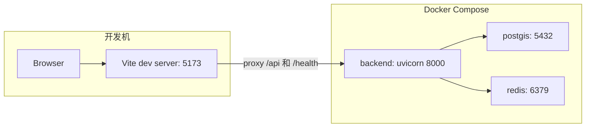
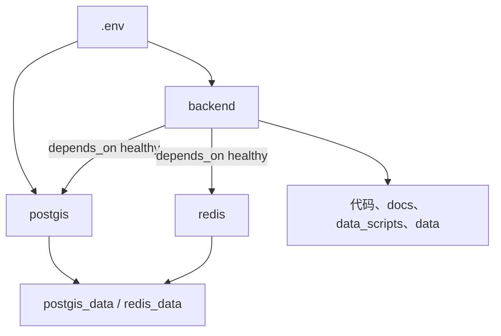
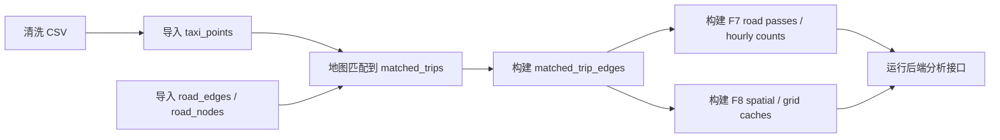

# 构建与运行原则

本文解释项目为什么这样构建、各服务如何协同，以及开发和课程演示时应遵守的真实运行边界。

## 技术选型原则

当前项目的技术栈围绕“空间数据分析 + 交互式地图工作台”设计。

| 技术 | 当前用途 | 选择原因 |
|---|---|---|
| React + Vite + TypeScript | 前端工作台 | 快速开发、类型约束、组件化、高德地图集成方便 |
| Ant Design + Tailwind CSS | UI 组件和样式 | 表单、按钮、面板、布局快速稳定，Tailwind 便于定制工作台视觉 |
| 高德地图 JS API | 地图底图和覆盖物 | 国内地图坐标、交互、线面覆盖物能力完善 |
| FastAPI | 后端 API | Pydantic 参数校验、开发效率高、接口定义清晰 |
| SQLAlchemy Core + 原生 SQL | 空间分析查询 | F3-F8 大量依赖复杂 SQL、CTE、PostGIS 函数，ORM 查询表达力不够直接 |
| PostgreSQL + PostGIS | 空间数据库 | 空间索引、几何运算、轨迹点和道路数据统一存储 |
| Redis | 服务依赖健康检查 | 当前用于 `/health`，尚未作为业务缓存层 |
| Python 数据脚本 | 离线数据管道 | 清洗、路网抽取、地图匹配、派生表构建更适合批处理脚本 |

## 构建拓扑

开发模式下，通常前端本地运行 `npm run dev`，后端和数据库用 Docker Compose。Vite 配置了代理：

| 前端请求 | 代理目标 |
|---|---|
| `/api/*` | `http://localhost:8000` |
| `/health` | `http://localhost:8000` |

`frontend/vite.config.ts` 设置了 `envDir: '..'`，因此前端读取的是项目根目录 `.env`，不是 `frontend/.env`。

## 环境变量原则

根目录 `.env` 同时被 Docker Compose 和 Vite 使用。关键变量如下：

| 变量 | 使用方 | 说明 |
|---|---|---|
| `POSTGRES_DB`、`POSTGRES_USER`、`POSTGRES_PASSWORD` | PostGIS、Backend | 数据库创建和连接 |
| `POSTGRES_PORT` | Compose | 暴露数据库端口，默认 5432 |
| `APP_PORT` | Compose | 暴露后端端口，默认 8000 |
| `REDIS_PORT` | Compose | 暴露 Redis 端口，默认 6379 |
| `VITE_API_BASE_URL` | Frontend | 真实模式下 Axios base URL |
| `VITE_DEMO_MODE` | Frontend | `true` 时启用前端-only mock |
| `VITE_AMAP_KEY`、`VITE_AMAP_SECURITY_JS_CODE` | Frontend | 高德地图 SDK 加载 |
| `OPENAI_API_KEY`、`OPENAI_BASE_URL`、`OPENAI_MODEL`、`OPENAI_API_MODE` | Backend | AI 助手可选 LLM |

安全边界：

- `VITE_*` 变量会进入前端构建产物，不能放后端密钥。
- OpenAI-compatible 密钥只应放在后端读取的变量中。
- Demo 模式不需要真实后端和 OpenAI 密钥。

## Docker Compose 原则

[docker-compose.yml](../../docker-compose.yml) 当前定义三个服务：

后端容器的挂载设计：

| 挂载 | 作用 |
|---|---|
| `./backend/app:/app/app` | 开发时后端代码热替换，容器无需重建即可读取 Python 文件变化 |
| `./docs:/app/docs:ro` | AI 助手读取文档，容器内只读 |
| `./README.md:/app/README.md:ro` | AI 助手读取根 README |
| `./data_scripts:/app/data_scripts` | 后端容器内可运行数据脚本 |
| `./data:/app/data` | 数据文件共享 |
| `./data/raw/taxi_log_2008_by_id:/app/taxi_log_2008_by_id` | 原始数据路径兼容 |
| `./data/processed/cleaned_data:/app/cleaned_data` | 清洗后数据路径兼容 |

资源限制通过环境变量调整，如 `BACKEND_CPUS`、`BACKEND_MEM_LIMIT`、`POSTGIS_SHARED_BUFFERS`、`POSTGIS_WORK_MEM` 等。

## 前端构建原则

前端 `package.json` 当前脚本：

| 命令 | 作用 |
|---|---|
| `npm run dev` | 启动 Vite 开发服务器 |
| `npm run build` | `tsc -b` 类型构建后执行 `vite build` |
| `npm run preview` | 预览构建产物 |
| `npm run typecheck` | `tsc -b --noEmit` 类型检查 |

前端实现应遵守：

1. 类型定义与接口封装放在 `trajectoryService.ts` 或对应 service 中。
2. 组件不要直接拼接 API URL，统一走 `apiClient`。
3. Demo 模式必须使用与真实接口相同的路径和大致相同的响应结构。
4. 高德地图坐标展示需注意 WGS84 与 GCJ02 转换，主页面已有转换函数。
5. F9 是前端排序逻辑，修改推荐策略不应新增不存在的后端接口。

## 后端构建原则

后端 `requirements.txt` 当前包含 FastAPI、Uvicorn、SQLAlchemy、PostGIS 相关库、Redis、H3、Pandas/GeoPandas、Pyrosm、地图匹配库等。

后端实现应遵守：

| 原则 | 说明 |
|---|---|
| 入参先由 Pydantic 校验 | 例如 `BBoxPayload`、`F8ABFrequentRoutesRequest` |
| 空结果和错误用结构化返回 | 多数分析接口返回空数组 + `meta.error`，前端据此显示 error 或 empty |
| 大查询优先 SQL 下推 | 时间、bbox、车辆范围、候选数量尽量在数据库侧过滤 |
| 空间过滤优先使用索引条件 | 常见模式是 `geom && ST_MakeEnvelope(...)` 后接 `ST_Intersects(...)` |
| 分析缓存必须显式说明位置 | 当前 F4/F6/F7/F8 是进程内缓存，不是 Redis |
| 派生表必须检查 ready 状态 | F7/F8 使用 `pipeline_build_status` 或表存在性检查 |

## API 设计原则

当前 API 不是严格 REST 资源模型，而是偏分析任务接口。命名方式以功能编号和业务动作清晰为主。

| 类型 | 命名特点 | 示例 |
|---|---|---|
| 基础读取 | `GET` + 资源路径 | `/api/v1/trajectories/polylines` |
| 空间/分析任务 | `POST` + 功能动作 | `/api/v1/analytics/f8-ab-frequent-routes` |
| 简单统计 | `GET` + query params | `/api/v1/analytics/f4-grid-density` |
| AI | `POST /chat` | `/api/v1/assistant/chat` |

不应保留或新增“当前前端没有使用且语义已过期”的接口文档。例如旧的 F9 time bucket 接口不在当前路由和前端调用中，应从文档现状中移除。

## 数据构建原则

数据管道不是后端启动时自动完整重建。真实顺序通常是：

各阶段的设计目的：

| 阶段 | 为什么需要 |
|---|---|
| 清洗 | 去除噪声、速度异常、格式异常，降低地图匹配失败率 |
| 导入 PostGIS | 后端空间查询需要数据库索引 |
| 路网抽取 | 地图匹配和道路级分析都依赖 `road_edges` |
| 地图匹配 | F2、F7、F8 需要道路几何和道路边序列 |
| `matched_trip_edges` | F8 必需，把匹配轨迹转换成 road edge 序列 |
| road passes 和 hourly counts | F7 必需或加速 |
| trip grid / spatial index | F6 through-flow 和 F8 pass-through 加速 |

## 性能原则

当前性能优化主要在三个层面：

| 层面 | 当前实现 |
|---|---|
| 前端 | F4 本地短期缓存、request id 防止旧 F8 覆盖新结果、地图覆盖物引用集中清理 |
| 后端 | F4/F6/F7/F8 进程内 TTL 缓存，F8 sampled trip 阶段缓存 |
| 数据库 | PostGIS GIST 索引、时间/车辆/道路索引、派生聚合表和网格索引 |

F4、F7、F8 都对查询范围或候选数量有限制：

- F4 bbox 过大时返回错误，提示放大地图。
- F7 bbox 模式下 bbox 过大时返回错误。
- F8 使用 `max_candidate_trips` 和候选预筛降低交互时延。

## 可靠性原则

当前可靠性更偏“本地开发与课程演示可靠”，不是生产级高可用：

| 方面 | 当前状态 |
|---|---|
| 健康检查 | `/health` 检查数据库和 Redis |
| 后端重启 | Compose `restart: unless-stopped` |
| 数据持久化 | PostGIS 和 Redis 使用 Docker volume |
| 缓存持久化 | 分析缓存不持久化，后端重启即丢失 |
| 错误展示 | 前端按 `meta.error` 或捕获异常更新状态 |
| 并发控制 | F8 前端 request id 避免旧请求覆盖新状态 |
| 鉴权 | 当前未实现 |

如果要生产化，建议新增：

1. 认证与权限控制。
2. 后端任务队列和异步任务状态表。
3. Redis 或数据库级共享缓存。
4. 结构化日志与查询审计。
5. 数据管道执行记录和自动化校验。

## 验证原则

修改后建议至少做三类验证：

| 修改类型 | 验证方式 |
|---|---|
| 前端类型或组件 | 在 `frontend/` 运行 `npm run typecheck` |
| 后端 Python 语法 | 对修改文件运行 `python -m py_compile` |
| 文档和 Mermaid | 检查 Markdown 链接、搜索过期接口名、验证 Mermaid 基本结构 |

文档真实性检查关键词：

- 不应出现当前不存在的 F9 time bucket 接口。
- 不应把 F9 描述为后端分时段计算。
- 不应把 F4 当前接口写成 H3 base-density 后端接口。
- 不应把 Redis 写成 F4/F6/F7/F8 的业务缓存。

## 构建边界

当前构建体系的真实边界：

- 前端没有单独部署配置文件，默认是本地 Vite dev 或 Vite build。
- 后端没有 Alembic 迁移系统，数据库结构主要靠 `schema.sql` 和脚本维护。
- 数据脚本不是 Compose 中的定时任务。
- AI 助手可以在没有 LLM Key 时工作，但只返回本地 Markdown 检索拼接结果。
- F9 推荐由前端完成，不需要后端容器重建。

更详细的操作步骤见 [构建与运行指南](../03-developer-guide/build-and-run.md) 和 [快速启动](../02-user-guide/quick-start.md)。
