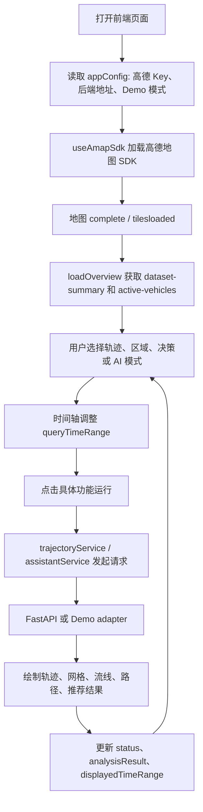
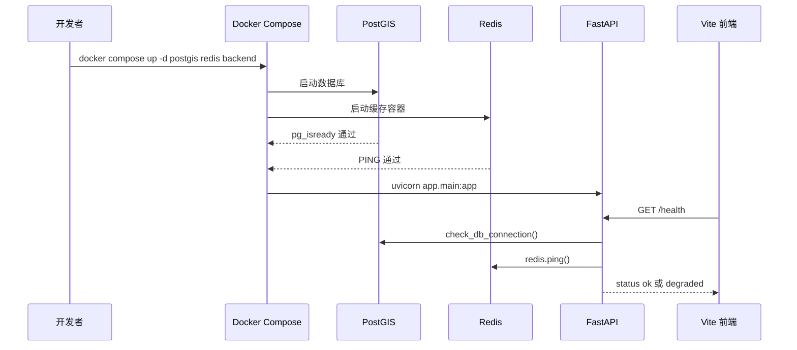
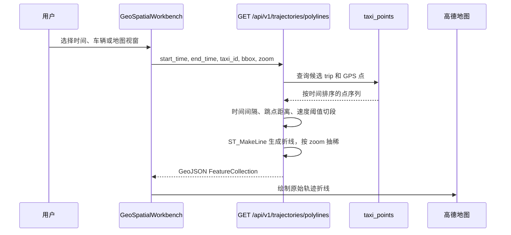
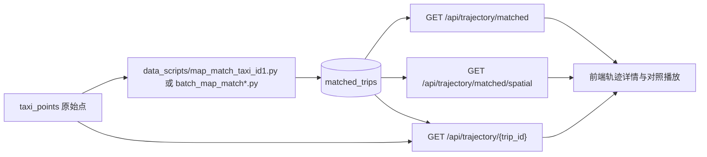
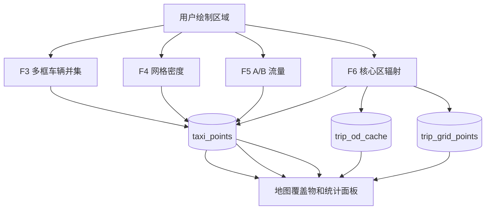
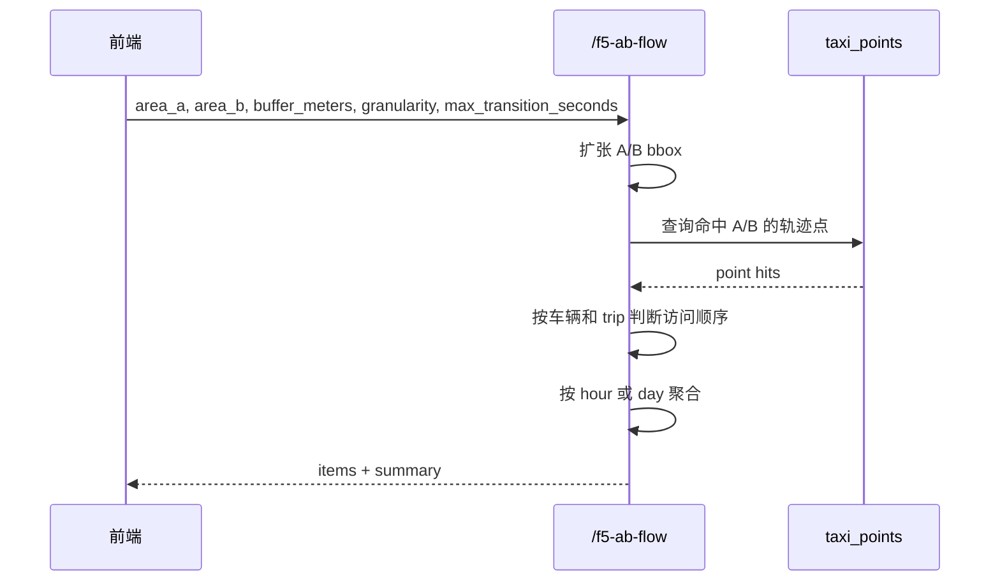
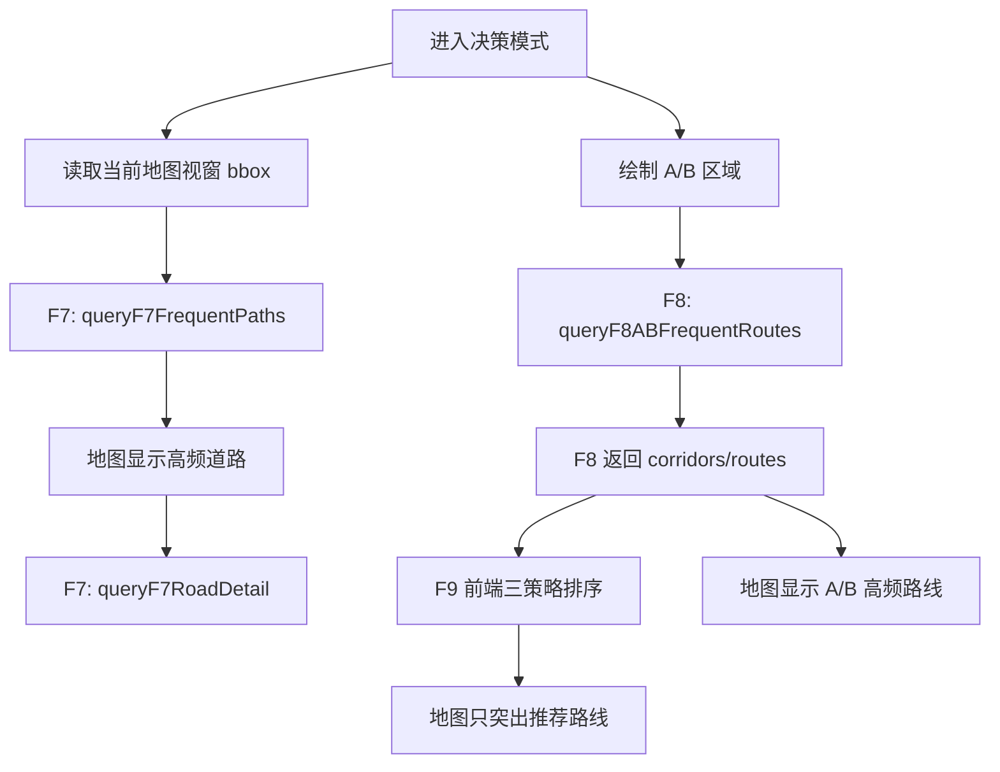
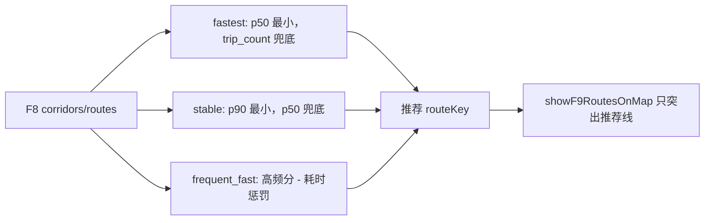
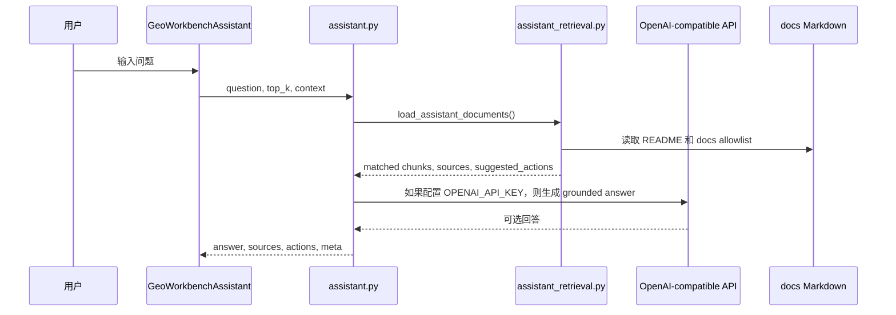

# 核心业务流程

本文从用户操作和系统调用两条线说明当前工作流。重点说明真实代码中的数据流、状态更新和功能边界。

## 工作台主循环

前端主页面 [GeoSpatialWorkbench.tsx](../../frontend/src/pages/GeoSpatialWorkbench.tsx) 承担当前大部分编排职责：加载高德地图、管理全局时间范围、根据侧栏模式切换功能、调用接口、绘制地图覆盖物、维护运行状态。

关键状态：

| 状态 | 含义 |
|---|---|
| `queryTimeRange` | 用户在时间轴上选择但未必已经应用的查询时间 |
| `displayedTimeRange` | 当前地图结果实际对应的时间范围 |
| `mode` | 当前工作区：概览、轨迹、区域、决策等 |
| `status` | `idle`、`computing`、`ready`、`empty`、`error` |
| `analysisResult` | 右侧或顶部展示的当前结果摘要 |
| `decisionMapLayer` | 决策模式下当前地图展示层：F7、F8、F9 等 |

## 启动与服务健康

真实模式下，推荐启动顺序是 PostGIS、Redis、Backend、Frontend。`docker-compose.yml` 中后端依赖 PostGIS 和 Redis 的 healthcheck。

`/health` 的 `degraded` 不等于所有业务接口都不可用。它表示数据库或 Redis 至少有一个异常。当前业务分析主要依赖 PostGIS；Redis 当前只用于健康检查，不承载 F4/F6/F7/F8 分析缓存。

## 时间轴应用流程

时间轴在所有功能中都是核心输入。前端将百分比范围转换为后端时间字符串：

1. 用户拖动时间轴，更新 `queryTimeRange`。
2. 用户点击应用或运行功能，前端调用 `toBackendTime()` 得到 `startTime` 和 `endTime`。
3. 请求成功后才把 `displayedTimeRange` 更新为本次实际查询范围。
4. 如果用户拖动后没有重新运行，界面会保留“查询时间”和“展示时间”的差异。

这样做可以避免地图上显示的是旧结果，而用户误以为已经自动按新时间重算。

## F1 原始轨迹流程

F1 面向原始 GPS 点。后端不直接返回散点，而是按 `taxi_id + trip_id + segment_id` 聚合成折线。

F1 的异常切段规则来自 [trajectory.py](../../backend/app/api/trajectory.py)：

| 参数 | 默认值 | 用途 |
|---|---:|---|
| `max_gap_minutes` | 40 | 相邻点时间间隔过大则开启新段 |
| `max_jump_km` | 30.0 | 相邻点空间跳跃过大则开启新段 |
| `max_speed_kmh` | 140.0 | 相邻点速度异常则开启新段 |
| `use_zoom_simplify` | true | 低缩放级别加强抽稀 |

## F2 地图匹配轨迹流程

F2 读取离线地图匹配结果。它不会现场运行 HMM 地图匹配，而是从 `matched_trips` 表读取已构建的 `matched_geom`。

三个接口分工：

| 接口 | 作用 |
|---|---|
| `GET /api/trajectory/matched` | 按 `taxi_id` 和可选 `trip_ids` 批量取匹配轨迹 |
| `GET /api/trajectory/matched/spatial` | 按时间、车辆范围、可选 bbox 查匹配轨迹和统计数量 |
| `GET /api/trajectory/{trip_id}` | 返回某个 trip 的原始点和匹配线，便于对照 |

## F3-F6 区域分析流程

区域分析都围绕用户绘制的矩形或核心区域进行。F3/F4 以 `taxi_points` 为主，F5 仍基于原始点判断 A/B 访问顺序，F6 在严格 OD 模式下优先使用 `trip_od_cache`，穿越流模式可使用 `trip_grid_points` 加速。

### F3 多框车辆并集

前端把多个 bbox 打包为 `bboxes`，调用：

- `POST /api/v1/analytics/active-vehicles-union`
- `POST /api/v1/analytics/active-vehicles-union-detail`

后端对每个 bbox 执行 PostGIS 相交判断，按车辆去重，并可返回车辆命中的框编号和 trip 列表。前端点击车辆行时，再加载该车辆相关轨迹用于地图定位。

### F4 网格密度

当前真实后端接口是 `GET /api/v1/analytics/f4-grid-density`。算法不是独立 H3 base-density 后端路由，而是：

1. 将用户 bbox 转为 3857 坐标系。
2. 按 `grid_size_m` 对 bbox 边界吸附到米制网格。
3. 从 `taxi_points` 查询时间范围内点。
4. 计算每个网格的 `point_count`，可选计算 `vehicle_count`。
5. 返回 compact `cells`，前端绘制热力图或分级面。

F4 前端还有本地缓存，后端也有 60 秒进程内缓存。当前运行路径仍以 `f4-grid-density` 为准。

### F5 A/B 流量

F5 使用两个区域 A 和 B，统计车辆在时间范围内从 A 到 B 或从 B 到 A 的转移数量。

`f5-transition-threshold-recommendation` 只根据 A/B 中心距离、保守速度、绕行系数和上下限给出 `max_transition_seconds` 建议值，不读取轨迹流量。

### F6 区域辐射

F6 支持：

| 参数 | 当前含义 |
|---|---|
| `direction` | `outbound`、`inbound`、`both` |
| `analysis_mode` | `strict_od` 使用 trip 起终点；`through_flow` 可通过轨迹穿越点判断 |
| `h3_resolution` | 外部区域用 H3 cell 聚合 |
| `top_k` | 返回流量最大的外部区域 |

后端会尝试导入 Python `h3` 包。如果后端镜像未安装 `h3`，接口会返回错误信息，提示重建后端镜像。

## F7-F9 决策流程

决策面板的入口是 [GeoWorkbenchDecisionPanel.tsx](../../frontend/src/components/GeoWorkbenchDecisionPanel.tsx)，实际计算由 `GeoSpatialWorkbench` 中的 `runDecisionF7`、`runDecisionF8` 和 F9 前端排序共同完成。

### F7 高频道路走廊

`runDecisionF7` 当前调用 `queryF7FrequentPaths`，传入：

- 当前时间范围；
- 当前地图 bbox；
- `topK`；
- 最小道路组长度；
- `scope: 'bbox'`；
- `sortMode: 'frequency'`。

后端优先级：

1. 若 `matched_trip_road_passes` 已 ready 且时间窗口不超过精确窗口限制，使用精确 road passes。
2. 否则如果有 `matched_road_group_hourly_counts`，先按道路组小时聚合筛候选，再回查精确组成。
3. 否则退到 `matched_road_hourly_counts` 的道路边小时聚合。

F7 road detail 用 `POST /api/v1/analytics/f7-road-detail` 根据 road group、direction、component 取具体道路段。

### F8 A/B 高频路线

`runDecisionF8` 当前调用 `queryF8ABFrequentRoutes`，传入 A/B 区域、时间、Top-K、candidate mode、buffer、min support、边长和路线长度阈值、候选 trip 上限。

后端必须存在 `matched_trip_edges`，否则会返回错误要求运行 `data_scripts/build_matched_trip_edges.py --rebuild`。

F8 主要阶段：

1. 用 `trip_od_cache` 取时间范围内 trip 起终点和持续时间。
2. 在 `pass_through` 模式下，如果 `trip_spatial_index` 和 `trip_grid_points` ready，则先用网格索引预筛 A/B 命中 trip。
3. 精确确认 A 在 B 之前，并截取 A 到 B 的道路边序列。
4. 将道路边转换为主干 road token 或 edge token。
5. 使用 Jaccard 相似图和连通分量聚类，形成候选 route/corridor。
6. 过滤耗时异常、低质量代表轨迹，选择真实 trip 几何作为代表线。
7. 返回 `corridors`，同时返回兼容前端旧结构的 `routes`。

### F9 三策略推荐

F9 不发起后端请求。它直接复用 F8 结果，按以下策略给出推荐路线：

因此，文档和演示中不要把 F9 说成独立的按时段后端推荐接口。当前它是“基于 F8 结果的前端三策略排序推荐”。

## AI 助手流程

AI 助手入口在前端 `GeoWorkbenchAssistant`。服务层调用 `POST /api/v1/assistant/chat`。

AI 助手不是独立智能体执行器。当前它只基于文档检索回答，并能返回少量地图动作建议，如放大、缩小、切换底图。

## 错误处理与空结果

各功能大致遵循相同模式：

| 场景 | 处理方式 |
|---|---|
| 参数非法 | 后端返回 `meta.error` 或 `error`，前端设置 `status = 'error'` |
| 查询无结果 | 后端返回空数组，前端设置 `status = 'empty'` |
| 请求过慢 | 前端为 F6/F7/F8 设置较长 timeout，按钮进入 loading |
| 后端结果过期 | F8 使用 request id 防止旧请求覆盖新状态 |
| Demo 模式 | 使用 fixtures 或 mock API，避免真实后端依赖 |

## 与技术说明的关系

本文件关注“用户操作如何流经系统”。更细的算法解释见：

- [F1-F9 核心代码逻辑说明](../05-technical-notes/f1-f9-code-logic.md)
- [F1 轨迹查询与路径生成逻辑](../05-technical-notes/f1-trajectory-logic.md)
- [F8-F9 依赖关系图](../05-technical-notes/f8-f9-dependency-map.md)
