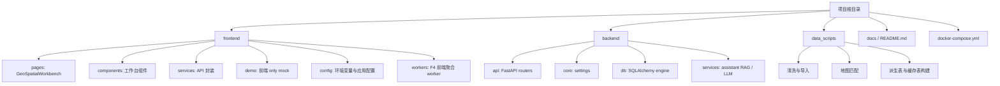
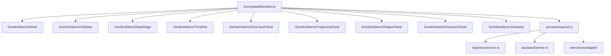
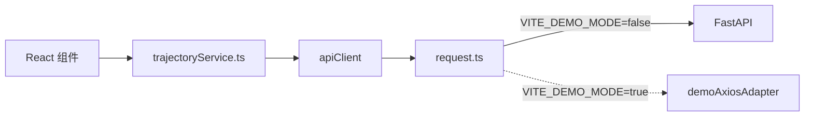
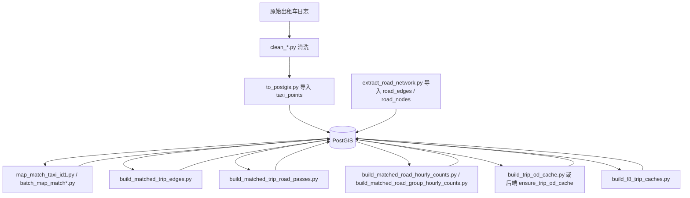
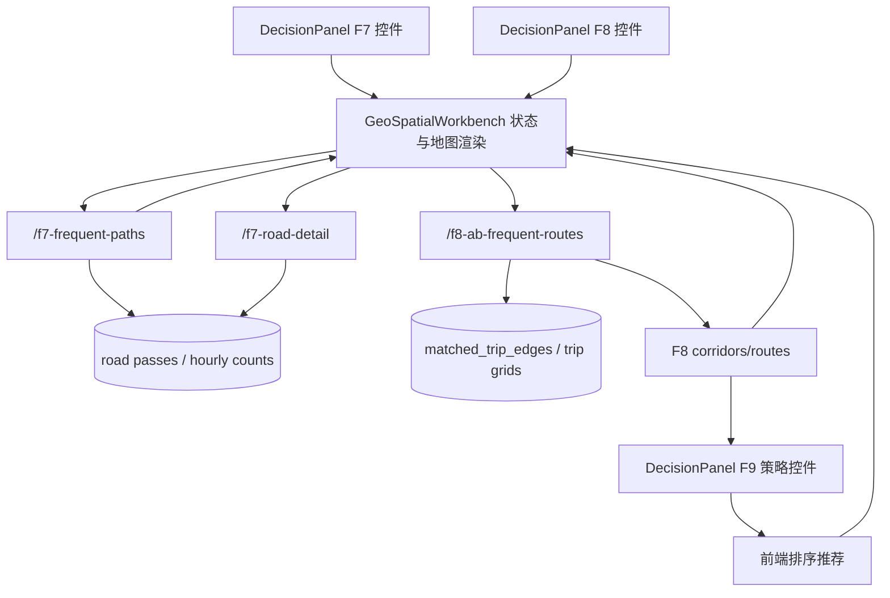

# 模块设计

本文说明当前代码模块如何划分、彼此如何依赖，以及哪些模块是当前真实运行路径。它适合开发者修改功能前快速定位代码。

## 模块总览

## 前端模块

前端采用 React + Vite。当前不是多页面应用，主业务集中在 `GeoSpatialWorkbench` 页面内，再拆分成多个工作台组件。

| 文件或目录 | 当前职责 |
|---|---|
| [index.tsx](../../frontend/src/index.tsx) | React 应用入口，挂载 `GeoSpatialWorkbench` |
| [GeoSpatialWorkbench.tsx](../../frontend/src/pages/GeoSpatialWorkbench.tsx) | 主状态机和业务编排：地图、时间轴、F1-F9、AI、覆盖物渲染 |
| [components/](../../frontend/src/components) | 可视组件：Shell、Sidebar、MapStage、TrajectoryPanel、RegionPanel、DecisionPanel、Timeline、Assistant |
| [trajectoryService.ts](../../frontend/src/services/trajectoryService.ts) | 轨迹和 F3-F8 的 API 类型与请求函数 |
| [assistantService.ts](../../frontend/src/services/assistantService.ts) | AI 助手请求封装 |
| [request.ts](../../frontend/src/services/request.ts) | Axios 实例、baseURL、Demo adapter、错误提示 |
| [appConfig.ts](../../frontend/src/config/appConfig.ts) | 读取 Vite 环境变量，生成运行配置 |
| [mockApi.ts](../../frontend/src/demo/mockApi.ts) | Demo 模式下模拟后端接口 |
| [f4H3AggregationWorker.ts](../../frontend/src/workers/f4H3AggregationWorker.ts) | F4 前端聚合 worker，当前真实后端路径仍是 `f4-grid-density` |

### 前端组件关系

组件设计特点：

| 组件 | 设计重点 |
|---|---|
| `GeoWorkbenchShell` | 页面框架、布局容器 |
| `GeoWorkbenchSidebar` | 模式切换和功能入口 |
| `GeoWorkbenchMapStage` | 地图容器、状态遮罩、基础地图交互 |
| `GeoWorkbenchTrajectoryPanel` | F1/F2 轨迹列表、选中、播放、导出 |
| `GeoWorkbenchRegionPanel` | F3-F6 区域工具入口和参数面板 |
| `GeoWorkbenchDecisionPanel` | F7-F9 决策参数、F8/F9 列表与推荐策略 |
| `GeoWorkbenchTimeline` | 全局时间范围选择与状态提示 |
| `GeoWorkbenchAssistant` | 文档问答和地图动作建议 |

### 主页面为什么较重

`GeoSpatialWorkbench.tsx` 当前承担大量职责，是项目仍在课程/原型阶段的结果：

- 高德地图实例和所有覆盖物引用必须集中管理，避免组件卸载后遗留地图对象。
- F3-F9 之间共享区域、时间、地图视窗和运行状态。
- F8 与 F9 强绑定，F9 必须知道 F8 当前结果和推荐 routeKey。
- Demo 模式和真实模式共用同一套 UI 状态。

如果后续重构，建议优先把“地图覆盖物绘制”和“F3-F9 状态机”拆成 hooks，而不是先改接口形状。

## 前端服务层设计

`trajectoryService.ts` 同时定义 TypeScript 返回类型和请求函数。这样组件拿到的是业务结构，而不是裸 Axios 响应。

主要函数：

| 函数 | 后端接口 | 功能 |
|---|---|---|
| `queryMatchedByTrips` | `GET /api/trajectory/matched` | 批量读取匹配轨迹 |
| `queryRawTrajectoryByTrip` | `GET /api/trajectory/{trip_id}` | 单 trip 原始点和匹配线 |
| `queryUnionVehicleDetailByBBoxes` | `POST /api/v1/analytics/active-vehicles-union-detail` | F3 多框车辆明细 |
| `queryF4GridDensity` | `GET /api/v1/analytics/f4-grid-density` | F4 网格密度 |
| `queryF5ABFlow` | `POST /api/v1/analytics/f5-ab-flow` | F5 A/B 流量 |
| `queryF5TransitionThresholdRecommendation` | `POST /api/v1/analytics/f5-transition-threshold-recommendation` | F5 阈值建议 |
| `queryF6RadiationFlow` | `POST /api/v1/analytics/f6-radiation-flow` | F6 区域辐射 |
| `queryF7FrequentPaths` | `POST /api/v1/analytics/f7-frequent-paths` | F7 高频走廊 |
| `queryF7RoadDetail` | `POST /api/v1/analytics/f7-road-detail` | F7 道路明细 |
| `queryF8ABFrequentRoutes` | `POST /api/v1/analytics/f8-ab-frequent-routes` | F8 A/B 高频路线 |

当前没有 `queryF9...` 函数，因为 F9 没有独立后端接口。

## 后端模块

后端是 FastAPI 应用，入口是 [main.py](../../backend/app/main.py)。`main.py` 负责创建 app、配置 CORS、挂载 routers。

| 文件 | 当前职责 |
|---|---|
| [main.py](../../backend/app/main.py) | FastAPI app 创建、CORS、路由挂载 |
| [health.py](../../backend/app/api/health.py) | `/health`，检查 PostGIS 和 Redis |
| [trajectory.py](../../backend/app/api/trajectory.py) | F1 原始轨迹折线 |
| [matched.py](../../backend/app/api/matched.py) | F2 匹配轨迹、空间查询、单 trip 对照 |
| [analytics.py](../../backend/app/api/analytics.py) | 概览、F3-F8 全部分析接口 |
| [assistant.py](../../backend/app/api/assistant.py) | AI 助手 `/chat` |
| [config.py](../../backend/app/core/config.py) | `DATABASE_URL`、`REDIS_URL`、OpenAI-compatible 配置 |
| [session.py](../../backend/app/db/session.py) | SQLAlchemy engine、数据库连通性检查 |
| [assistant_retrieval.py](../../backend/app/services/assistant_retrieval.py) | Markdown 文档加载、分块、检索、地图动作识别 |
| [assistant_llm.py](../../backend/app/services/assistant_llm.py) | 可选 LLM 调用，支持 chat completions 或 responses 风格 |

### analytics.py 内部划分

`analytics.py` 当前是最大模块，包含请求模型、缓存、辅助函数和 F3-F8 路由。真实结构可以按功能理解：

| 区域 | 代表代码 | 说明 |
|---|---|---|
| 请求模型 | `BBoxPayload`、`F5ABFlowRequest`、`F6RadiationFlowRequest`、`F7FrequentPathsRequest`、`F8ABFrequentRoutesRequest` | Pydantic 入参校验 |
| 公共空间辅助 | `expand_bbox_by_meters`、H3 helpers、grid key helpers | bbox 扩张、H3 cell、网格索引 |
| 缓存 | `F4_RESPONSE_CACHE`、`F6_RESPONSE_CACHE`、`F7_RESPONSE_CACHE`、`F8_RESPONSE_CACHE` | 进程内 TTL 缓存 |
| 数据存在性检查 | `matched_trip_edges_exists`、`trip_spatial_index_exists`、`trip_grid_points_exists`、`matched_trip_road_passes_exists` | 判断派生表是否 ready |
| F3/F4 | active vehicle、grid density | 基于 `taxi_points` |
| F5/F6 | A/B flow、radiation flow | 基于轨迹点、OD cache、H3 |
| F7 | frequent paths、road detail | 基于道路通行派生表 |
| F8 | A/B frequent routes | 基于匹配道路边序列、空间索引和路线聚类 |

## 数据脚本模块

数据脚本是离线管道，不是后端请求直接调用的任务队列。它们通常在开发者或数据构建阶段手工运行。

脚本职责：

| 脚本 | 输出或作用 |
|---|---|
| `clean_to_folder_speed_filter.py` | 清洗原始轨迹文件、处理速度异常并切分 trip |
| `to_postgis.py` | 导入 `taxi_points` |
| `extract_road_network.py` | 提取 `road_edges`、`road_nodes` |
| `batch_map_match.py`、`map_match_taxi_id1.py` | 构建 `matched_trips`，其中 `map_match_taxi_id1.py` 提供核心 HMM/Viterbi 算法 |
| `build_matched_trip_edges.py` | 将匹配轨迹展开为 `matched_trip_edges` |
| `build_matched_trip_road_passes.py` | 构建 F7 使用的道路经过表 |
| `build_matched_road_hourly_counts.py`、`build_matched_road_group_hourly_counts.py` | 构建 F7 快速候选聚合 |
| `build_trip_od_cache.py` | 构建 trip 起终点缓存 |
| `build_f8_trip_caches.py` | 构建 F8 相关空间和点网格缓存 |

## 数据表模块

可以按“原始层、路网层、匹配层、派生分析层”理解数据库。

| 层级 | 表 | 用途 |
|---|---|---|
| 原始层 | `taxi_points` | F1、F3、F4、F5 的直接来源，也用于 F6/F8 fallback |
| 路网层 | `road_edges`、`road_nodes` | 地图匹配、F7/F8 道路语义与几何 |
| 匹配层 | `matched_trips`、`matched_trip_edges` | F2、F7、F8 的基础 |
| 道路通行层 | `matched_trip_road_passes`、`matched_road_hourly_counts`、`matched_road_group_hourly_counts` | F7 高频道路走廊 |
| 空间索引层 | `trip_spatial_index`、`trip_grid_points` | F6 through-flow 和 F8 pass-through 预筛 |
| 路线 token 层 | `trip_token_sequence`、`trip_edge_sequence_cache`、`road_edge_feature_cache` | F8 相关预计算和扩展空间 |
| 状态层 | `pipeline_build_status` | 标记派生表是否 ready |

## F7-F9 模块依赖

F9 的依赖很短：`F8Result -> DecisionPanel 排序 -> showF9RoutesOnMap`。所以修改 F8 返回字段时，要优先检查 F9 是否仍能读取 `trip_count`、`avg_duration_min`、`p50_duration_min`、`p90_duration_min`、`corridor_signature` 或 `route_signature`。

## Demo 模块

Demo 模式入口在 [request.ts](../../frontend/src/services/request.ts)，配置来自 `appConfig.demoMode`。当 `VITE_DEMO_MODE=true` 时，Axios 使用 [mockApi.ts](../../frontend/src/demo/mockApi.ts)。

Demo 覆盖的接口与真实前端调用保持一致，包括：

- dataset summary、active vehicles；
- F1/F2 轨迹相关接口；
- F3 多框车辆并集；
- F4-F8 分析接口；
- AI 助手 `/api/v1/assistant/chat`。

Demo 模块的设计目标是“课程提交和交互演示可运行”，不是性能或算法正确性的替代品。

## 修改建议

常见修改应优先落在以下位置：

| 目标 | 优先修改位置 |
|---|---|
| 改接口参数或返回字段 | 后端 `analytics.py` 请求模型和函数，前端 `trajectoryService.ts` 类型 |
| 改 F9 推荐策略 | `GeoWorkbenchDecisionPanel.tsx`，不需要新增后端接口 |
| 改地图绘制样式 | `GeoSpatialWorkbench.tsx` 中对应 `draw*`、`render*` 函数 |
| 改 Demo 数据 | `frontend/src/demo/mockApi.ts` 或 demo fixtures |
| 改 AI 检索范围 | `assistant_retrieval.py` 的 allowlist 和分块规则 |
| 改数据库结构 | `data_scripts/schema.sql` 和对应构建脚本 |

如果新增功能跨越前端、后端和数据表，建议同步更新：

- [API 参考](../03-developer-guide/api-reference.md)
- [数据库设计](../03-developer-guide/database-design.md)
- [F1-F9 核心代码逻辑说明](../05-technical-notes/f1-f9-code-logic.md)
