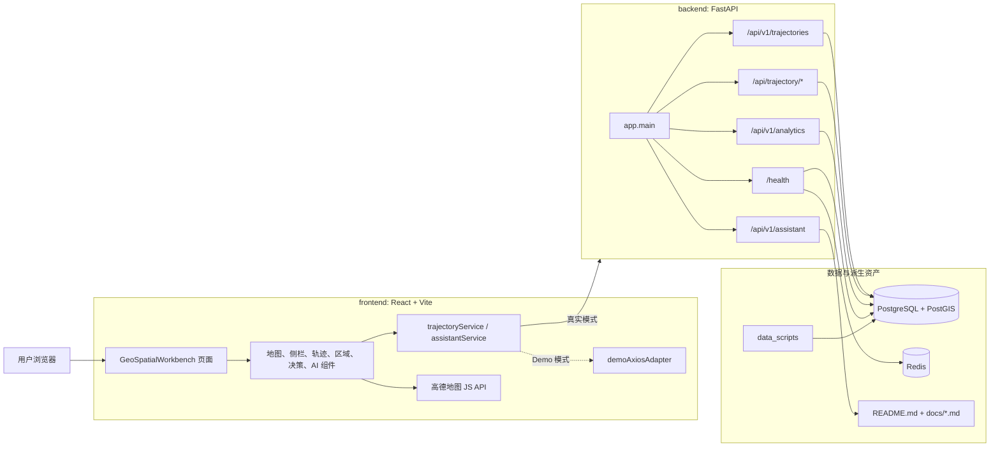
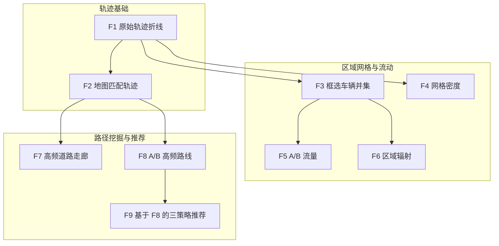
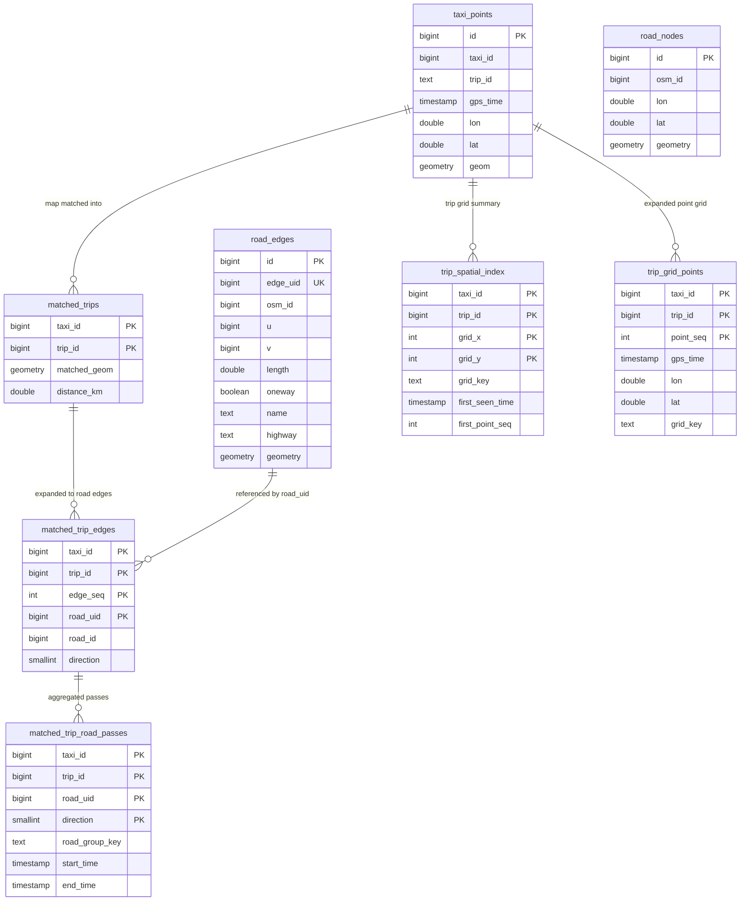

# 系统架构总览

本文说明当前项目的真实系统架构。内容以代码为准，主要参考：

- 前端入口：[GeoSpatialWorkbench.tsx](../../frontend/src/pages/GeoSpatialWorkbench.tsx)
- 前端接口封装：[trajectoryService.ts](../../frontend/src/services/trajectoryService.ts)
- 后端路由：[analytics.py](../../backend/app/api/analytics.py)、[trajectory.py](../../backend/app/api/trajectory.py)、[matched.py](../../backend/app/api/matched.py)、[assistant.py](../../backend/app/api/assistant.py)
- 数据表与索引：[schema.sql](../../data_scripts/schema.sql)
- 容器编排：[docker-compose.yml](../../docker-compose.yml)

## 架构定位

项目是一个面向出租车轨迹数据的城市交通分析系统。它不是单纯地图展示页面，而是由“前端交互工作台 + FastAPI 分析服务 + PostGIS 空间数据库 + 离线数据脚本”共同组成的分析应用。

当前真实分层如下：

| 层级 | 当前实现 | 主要职责 |
|---|---|---|
| 前端工作台 | React 18、Vite、TypeScript、Ant Design、Tailwind CSS、高德地图 JS API | 地图交互、时间轴、F1-F9 功能组织、结果渲染、Demo mock、AI 助手入口 |
| 后端 API | FastAPI、SQLAlchemy Core、Pydantic | 提供轨迹、匹配轨迹、统计分析、AI 助手接口 |
| 空间数据层 | PostgreSQL 16 + PostGIS | 存储原始 GPS 点、道路网络、地图匹配结果、派生索引与聚合表 |
| 缓存与健康检查 | Redis 容器 + 后端进程内缓存 | Redis 当前用于健康检查；F4/F6/F7/F8 结果缓存是后端进程内字典 |
| 数据构建脚本 | `data_scripts/` 下的 Python 脚本 | 清洗、导入、路网抽取、地图匹配、派生表构建 |
| 文档与 RAG | `README.md`、`docs/` | 被 AI 助手按 Markdown 分块检索，作为回答依据 |

## 总体结构图

## 运行时边界

前端通过 `VITE_DEMO_MODE` 决定走真实后端还是前端 mock。

| 模式 | 请求路径 | 数据来源 | 适用场景 |
|---|---|---|---|
| 真实模式 | Axios 请求 `VITE_API_BASE_URL`，默认 `http://<host>:8000` | FastAPI + PostGIS | 完整开发、验收、真实数据分析 |
| Demo 模式 | Axios adapter 拦截请求 | [mockApi.ts](../../frontend/src/demo/mockApi.ts) 和 demo fixtures | 课程演示、无后端环境预览 |

注意：Demo 模式只模拟接口形状和交互效果，不代表完整数据库规模、性能或真实统计结果。

## 后端路由拓扑

`backend/app/main.py` 当前只挂载以下路由模块：

```mermaid
flowchart TD
  Main["FastAPI app.main"]
  Main --> Health["health_router: /health"]
  Main --> Traj["trajectory_router: /api/v1/trajectories"]
  Main --> Analytics["analytics_router: /api/v1/analytics"]
  Main --> Matched["matched_router: /api"]
  Main --> Assistant["assistant_router: /api/v1/assistant"]

  Traj --> F1["GET /polylines"]
  Matched --> F2a["GET /trajectory/matched"]
  Matched --> F2b["GET /trajectory/matched/spatial"]
  Matched --> F2c["GET /trajectory/{trip_id}"]
  Analytics --> Overview["GET /dataset-summary, /active-vehicles"]
  Analytics --> F3["POST /active-vehicles-union, /active-vehicles-union-detail"]
  Analytics --> F4["GET /f4-grid-density"]
  Analytics --> F5["POST /f5-transition-threshold-recommendation, /f5-ab-flow"]
  Analytics --> F6["POST /f6-radiation-flow"]
  Analytics --> F7["POST /f7-frequent-paths, /f7-road-detail"]
  Analytics --> F8["POST /f8-ab-frequent-routes"]
  Assistant --> Chat["POST /chat"]
```

当前真实接口清单：

| 功能区 | 接口 | 说明 |
|---|---|---|
| 基础 | `GET /`、`GET /health` | 根路径和健康检查，`/health` 检查 PostGIS 与 Redis |
| F1 原始轨迹 | `GET /api/v1/trajectories/polylines` | 从 `taxi_points` 生成轨迹折线，支持时间、车辆、视窗、抽稀和异常切段 |
| F2 匹配轨迹 | `GET /api/trajectory/matched`、`GET /api/trajectory/matched/spatial`、`GET /api/trajectory/{trip_id}` | 从 `matched_trips` 和 `taxi_points` 读取地图匹配轨迹、空间查询和单 trip 对照 |
| 概览/F3 | `GET /api/v1/analytics/dataset-summary`、`GET /api/v1/analytics/active-vehicles`、`POST /api/v1/analytics/active-vehicles-union`、`POST /api/v1/analytics/active-vehicles-union-detail` | 数据集概览、活跃车辆数、多框并集与车辆明细 |
| F4 | `GET /api/v1/analytics/f4-grid-density` | 按 Web Mercator 米制网格聚合轨迹点，返回 compact cells 或 GeoJSON |
| F5 | `POST /api/v1/analytics/f5-transition-threshold-recommendation`、`POST /api/v1/analytics/f5-ab-flow` | 推荐 A/B 转移阈值，统计 A→B、B→A 时间序列与汇总 |
| F6 | `POST /api/v1/analytics/f6-radiation-flow` | 以核心区域为中心统计外部 H3 区域流入/流出 |
| F7 | `POST /api/v1/analytics/f7-frequent-paths`、`POST /api/v1/analytics/f7-road-detail` | 当前视窗内高频道路走廊和道路明细 |
| F8 | `POST /api/v1/analytics/f8-ab-frequent-routes` | A/B 高频路线挖掘，返回 corridors 和兼容 routes |
| AI | `POST /api/v1/assistant/chat` | Markdown RAG + 可选 OpenAI-compatible LLM |

不存在的当前接口不要写成现状：没有独立 F9 后端接口，也没有当前可用的 F4 H3 base-density 后端接口。

## F1-F9 归属关系

关键事实：

| 功能 | 前端入口 | 后端计算 | 主要数据表 |
|---|---|---|---|
| F1 | `GeoSpatialWorkbench` 轨迹模式 | `get_trajectory_polylines` | `taxi_points` |
| F2 | 轨迹详情、匹配轨迹切换 | `matched.py` 三个接口 | `taxi_points`、`matched_trips` |
| F3 | 区域工具框选 | `active-vehicles-union*` | `taxi_points` |
| F4 | 区域工具密度图 | `f4-grid-density` | `taxi_points` |
| F5 | A/B 区域流量 | `f5-ab-flow` | `taxi_points` |
| F6 | 核心区域辐射 | `f6-radiation-flow` | `trip_od_cache`、`trip_grid_points`、`taxi_points` |
| F7 | 决策面板高频道路 | `f7-frequent-paths`、`f7-road-detail` | `matched_trip_road_passes`、`matched_road_group_hourly_counts`、`matched_road_hourly_counts`、`road_edges` |
| F8 | 决策面板 A/B 高频路线 | `f8-ab-frequent-routes` | `matched_trip_edges`、`trip_od_cache`、`trip_spatial_index`、`trip_grid_points`、`road_edges` |
| F9 | 决策面板推荐卡片 | 无独立后端，使用 F8 结果在前端排序 | 复用 F8 返回的 `corridors` 或 `routes` |

## 数据表视图

`trip_od_cache` 由后端 `ensure_trip_od_cache()` 按需创建，不在 `schema.sql` 中静态声明。它从 `taxi_points` 提取每个 trip 的起终点、起止时间、持续时间，用于 F6 和 F8。

## 缓存设计

| 缓存 | 位置 | TTL | 说明 |
|---|---|---:|---|
| F4 响应缓存 | `analytics.py` 进程内 `F4_RESPONSE_CACHE` | 60 秒 | 按时间、bbox、网格大小、格式等构造 JSON key |
| F6 响应缓存 | `analytics.py` 进程内 `F6_RESPONSE_CACHE` | 45 秒 | 命中后 `elapsed_ms` 置 0，并保留原计算耗时 |
| F7 响应缓存 | `analytics.py` 进程内 `F7_RESPONSE_CACHE` | 45 秒 | 用于高频道路查询 |
| F8 响应缓存 | `analytics.py` 进程内 `F8_RESPONSE_CACHE` | 300 秒 | 最多保留 24 个响应 |
| F8 sampled trip 阶段缓存 | `analytics.py` 进程内阶段缓存 | 300 秒 | 复用候选 trip 与向量化阶段 |
| Redis | 独立容器 | 不用于上述缓存 | 当前代码只在 `/health` 中检查连通性 |

由于这些分析缓存是进程内缓存，重启后端容器会清空缓存；多副本部署时也不会自动共享缓存。

## 设计边界

当前系统已经具备完整的本地开发与课程演示路径，但仍有明确边界：

- 认证、权限、审计、租户隔离没有实现，课程项目默认可信本地环境。
- F9 没有独立 API，也没有后端按时段聚合推荐。
- F4 当前真实后端接口是 `f4-grid-density`，文档不应描述已废弃的 H3 base-density 路由。
- Redis 当前不是业务缓存层；不要把 F4/F6/F7/F8 的缓存描述为 Redis 缓存。
- 大规模生产部署需要额外处理多进程缓存一致性、异步任务队列、限流和持久化日志。

## 推荐继续阅读

- [核心业务流程](./core-workflow.md)
- [模块设计](./module-design.md)
- [构建与运行原则](./build-principle.md)
- [AI 助手工作流](./ai-assistant-workflow.md)
- [F1-F9 核心代码逻辑说明](../05-technical-notes/f1-f9-code-logic.md)
