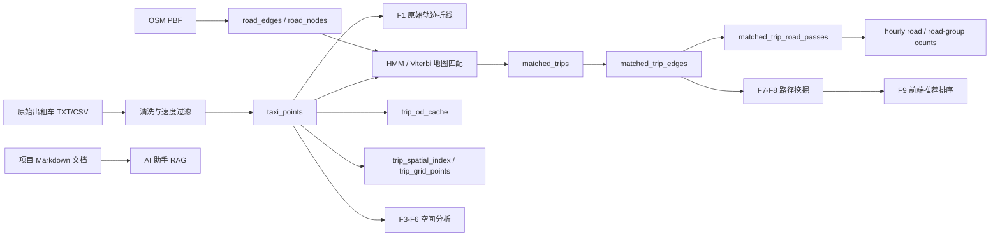

# 05 核心技术笔记

本目录是项目核心技术手册，面向验收、答辩、维护和二次开发。这里不按界面截图罗列功能，而是按真实代码解释 F1-F9 与 AI 助手背后的数据结构、算法流程、接口、关键参数和工程取舍。

## 阅读顺序

1. 先读 [data-structures-and-pipeline.md](./data-structures-and-pipeline.md)，理解原始 GPS、路网、匹配结果、派生缓存表之间的关系。
2. 再读 [f1-f2-trajectory-and-map-matching.md](./f1-f2-trajectory-and-map-matching.md)，理解轨迹折线生成和 HMM/Viterbi 地图匹配。
3. 继续读 [f3-f6-spatial-analytics.md](./f3-f6-spatial-analytics.md)，理解区域车辆、网格密度、A/B 流向、辐射流。
4. 然后读 [f7-f9-path-mining-and-recommendation.md](./f7-f9-path-mining-and-recommendation.md)，理解高频道路、A/B 高频路线、前端推荐策略。
5. AI 助手单独见 [ai-assistant-rag-and-llm.md](./ai-assistant-rag-and-llm.md)。
6. 参数集中索引见 [algorithm-parameters.md](./algorithm-parameters.md)。
7. 技术选型解释见 [selected-technology.md](./selected-technology.md)。

## 功能与代码映射

| 功能 | 用户侧含义 | 主要后端代码 | 主要前端代码 | 主要数据表 |
|---|---|---|---|---|
| F1 | 原始 GPS 轨迹折线 | `backend/app/api/trajectory.py` | `frontend/src/pages/GeoSpatialWorkbench.tsx` | `taxi_points` |
| F2 | 地图匹配轨迹 | `backend/app/api/matched.py`，`data_scripts/map_match_taxi_id1.py`，`data_scripts/batch_map_match.py` | `GeoSpatialWorkbench.tsx`，`trajectoryService.ts` | `matched_trips`，`road_edges`，`road_nodes` |
| F3 | 多框并集车辆查询 | `backend/app/api/analytics.py` 的 `active-vehicles*` | `GeoSpatialWorkbench.tsx` | `taxi_points` |
| F4 | 米制网格密度 | `backend/app/api/analytics.py` 的 `f4-grid-density` | `GeoSpatialWorkbench.tsx`，`trajectoryService.ts` | `taxi_points` |
| F5 | A/B 流向与阈值推荐 | `backend/app/api/analytics.py` 的 `f5-*` | `GeoSpatialWorkbench.tsx` | `taxi_points` |
| F6 | 核心区辐射流 | `backend/app/api/analytics.py` 的 `f6-radiation-flow` | `GeoSpatialWorkbench.tsx` | `trip_od_cache`，`trip_grid_points`，`taxi_points` |
| F7 | 高频道路走廊 | `backend/app/api/analytics.py` 的 `f7-*` | `GeoWorkbenchDecisionPanel.tsx`，`GeoSpatialWorkbench.tsx` | `matched_trip_road_passes`，`matched_road_group_hourly_counts`，`matched_road_hourly_counts`，`matched_trip_edges` |
| F8 | A/B 高频路线挖掘 | `backend/app/api/analytics.py` 的 `f8-ab-frequent-routes` | `GeoWorkbenchDecisionPanel.tsx`，`GeoSpatialWorkbench.tsx` | `matched_trip_edges`，`trip_od_cache`，`trip_spatial_index`，`trip_grid_points`，`trip_edge_sequence_cache`，`road_edge_feature_cache` |
| F9 | 最优路径推荐 | 无独立后端接口 | `GeoWorkbenchDecisionPanel.tsx`，`GeoSpatialWorkbench.tsx` | 直接复用 F8 返回的 `corridors/routes` |
| AI 助手 | Markdown RAG + 可选 LLM | `backend/app/api/assistant.py`，`backend/app/services/assistant_retrieval.py`，`backend/app/services/assistant_llm.py` | `frontend/src/components/GeoWorkbenchAssistant.tsx` | `docs/**/*.md` |

## 总体链路

## 真实性说明

本文档按当前代码整理。需要特别注意两点：

- F4 当前后端实现是 Web Mercator 米制网格聚合，返回 `query_mode=point_bucket_lonlat`；前端仓库仍保留旧 H3 worker 类型和接口定义，但不是当前 F4 的后端主逻辑。
- F9 没有独立后端接口，也不按时间桶单独计算。它只在前端从 F8 的 `corridors` 或 `routes` 中按 `fastest`、`stable`、`frequent_fast` 三种策略选一条推荐路线。

