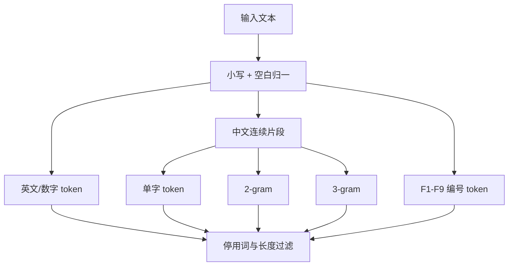
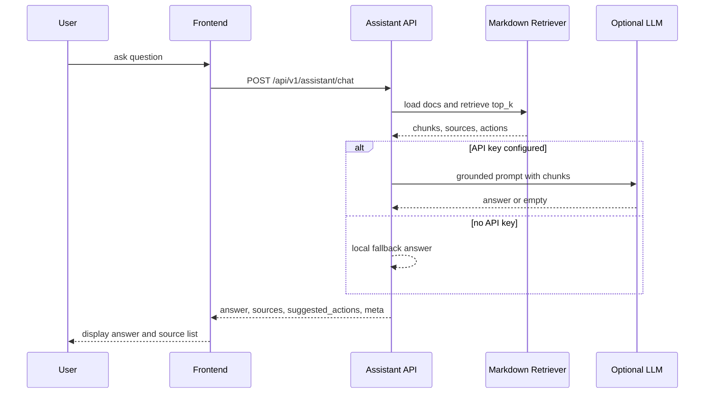

# AI 助手 RAG 与 LLM

AI 助手由“本地 Markdown 检索 + 本地 fallback 回答 + 可选 OpenAI-compatible LLM”组成。接口在 `backend/app/api/assistant.py`，检索在 `backend/app/services/assistant_retrieval.py`，LLM 调用在 `backend/app/services/assistant_llm.py`。

## 接口结构

接口：`POST /api/v1/assistant/chat`

请求：

| 字段 | 默认值 | 约束 | 含义 |
|---|---:|---|---|
| `question` | 必填 | `1-500` 字符 | 用户问题 |
| `top_k` | `5` | `1-8` | 检索文档片段数量 |
| `context` | 空 | dict | 前端上下文，可传当前功能、时间窗、地图状态等 |

响应：

```json
{
  "answer": "...",
  "sources": [
    {
      "title": "...",
      "path": "docs/05-technical-notes/...",
      "heading": "...",
      "score": 1.23
    }
  ],
  "suggested_actions": [
    {
      "type": "zoom_in",
      "label": "...",
      "value": null
    }
  ],
  "meta": {
    "retrieval": "local_markdown_top_k",
    "answer_mode": "llm 或 local_fallback",
    "llm_configured": true,
    "llm_mode": "chat_completions",
    "llm_model": "gpt-4o-mini",
    "chunk_count": 0,
    "matched_chunk_count": 0,
    "context": {}
  }
}
```

## 文档 allowlist

`load_assistant_documents()` 会从仓库根目录和 `docs` 下加载 Markdown，但只允许：

- `README.md`
- `docs/01-overview`
- `docs/02-user-guide`
- `docs/03-developer-guide`
- `docs/04-architecture`
- `docs/05-technical-notes`

并显式排除路径中包含 `work-notes` 的文档。这样做是为了让助手只基于正式文档回答，不把临时工作笔记、草稿或内部记录误当事实来源。

## Markdown 分块

`split_markdown_sections(path, content)` 的规则：

1. 先提取一级标题 `# title` 作为文档 title；没有则用文件名。
2. 按 `##` 到 `####` 标题切分片段。
3. 每个片段记录：
   - `id`
   - `path`
   - `title`
   - `heading`
   - `content`
4. 如果文档没有二到四级标题，则整篇作为一个 chunk。
5. `_clean_markdown_text()` 会移除代码块、图片、链接语法、列表符号和表格行首竖线，并做空白归一化。

这意味着技术文档里的二级/三级标题会直接影响检索召回质量。

## token 化

`tokenize_text()` 同时处理英文、数字、中文和功能编号：



英文/数字正则会提取：

```text
[a-z][a-z0-9_+-]* | 数字/小数
```

功能编号正则是：

```text
(?<![a-z0-9])f\d+(?![a-z0-9])
```

所以 `F8`、`f9` 会被稳定识别，而 `foo_f8x` 这类不会误匹配。

中文使用单字、二元和三元 n-gram，是为了在没有分词器的情况下支持“地图匹配”“高频路线”“核心区辐射”这类短语召回。

## Top-K 检索打分

`retrieve_top_k(question, chunks, top_k)` 的核心是局部 TF-IDF 加权：

1. 对 query 和每个 chunk token 化。
2. 统计每个 token 的文档频率 `doc_freq`。
3. 对 query token 累加：

```text
score += query_tf * (chunk_tf / sqrt(content_length)) * idf * heading_boost
idf = log((total_docs + 1) / (doc_freq + 0.5)) + 1
heading_boost = 1.8 if token in title/heading else 1.0
```

额外加权：

- 如果压缩后的问题字符串完整出现在 chunk 标题/正文中，加 `2.0`。
- 如果问题显式包含 `F1-F9` 编号：
  - 编号出现在标题中，加 `6.0`。
  - 编号出现在正文中，加 `2.0`。
  - 如果 chunk 完全不匹配请求编号，分数乘 `0.03`，强力降权。
- 如果问题像是在问实现细节，并且 chunk 是实现逻辑类文档，加 `5.0`。

排序规则：

```text
score desc, path asc, heading asc
```

最终返回 `top_k` 个 `SearchResult`。

## 本地 fallback 回答

`build_assistant_reply()` 总是先跑本地检索。如果没有匹配结果，返回“项目文档中暂未找到直接说明”的 fallback，同时仍然返回可识别的地图动作。

如果有匹配结果，`_compose_answer()` 会：

1. 取最高分 chunk。
2. 用 `_select_relevant_sentences()` 从 chunk 内容中挑最多 3 个与问题 token 有重叠的句子。
3. 拼出简短答案。
4. 如果有多个结果，补充相关文档 heading。

本地 fallback 不调用外部网络，适合作为无 API key 或 LLM 失败时的稳定回答。

## 可选 LLM 调用

`generate_llm_answer()` 只有在 `settings.openai_api_key` 非空且检索到 chunk 时才会调用。

配置在 `backend/app/core/config.py`：

| 配置 | 默认值 |
|---|---|
| `openai_base_url` | `https://api.openai.com/v1` |
| `openai_model` | `gpt-4o-mini` |
| `openai_api_mode` | `chat_completions` |
| `openai_timeout_seconds` | `30` |
| `openai_max_output_tokens` | `900` |

支持两种 OpenAI-compatible 模式：

- `chat_completions`：调用 `{base_url}/chat/completions`
- `responses`：调用 `{base_url}/responses`

`build_grounded_prompt()` 会把用户问题、前端上下文和最多 6 个文档片段写入 prompt，每个片段最多截取 1200 字符。系统指令要求模型只能基于给定文档片段回答，不编造文档中没有的功能。

如果 HTTP 错误、网络错误、超时或 JSON 解析失败，`_post_json()` 返回空 dict，最终自动退回本地 fallback。

## 地图动作识别

`detect_map_actions()` 从用户问题里识别可执行的地图动作：

- 放大地图：`zoom_in`
- 缩小地图：`zoom_out`
- 切换底图：`set_map_style`，可选值 `darkblue`、`dark`、`normal`

识别结果放在 `suggested_actions` 中，前端可以据此执行地图操作。动作会用 `_dedupe_actions()` 按 `(type,value)` 去重。

## 端到端流程



## 维护注意事项

- 新增正式功能文档时，应放在 allowlist 目录下，优先使用 `##`/`###` 标题组织，这会直接提高检索质量。
- 如果用户问“F8 怎么实现”“F9 为什么没有接口”这类问题，应确保对应内容在 `docs/05-technical-notes` 标题和正文里都出现功能编号。
- 当前服务端部分中文 prompt、fallback 和 action label 在源码中存在历史编码异常风险；如果线上助手回答或按钮 label 出现不可读字符，应优先修复 `assistant_retrieval.py` 与 `assistant_llm.py` 的字符串编码。
