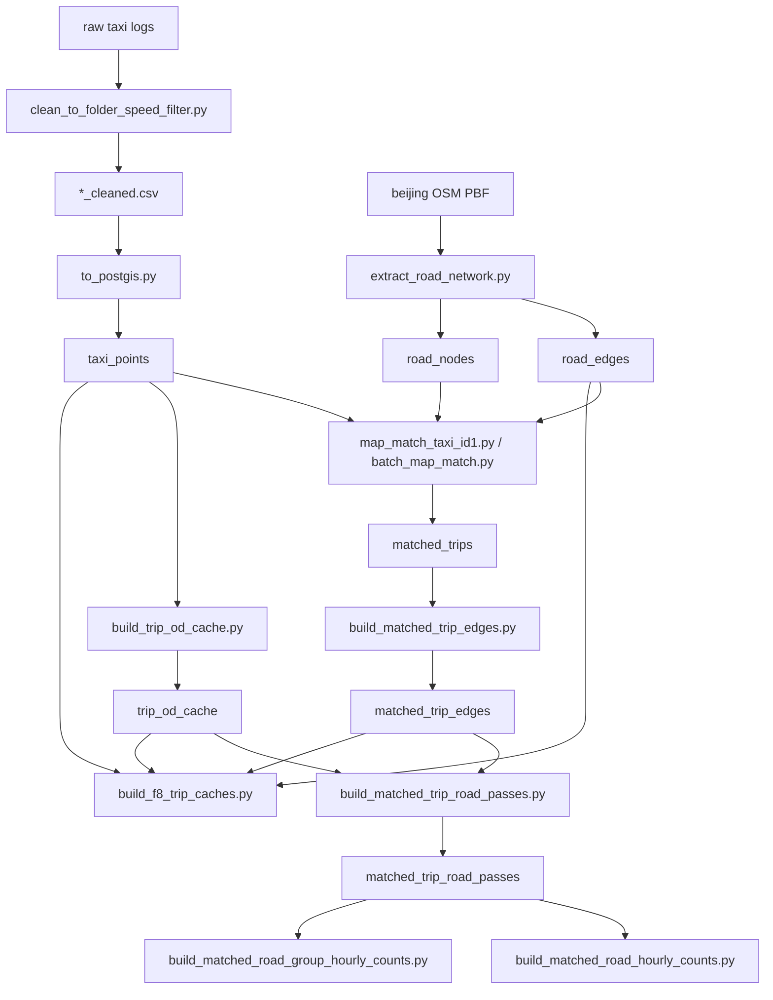
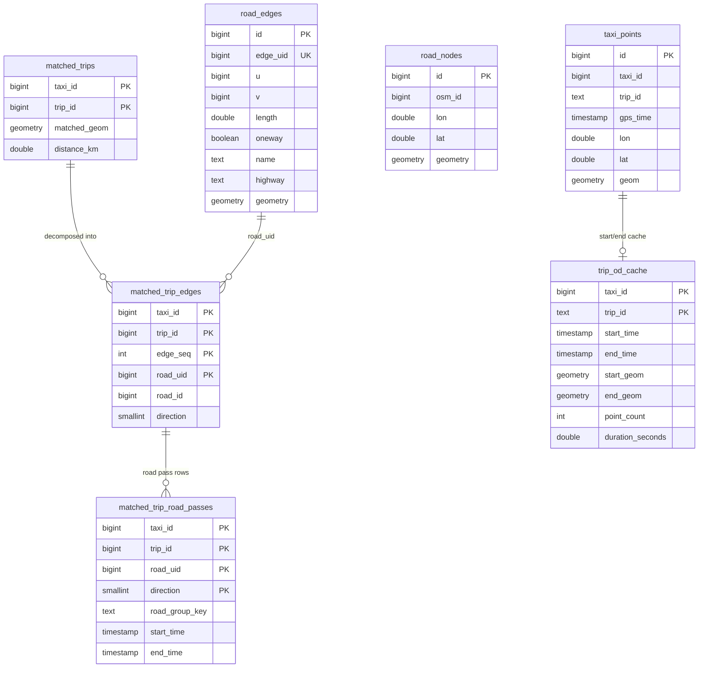

# 数据结构与数据管道

本页解释项目里的核心表、派生缓存和离线构建脚本。代码入口主要在 `data_scripts/schema.sql`、`data_scripts/to_postgis.py`、`data_scripts/extract_road_network.py`、`data_scripts/build_*.py`，在线 API 主要消费 `backend/app/api/*.py`。

## 数据管道



## 核心 ER 关系



## 原始轨迹表

`taxi_points` 是所有在线空间分析的基础表，由 `to_postgis.py` 从 `*_cleaned.csv` 导入。

| 字段 | 含义 | 主要用途 |
|---|---|---|
| `id` | 自增点 ID | 同一时间戳下稳定排序；窗口函数辅助排序 |
| `taxi_id` | 车辆 ID | F1/F2/F3/F5/F6/F8 过滤、聚合 |
| `trip_id` | 清洗阶段切出的行程 ID，类型为 `TEXT` | 与 `matched_trips.trip_id` 连接时常转为 `BIGINT` 或字符串 |
| `gps_time` | GPS 时间 | 所有时间窗过滤、A/B 顺序判断 |
| `lon`, `lat` | WGS84 经纬度 | 前端显示、网格计算、H3 聚合 |
| `geom` | `geometry(Point,4326)` | PostGIS 空间过滤 |

关键索引：`(taxi_id,gps_time)`、`(trip_id,gps_time)`、`(taxi_id,trip_id,gps_time)`、`GIST(geom)`。

## 路网表

`road_edges` 和 `road_nodes` 由 `extract_road_network.py` 从 OSM PBF 读取 driving network 后写入 PostGIS。

`road_edges` 里最重要的是：

- `edge_uid`：项目内部稳定边 ID，后续 `matched_trip_edges.road_uid` 使用它。
- `u`、`v`：边起终点节点 ID，HMM 拼接和 `matched_trip_edges` 反解边方向依赖它。
- `oneway`：构图时决定方向。代码中 `yes/true/1/t` 视为正向，`-1/reverse/backward` 视为反向，其它视为双向。
- `name`、`highway`、`length`：F7 分组、F8 token 化和长度过滤使用。
- `geometry`：路径显示、空间相交、长度计算使用。

## 地图匹配结果

`matched_trips` 由 `map_match_taxi_id1.py` 或 `batch_map_match.py` 写入。每行表示一条行程的匹配后道路折线：

- 主键：`(taxi_id, trip_id)`。
- `matched_geom`：匹配后的 `LineString`，由 HMM 选择的节点序列经 Dijkstra 拼接后转换为经纬度折线。
- `distance_km`：`matched_geom` 的地理长度。

在线 F2 直接读取 `matched_trips`，F7/F8 不直接用几何聚类，而是继续把 `matched_geom` 拆为道路边序列。

## 道路边序列表

`matched_trip_edges` 由 `build_matched_trip_edges.py` 从 `matched_trips.matched_geom` 反解而来。脚本将匹配线的点 `ST_DumpPoints` 出来，用点坐标匹配 `road_nodes`，再用相邻节点 `(from_node_id,to_node_id)` 找 `road_edges`。

| 字段 | 含义 |
|---|---|
| `edge_seq` | 行程内道路边顺序 |
| `road_uid` | 对应 `road_edges.edge_uid` |
| `road_id` | 对应 `road_edges.id` |
| `direction` | `1` 表示沿 `road_edges.u -> v`，`-1` 表示反向，`0` 表示无法判断 |

这是 F7/F8 的关键结构：F7 统计哪些道路边被反复经过，F8 在 A/B 区间内截取 `edge_seq` 子路径并做 token 聚类。

## 行程 OD 缓存

`trip_od_cache` 由 `build_trip_od_cache.py` 构建，也会在后端 `ensure_trip_od_cache()` 中按需创建。它用 `DISTINCT ON (taxi_id,trip_id)` 找每条行程最早点和最晚点，并缓存：

- `start_time`、`end_time`
- `start_geom`、`end_geom`
- `start_lon/lat`、`end_lon/lat`
- `point_count`
- `duration_seconds`

消费者：

- F6 `strict_od`：判断起点在核心区、终点在外部，或终点在核心区、起点在外部。
- F7：旧回退路径中用它筛候选行程时间窗。
- F8：先用 OD 时间窗、候选模式和时段过滤减少候选行程。

## F7 派生表

`matched_trip_road_passes` 由 `build_matched_trip_road_passes.py` 从 `matched_trip_edges` + `road_edges` + `trip_od_cache` 生成。每行是“某行程经过某道路边/方向”的事实记录，并带行程开始结束时间，便于按窗口精确筛选。

`matched_road_hourly_counts` 由 `build_matched_road_hourly_counts.py` 生成，按 `road_uid + direction + hour_bucket` 汇总：

- `trip_count`
- `vehicle_count`

`matched_road_group_hourly_counts` 由 `build_matched_road_group_hourly_counts.py` 生成，按 `road_group_key + direction + hour_bucket` 汇总：

- `trip_count`
- `vehicle_count`
- `edge_pass_weight`，表示同一路名组内经过边次数的累加权重。

F7 查询优先级是：短时间窗精确 pass 表、道路组小时汇总、道路边小时汇总、精确 pass 表回退、最后才是在线 `matched_trip_edges` 旧逻辑。

## F8 加速缓存

`build_f8_trip_caches.py` 构建 5 类缓存：

| 表 | 作用 |
|---|---|
| `trip_spatial_index` | 以 `0.01` 度网格记录行程触达哪些网格，用于 F8 `pass_through` 粗筛 A/B 顺序 |
| `trip_grid_points` | 每个轨迹点的 `point_seq`、时间、网格键，用于 F6 through-flow 和 F8 精筛 |
| `trip_token_sequence` | 全行程主要道路 token 和序列 token，目前更多是预计算备用结构 |
| `trip_edge_sequence_cache` | 每条行程的 `road_uid_array`，F8 可直接在 Python 里切 A/B 子路径 |
| `road_edge_feature_cache` | 每条道路边的等级、归一化路名、长度、bbox，用于 F8 token 化和减少 road metadata 查询 |

`trip_spatial_index` 与 `trip_grid_points` 的网格键规则是：

```text
grid_x = floor(lon / grid_step_degrees)
grid_y = floor(lat / grid_step_degrees)
grid_key = "{grid_x}:{grid_y}"
```

默认 `grid_step_degrees=0.01`。这不是 H3，而是经纬度规则网格，用于快速候选筛选。

## 构建顺序建议

一次完整离线管道通常按这个顺序：

1. `clean_to_folder_speed_filter.py` 清洗原始点。
2. `to_postgis.py` 导入 `taxi_points`。
3. `extract_road_network.py` 导入 `road_edges`、`road_nodes`。
4. `batch_map_match.py` 或 `map_match_taxi_id1.py` 写入 `matched_trips`。
5. `build_matched_trip_edges.py` 写入 `matched_trip_edges`。
6. `build_trip_od_cache.py` 写入 `trip_od_cache`。
7. `build_matched_trip_road_passes.py` 写入 `matched_trip_road_passes`。
8. `build_matched_road_hourly_counts.py` 与 `build_matched_road_group_hourly_counts.py` 写入 F7 汇总。
9. `build_f8_trip_caches.py` 写入 F8/F6 加速缓存。

`pipeline_build_status` 记录部分派生表构建状态。F7/F8 查询会检测相关表是否存在，缺表时返回明确错误，而不是静默降级为错误结果。

