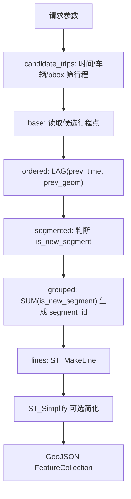
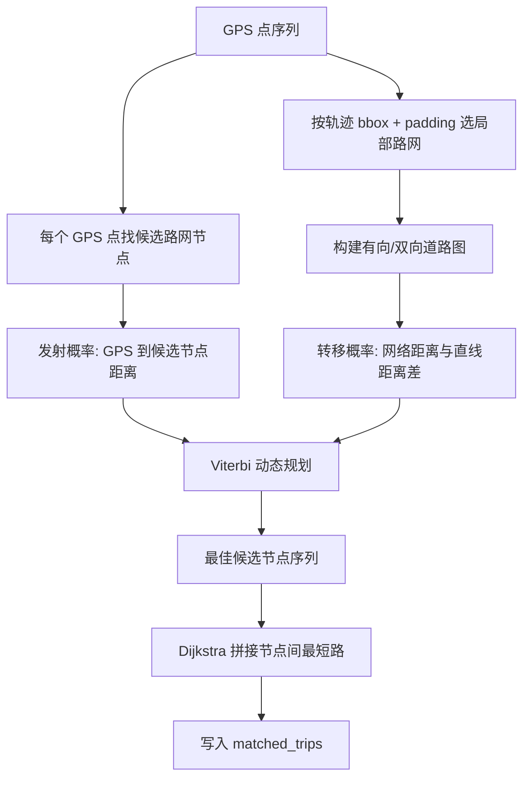

# F1-F2 轨迹生成与地图匹配

F1 负责把原始 GPS 点按行程和异常规则连成折线；F2 负责读取离线 HMM/Viterbi 地图匹配结果，并在地图上展示匹配后的道路路线。F2 的在线接口不实时跑 HMM，真正的匹配发生在 `data_scripts/map_match_taxi_id1.py` 和 `data_scripts/batch_map_match.py`。

## F1 原始轨迹折线

接口：`GET /api/v1/trajectories/polylines`  
代码：`backend/app/api/trajectory.py`

### 输入参数

| 参数 | 默认值 | 约束 | 含义 |
|---|---:|---|---|
| `start_time` / `end_time` | 必填 | `start_time < end_time` | 查询时间窗 |
| `taxi_id` | 空 | `>=1` | 可选单车过滤 |
| `min_lon/min_lat/max_lon/max_lat` | 空 | 必须四个一起传 | 可选空间范围 |
| `zoom` | `12` | `3-20` | 用于自动简化容差 |
| `use_zoom_simplify` | `true` | 布尔 | 是否按 zoom 简化折线 |
| `simplify_tolerance` | 空 | `>=0` | 手动覆盖简化容差 |
| `max_trips` | `300` | `1-5000` | 返回折线数量上限 |
| `max_gap_minutes` | `40` | `1-240` | 超过该时间间隔断开 |
| `max_jump_km` | `30.0` | `0.1-500` | 单段跳跃距离超过该值断开 |
| `max_speed_kmh` | `140.0` | `10-400` | 相邻点隐含速度超过该值断开 |

注意：清洗脚本默认速度过滤阈值是 `130 km/h`，F1 在线分段默认是 `140 km/h`。前者用于离线删除异常点，后者用于在线展示时避免把残余跳点连成跨城直线。

### SQL 实现流程

F1 的核心是一个 PostGIS + SQL 窗口函数管道：



关键逻辑：

1. `candidate_trips` 先按时间、车辆和 bbox 找候选行程，并按 `MIN(gps_time)` 排序，只取 `max_trips` 个候选行程。
2. `base` 读取候选行程在时间窗和 bbox 内的点。
3. `ordered` 用 `LAG(gps_time)`、`LAG(geom)` 找上一点。
4. `segmented` 判断是否新段：
   - 第一条点必定新段。
   - 时间差小于等于 0，新段。
   - 时间差超过 `max_gap_minutes * 60` 秒，新段。
   - `ST_DistanceSphere(prev_geom, geom)` 超过 `max_jump_km * 1000` 米，新段。
   - 距离 / 时间差超过 `max_speed_kmh / 3.6` 米/秒，新段。
5. `grouped` 对 `is_new_segment` 做累计和，得到同一行程下的 `segment_id`。
6. `lines` 对每个段做 `ST_MakeLine(geom ORDER BY gps_time)`，并要求 `COUNT(*) >= 2`。
7. 如果启用简化，对折线执行 `ST_Simplify(line_geom, tolerance)`。

### 简化容差

`zoom_to_tolerance(zoom)` 的代码规则：

```text
clamped_zoom = clamp(zoom, 3, 20)
tolerance = max(0.00002, 0.2 / 2^clamped_zoom)
```

低 zoom 使用更大的简化容差，减少传输和绘制压力；高 zoom 保留更多细节。这里的容差单位是经纬度角度，不是米。

### 返回结构

返回 `FeatureCollection`。每条 feature 的属性包括：

- `taxi_id`
- `trip_id`，格式为原始 `trip_id_s{segment_id}`
- `point_count`
- `start_time`
- `end_time`

`meta.segment_rules` 会回显 `max_gap_minutes`、`max_jump_km`、`max_speed_kmh`，便于前端或验收确认本次折线断段规则。

## F2 在线匹配轨迹展示

代码：`backend/app/api/matched.py`

F2 有三个读取接口：

| 接口 | 用途 |
|---|---|
| `GET /api/trajectory/matched/spatial` | 按时间、bbox、车辆范围查询已匹配行程集合 |
| `GET /api/trajectory/matched` | 按 `taxi_id` 和可选 `trip_ids` 查询匹配几何 |
| `GET /api/trajectory/{trip_id}` | 同时返回原始点和一条匹配路线，便于对照 |

`/api/trajectory/matched/spatial` 的查询流程是：

1. 先在 `taxi_points` 中找时间窗、bbox、车辆范围内出现过的 `(taxi_id,trip_id)`。
2. 再按 `matched_trips.taxi_id = bbox_trips.taxi_id` 且 `bbox_trips.trip_id = matched_trips.trip_id::text` 连接。
3. 返回 `active_vehicle_count`、`trip_count` 和最多 `detail_limit` 条匹配折线。
4. `detail_limit` 虽然参数允许到 `10357`，代码实际用 `min(detail_limit,1200)` 限制明细返回规模。

## 离线地图匹配算法

地图匹配代码主要在 `data_scripts/map_match_taxi_id1.py`，批处理优化在 `data_scripts/batch_map_match.py`。

### HMM 建模



状态：每个 GPS 点附近的候选道路节点。  
观测：GPS 点经纬度。  
目标：找到一条候选节点序列，使“点到路网近”和“相邻点之间路网距离合理”同时最优。

### 候选节点

函数：`candidate_nodes_for_point()`

默认参数：

- `search_radius_m=250.0`
- `max_candidates=6`

逻辑：

1. 遍历局部路网节点，计算 GPS 点到节点的 haversine 距离。
2. 保留 `search_radius_m` 内的候选。
3. 按距离升序排序，截取前 `max_candidates` 个。
4. 如果半径内没有候选，但存在最近节点，则回退为最近节点，避免整条轨迹断掉。

批处理版 `batch_map_match.py` 用 `NODE_GRID_SIZE_DEG=0.002` 的节点网格减少候选搜索范围，语义保持一致。

### 发射概率

函数：`emission_log_prob(distance_m, sigma_z)`

```text
log P(observation | candidate) = -0.5 * (distance_m / sigma_z)^2
```

默认 `sigma_z=80.0`。GPS 点离候选节点越远，分数越低；`sigma_z` 越大，对 GPS 偏移越宽容。

### 转移概率

函数：`transition_log_prob(network_dist_m, straight_dist_m, beta)`

```text
delta = abs(network_dist_m - straight_dist_m)
log P(transition) = -delta / beta
```

默认 `beta=350.0`。如果路网最短路径距离和 GPS 两点直线距离差异越大，转移分数越低；`beta` 越大，对绕行和路网误差越宽容。

`network_dist_m` 由 Dijkstra 在候选节点之间求最短路得到；如果没有路径，转移概率为负无穷。

### Viterbi 动态规划

函数：`viterbi_match()`

流程：

1. 第一个 GPS 点的每个候选节点以发射概率初始化。
2. 对每个后续 GPS 点，枚举当前候选和上一时刻候选。
3. 分数为：上一状态最佳分数 + 转移概率 + 当前发射概率。
4. 记录 `prev_choice`，最后从最高分状态回溯出最佳候选节点序列。
5. 如果某一步所有转移都不可达，代码会硬回退到“当前最近候选 + 上一步最佳候选”，并扣 `10.0` 分，保证异常稀疏点不至于让整条轨迹完全失败。

### 拼接与保存

Viterbi 得到的是关键候选节点序列，不一定包含中间道路节点。`stitch_node_sequence()` 会对相邻候选节点再次跑最短路，把中间节点补齐。之后：

1. `node_ids_to_lonlat()` 把节点序列转为经纬度。
2. `linestring_wkt_from_lonlat()` 生成 `LINESTRING(...)`。
3. `save_result()` 写入 `matched_trips`，并用 `ST_Length(...::geography)/1000` 计算 `distance_km`。

### 批处理优化

`batch_map_match.py` 保留同样的 HMM/Viterbi 思路，但做了工程优化：

- 进程池并行，默认 `workers=max(1,cpu_count()-2)`。
- 预加载全量道路边到 worker 内存。
- `EDGE_GRID` 用 `GRID_SIZE_DEG=0.02` 粗筛局部道路边。
- `NODE_GRID_SIZE_DEG=0.002` 加速候选节点搜索。
- `stationary_threshold_m=30.0`，累计位移低于该阈值的行程标记为 `stationary`。
- 失败状态写入 `map_match_trip_status`，避免重复处理已失败或静止行程。

### 清洗阶段最大速度

`data_scripts/clean_to_folder_speed_filter.py` 在导入数据库前做速度异常点删除：

- 默认 `max_speed_kmh=130.0`
- 默认 `speed_filter_rounds=3`
- 默认 `min_dt_seconds=1.0`
- 默认 `trip_gap_minutes=30`

每一轮会计算当前点与上一点的距离、时间差和速度。如果 `dt_seconds >= min_dt_seconds` 且速度超过阈值，则删除当前点；删除后重新计算下一轮。这样可以处理“一个坏点导致前后两段都异常”的情况。

## F1 与 F2 的区别

| 维度 | F1 原始轨迹 | F2 匹配轨迹 |
|---|---|---|
| 数据源 | `taxi_points` | `matched_trips` |
| 计算时机 | 在线 SQL 即时生成 | 离线 HMM/Viterbi 预处理 |
| 几何含义 | GPS 点连线，按异常规则断段 | 道路网络上的匹配路线 |
| 主要误差 | GPS 漂移、跳点、采样间隔 | 候选节点、路网缺口、HMM 参数 |
| 适合场景 | 快速看原始运行轨迹 | 道路通行、F7/F8 路径挖掘 |

