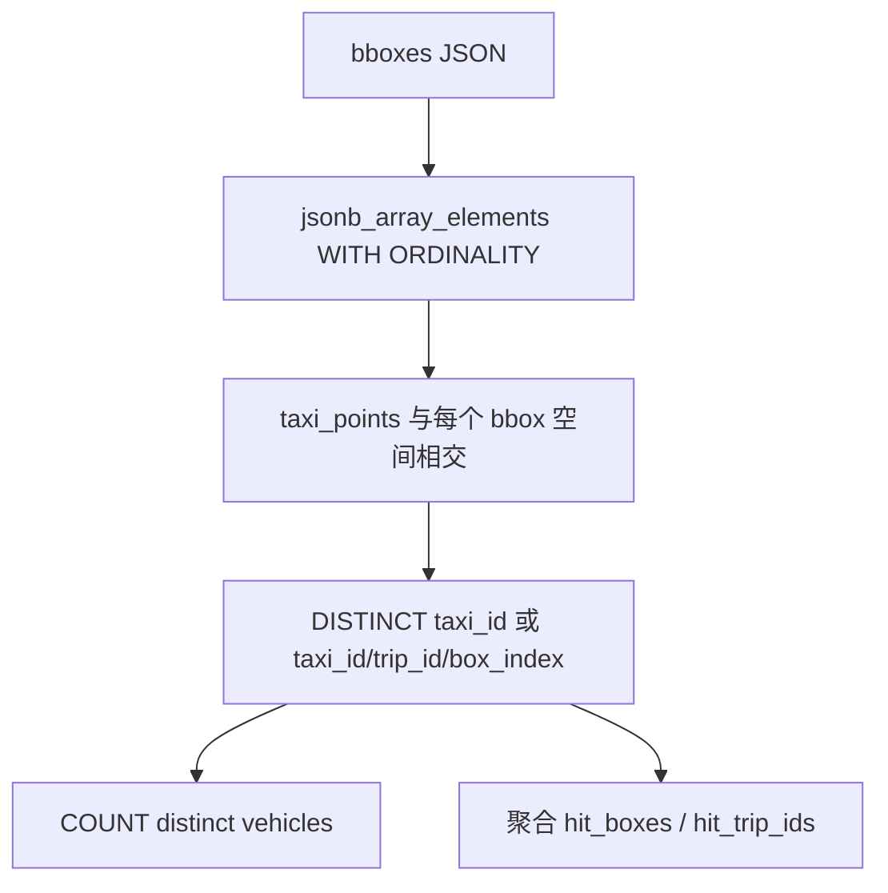
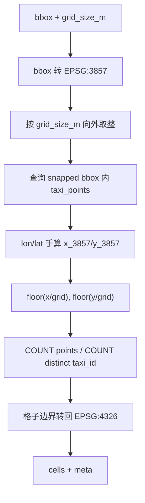
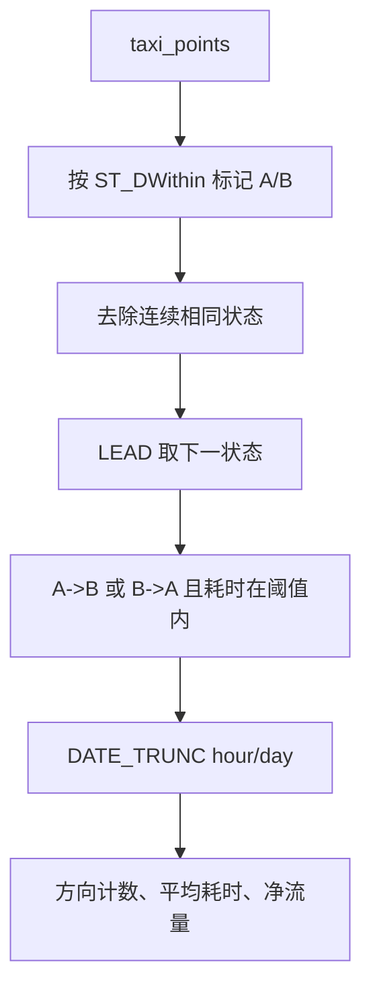

# F3-F6 空间分析

F3-F6 都在 `backend/app/api/analytics.py` 中实现，前端通过 `frontend/src/services/trajectoryService.ts` 调用，再由 `frontend/src/pages/GeoSpatialWorkbench.tsx` 绘制。它们主要消费 `taxi_points`，F6 在严格 OD 和高性能穿越流场景会使用派生缓存。

## F3 多框并集车辆查询

F3 的目标是回答：“在时间窗内，哪些车辆出现在用户画出的一个或多个区域里？”

### 接口

| 接口 | 作用 |
|---|---|
| `GET /api/v1/analytics/active-vehicles` | 单 bbox 或全局活跃车辆数 |
| `POST /api/v1/analytics/active-vehicles-union` | 多 bbox 并集车辆数 |
| `POST /api/v1/analytics/active-vehicles-union-detail` | 多 bbox 并集明细，返回车辆、命中框、行程 ID |

### 多框并集算法



实现要点：

- 多个 bbox 通过 `jsonb_array_elements(... WITH ORDINALITY)` 展开，并保留 `box_index`。
- 空间过滤先用 `geom && ST_MakeEnvelope(...)` 走 GiST bbox 快筛，再用 `ST_Intersects` 精确判断。
- 并集车辆数使用 `SELECT DISTINCT tp.taxi_id`，同一车命中多个框只算一次。
- 明细接口额外返回 `box_vehicle_counts`，可以看到每个框单独命中多少车。

### 参数与限制

`taxi_id_min` 默认 `1`，`taxi_id_max` 默认 `10357`。明细接口 `row_limit` 默认 `10357`，后端字段约束也是 `1-10357`。

## F4 米制网格密度

F4 的当前后端实现是“Web Mercator 米制网格”，不是早期的 H3 聚合接口。

接口：`GET /api/v1/analytics/f4-grid-density`

### 参数

| 参数 | 默认值 | 约束 | 含义 |
|---|---:|---|---|
| `grid_size_m` | `500` | `100-3000` | 网格边长，单位米 |
| `include_vehicle_count` | `false` | 布尔 | 是否额外计算去重车辆数 |
| `max_cells` | `3000` | `1-12000` | 最多返回格子数 |
| `format` | `compact` | `compact/geojson` | 返回紧凑 cell 或 GeoJSON |

如果 bbox 经度跨度大于 `0.8` 或纬度跨度大于 `0.6`，后端直接返回错误，提示用户放大地图后再运行。这样避免一次查询扫太大范围。

### 网格算法



代码在 SQL 中手算 Web Mercator 坐标：

```text
x_3857 = lon * 20037508.342789244 / 180
y_3857 = ln(tan((90 + lat) * pi / 360)) * 20037508.342789244 / pi
```

再用：

```text
i = floor(x_3857 / grid_size_m)
j = floor(y_3857 / grid_size_m)
```

聚合字段：

- `point_count`：格内 GPS 点数。
- `vehicle_count`：可选，格内去重车辆数。
- `density`：当前等于 `point_count`。

响应 `meta.query_mode` 为 `point_bucket_lonlat`。后端有 60 秒进程内缓存，缓存键包含时间、bbox、网格大小、是否计算车辆数、返回格式等参数。

## F5 A/B 流向与阈值推荐

F5 包含两个接口：

- `POST /api/v1/analytics/f5-transition-threshold-recommendation`
- `POST /api/v1/analytics/f5-ab-flow`

### 阈值推荐

阈值推荐用于给 A/B 流向里的 `max_transition_seconds` 一个合理初值。代码先计算 A 区中心与 B 区中心的地理距离：

```text
distance_meters = ST_Distance(ST_Centroid(A)::geography, ST_Centroid(B)::geography)
raw_seconds = distance_meters / pessimistic_mps * road_winding_factor
recommended_seconds = ceil(clamp(raw_seconds, min, max) / 60) * 60
```

默认参数：

- `pessimistic_mps=2.8`，约 `10.08 km/h`
- `road_winding_factor=1.6`
- `absolute_minimum_seconds=600`
- `absolute_maximum_seconds=7200`

### A/B 流向状态机

F5 不是简单统计 A 区点数和 B 区点数，而是识别同一车同一行程中 A/B 状态的变化顺序。



关键 SQL 结构：

1. `tagged_points`：点落入 A buffered 或 B buffered 后，标记 `current_area='A'/'B'`。
2. `state_points`：用 `LAG(current_area)` 去掉连续重复状态，只保留状态变化点。
3. `sequence`：用 `LEAD(current_area)` 和 `LEAD(gps_time)` 找下一状态。
4. `directional`：只保留 `A_TO_B` 或 `B_TO_A`，并要求转移时间在 `0` 到 `max_transition_seconds`。
5. 最后按 `DATE_TRUNC(granularity,time_1)` 汇总。

默认 `buffer_meters=30`，`max_transition_seconds=1800`，`granularity='hour'`。

## F6 核心区辐射流

F6 目标是分析核心区域与外部区域之间的流入、流出。接口：

`POST /api/v1/analytics/f6-radiation-flow`

### 两种分析模式

| 模式 | 数据源 | 判定方式 | 适用场景 |
|---|---|---|---|
| `strict_od` | `trip_od_cache` | 行程起点/终点是否在核心区 | 严格 OD 通勤/出入分析 |
| `through_flow` | 优先 `trip_grid_points`，否则 `taxi_points` | 行程是否穿越核心区，取进入前/离开后的第一个外部点 | 过境流、经过核心区的路线分析 |

`strict_od` 会调用 `ensure_trip_od_cache()` 确保 OD 缓存存在。`through_flow` 如果发现 `trip_grid_points` 存在，会用网格加速版本；否则退回直接扫 `taxi_points`。

### strict OD 逻辑

出站：

- `start_geom` 在核心区 buffer 内，并且 `ST_DWithin(start_geom, core_geom, buffer_meters)`。
- `end_geom` 不在核心区内。
- 外部区域点取 `end_lon/end_lat`。
- 事件时间取 `start_time`。

入站：

- `end_geom` 在核心区。
- `start_geom` 不在核心区。
- 外部区域点取 `start_lon/start_lat`。
- 事件时间取 `end_time`。

### through-flow 逻辑

直接点表版本：

1. 找每条行程在核心区的 `first_core_time` 和 `last_core_time`。
2. 出站：用 LATERAL 子查询找 `last_core_time` 之后、`max_transition_seconds` 内第一个核心区外点。
3. 入站：找 `first_core_time` 之前、`max_transition_seconds` 内最近的核心区外点。

网格版本：

- 使用 `F6_TRIP_GRID_STEP_DEGREES=0.01` 的 `trip_grid_points`。
- 先计算核心区 buffered bbox 覆盖的 `core_grid_keys`。
- 用 `grid_key = ANY(core_grid_keys)` 快速找可能触达核心区的点。
- 查询时设置 `SET LOCAL work_mem='256MB'`。

### H3 外部区域聚合

F6 用 Python 包 `h3` 把外部点聚合为 H3 区域。默认 `h3_resolution=8`，后端约束 `6-10`。

对每条出入事件：

1. 用 `h3_cell_for_point(lon,lat,resolution)` 得到 H3 cell。
2. 按 cell 汇总 `outbound_total`、`inbound_total`、`total`、平均耗时。
3. 按总量排序取 `top_k` 个区域。
4. 只为 Top-K 区域返回 boundary、center、bounds 和时间序列。

响应中的 `summary` 是全量统计，不限 Top-K；`regions` 和 `series` 只包含 Top-K。`meta.data_scope` 明确写着 `summary is global; regions and series are Top-K only`。

### F6 参数

| 参数 | 默认值 | 约束 |
|---|---:|---|
| `granularity` | `hour` | `hour/day` |
| `direction` | `both` | `outbound/inbound/both` |
| `analysis_mode` | `strict_od` | `strict_od/through_flow` |
| `h3_resolution` | `8` | `6-10` |
| `grid_size_m` | `1000` | `500-5000`，当前响应中保留但主聚合使用 H3 |
| `buffer_meters` | `30` | `0-200` |
| `max_transition_seconds` | `3600` | `60-21600` |
| `top_k` | `30` | `1-100` |

后端 F6 响应缓存 TTL 是 45 秒。
