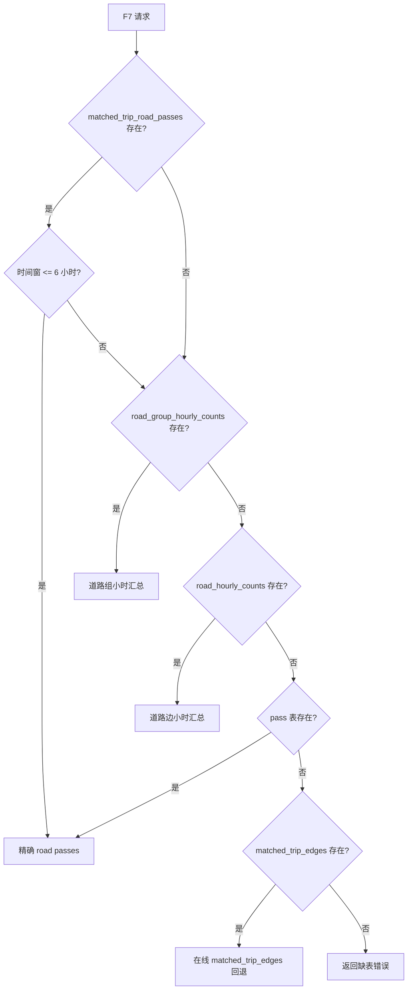
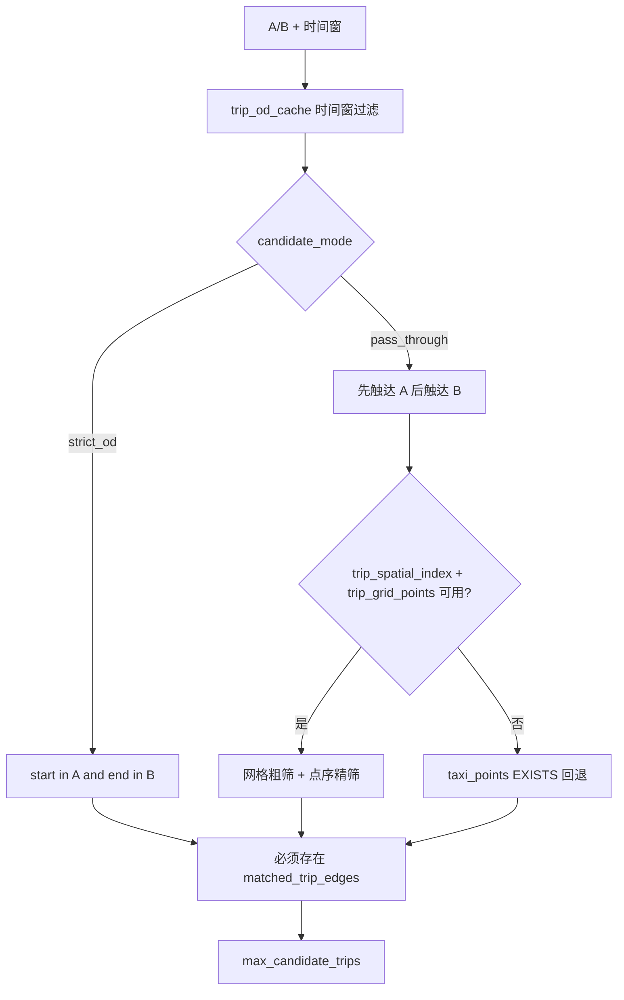
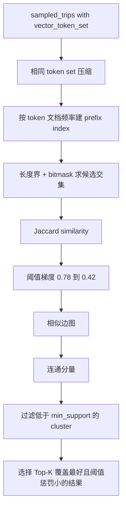

# F7-F9 路径挖掘与推荐

F7-F9 是“决策建议”部分的核心：F7 找城市或视窗内的高频道路走廊，F8 在 A/B 区域之间挖掘高频路线，F9 在前端基于 F8 结果选择一条推荐路线。三者都依赖地图匹配后的道路边序列，而不是原始 GPS 点连线。

## F7 高频道路走廊

接口：

- `POST /api/v1/analytics/f7-frequent-paths`
- `POST /api/v1/analytics/f7-road-detail`

代码：`backend/app/api/analytics.py`

### 输入参数

| 参数 | 默认值 | 约束 | 说明 |
|---|---:|---|---|
| `top_k` | `50` | `1-200` | 返回走廊数量 |
| `min_group_length_m` | `300` | `0-10000` | 路名组总长度过滤 |
| `max_trips` | `500` | `100-5000` | 在线回退逻辑的候选行程上限 |
| `scope` | `citywide` | `citywide/bbox` | 是否使用视窗 bbox 限制 |
| `sort_mode` | `frequency` | `frequency/length_weighted` | 排序方式 |

当 `scope='bbox'` 且 bbox 经度跨度超过 `0.7` 或纬度跨度超过 `0.5`，后端要求放大地图，避免视窗查询过大。

### 数据源优先级

F7 会按可用表和时间窗选择计算路径：



关键常量：

- `F7_EXACT_WINDOW_LIMIT_HOURS=6.0`
- `F7_RESPONSE_CACHE_TTL_SECONDS=45.0`
- `F7_STAGE2_MAX_RAW_PAIRS_PER_FAMILY=4`

### road pass 结构

`matched_trip_road_passes` 是 F7 最精确的数据源。每行代表一条行程经过一条道路边和一个方向：

- `taxi_id/trip_id`
- `road_uid/road_id`
- `road_group_key`
- `direction`
- `road_name/highway`
- `group_length_m`
- `matched_segment_length_m`
- `start_time/end_time`

短时间窗 F7 直接按 pass 表过滤时间重叠，并统计：

- `trip_count = COUNT(DISTINCT (taxi_id,trip_id))`
- `vehicle_count = COUNT(DISTINCT taxi_id)`
- `edge_pass_weight = COUNT(*)`

### 道路组与方向

道路边会按 `road_group_key + direction` 聚合。`road_group_key` 主要来自 `road_edges.name`，空名道路回退为 `edge:{id}`。`direction` 来自 `matched_trip_edges.direction`：

- `1`：沿道路边几何正向。
- `-1`：反向。
- `0`：未知。

响应中会转换为：

- `forward`
- `reverse`
- `unknown`

### 走廊连通与 backbone/branches

F7 不只是把同名道路边简单 `ST_Collect`，还会做道路连通和骨架提取。相关函数包括 `_f7_oriented_edge`、`_f7_componentize_directed_edges`、`_f7_extract_backbone`、`_f7_merge_component_rows_to_road_groups`。

关键参数：

| 常量 | 值 | 作用 |
|---|---:|---|
| `F7_COMPONENT_CLUSTER_EPS_DEGREES` | `0.00018` | `ST_ClusterDBSCAN` 的几何聚类 eps |
| `F7_STITCH_MAX_GAP_M` | `120.0` | 普通边端点拼接最大间隙 |
| `F7_LONG_CORRIDOR_MIN_LENGTH_M` | `1200.0` | 长走廊判定阈值 |
| `F7_LONG_CORRIDOR_MAX_GAP_M` | `260.0` | 长走廊允许更大拼接间隙 |
| `F7_LONG_CORRIDOR_MAX_ANGLE_PENALTY` | `0.22` | 长走廊跨 gap 时的方向惩罚上限 |
| `F7_FRAGMENT_PENALTY_PER_EXTRA_COMPONENT` | `0.14` | 多碎片置信度惩罚 |
| `F7_MIN_DISPLAY_CONFIDENCE` | `0.18` | 展示置信度下限 |
| `F7_BACKBONE_MAX_BRANCH_GEOMETRIES` | `80` | branches 几何数量上限 |

骨架提取思想：

1. 对方向一致的道路边按端点连通或近邻 gap 组成 component。
2. 以高分边作为 seed。
3. 沿拓扑或近邻候选向前/向后扩展成 backbone。
4. 未进入 backbone 的支线作为 branches，数量受限。
5. 多 component 会被标记 `is_fragmented`、`fragment_count`，并影响 `corridor_confidence`。

### F7 详情接口

`f7-road-detail` 按某个 `road_group_key + direction + component_id` 展开道路边明细。短窗口优先用 `matched_trip_road_passes`，否则用小时汇总。返回字段包括：

- `road_uid`
- `trip_count`
- `edge_pass_weight`
- `vehicle_count`
- `length_m`
- `geometry`
- `profile_order`
- `flow_rank`

前端双击或选择 F7 走廊后，会调用该接口绘制分段 profile。

## F8 A/B 高频路线挖掘

接口：`POST /api/v1/analytics/f8-ab-frequent-routes`  
主函数：`_get_f8_ab_frequent_routes_clustered()`

F8 的目标不是找“最短路”，而是从真实车辆在 A/B 之间的匹配道路子路径里，挖出重复出现的走廊。

### 参数

| 参数 | 默认值 | 约束 | 说明 |
|---|---:|---|---|
| `top_k` | `5` | `1-20` | 返回走廊数量 |
| `candidate_mode` | `pass_through` | `strict_od/pass_through` | 候选行程模式 |
| `buffer_meters` | `30` | `0-200` | A/B 区域外扩 |
| `min_support` | `3` | `1-1000` | 聚类最小支持度 |
| `min_edge_length_m` | `20` | `0-500` | token 化最小边长，实际至少 20 |
| `min_route_length_m` | `500` | `0-20000` | A/B 子路径最小长度 |
| `max_candidate_trips` | `10000` | `100-50000` | 候选行程上限 |
| `start_hour_filter` | 空 | `1-24` 个小时 | 可选开始小时过滤 |
| `start_minute_filter_start/end` | 空 | `0-1439` | 可选分钟窗口，支持跨午夜 |

派生参数：

- `effective_min_support=max(min_support,1)`
- `vector_min_edge_length_m=max(min_edge_length_m,20.0)`
- `major_road_min_length_m=max(200.0,vector_min_edge_length_m)`
- `stop_token_ratio=0.9`
- `similarity_thresholds=[0.78,0.7,0.62,0.55,0.48,0.42]`
- `skeleton_support_ratio=0.35`
- `grid_step_degrees=0.01`
- `candidate_prefilter_limit=min(max(max_candidate_trips*5,max_candidate_trips+1000),50000)`

### 候选行程筛选



`strict_od` 要求行程起点在 A、终点在 B。  
`pass_through` 要求同一行程先进入 A，再进入 B。若 `trip_spatial_index` 和 `trip_grid_points` 存在，F8 先用 `grid_key` 粗筛 A/B，再按 `point_seq/gps_time` 精确判断顺序。

### A/B 子路径截取

候选行程不是整条都用于聚类。F8 会：

1. 读取该行程的 `matched_trip_edges` 或 `trip_edge_sequence_cache.road_uid_array`。
2. 根据 `road_edges` 与 A/B bbox 的相交情况找到最后一个 A 命中边 `a_seq` 和其后第一个 B 命中边 `b_seq`。
3. 只保留 `edge_seq BETWEEN a_seq AND b_seq` 的子路径。
4. 计算子路径长度，要求 `route_length_m >= min_route_length_m`。

### token 化

F8 用 token 表示道路子路径，避免直接对几何做昂贵比较。

主要 token：

- `road:{road_group_key}`：有路名且道路等级是 `motorway/trunk/primary/secondary`，或边长达到 `major_road_min_length_m`。
- `edge:{road_uid}`：无路名但属于 `motorway/trunk/primary` 且足够长的边。
- `grid:{lon}:{lat}`：道路边 bbox 中心按 `0.01` 度吸附后的空间 token。
- `alias:route:*`、`alias:ring:*`、`alias:express:*`、`alias:corridor:*`：基于道路名、环路/高速别名、粗网格生成的语义别名。
- `anchor:start:{road_uid}`、`anchor:end:{road_uid}`：子路径前 3 条边和后 3 条边的入口/出口锚点。

F8 会维护两类序列：

- `vector_tokens`：去重后的集合特征，用于 Jaccard 聚类。
- `sequence_tokens`：保留顺序和锚点，用于骨架签名、变体和子簇拆分。

### 时长异常过滤

如果有效样本不少于 20 条，F8 会计算候选样本的 `p50 duration_seconds`，并设置：

```text
duration_outlier_cutoff_seconds = max(p50 * 3, 1800)
```

超过 cutoff 的样本被过滤，前提是过滤后仍能满足 `effective_min_support`。响应 meta 会回传是否应用过滤、过滤数量、p50 和 cutoff。

### Jaccard 相似图聚类



相似度：

```text
Jaccard(A,B) = |A ∩ B| / |A ∪ B|
```

为了避免 O(n²) 全量比较，代码将相同 token set 先压缩，再用 prefix index 和 bitmask 计算候选 pair。

### ordered feature 子簇拆分

大父簇可能包含同一主走廊下的入口/出口变体。`_split_f8_clusters_by_ordered_features()` 会对大簇尝试非破坏式拆分：

- 拆分最小支持度：`max(min_support, min(30, max(2, ceil(total * 0.006))))`
- 父簇足够大才拆：至少满足 `parent_split_min_support * 4`、`120`、全量 `8%` 等条件之一。
- 使用入口/出口 anchor、bigram/trigram、LCS coverage 等 ordered features。
- 拆分必须守恒：拆分后成员集合必须等于父簇成员集合，否则放弃拆分。

### 代表轨迹与质量过滤

每个 cluster 会选真实行程作为代表几何，而不是人工合成一条线：

1. `_rank_f8_cluster_medoid_candidates()` 根据 token 中心性、高频 token 覆盖、时长/长度接近 p50 等因素选 medoid 候选。
2. `_fetch_f8_cluster_geometries()` 取候选真实子路径几何。
3. `_f8_geometry_quality_metrics()` 计算：
   - `geometry_length_m`
   - `direct_distance_m`
   - `directness_ratio`
   - `repeat_point_ratio`
   - `a_hit_edge_count`
   - `b_hit_edge_count`
   - `repeated_edge_count`
   - `subpath_edge_count`
4. 低质量代表会进入 warning 或被 fatal drop。

致命过滤规则包括：

- `representative_quality_score < 0.25`
- `directness_ratio > 5.0` 且质量分 `< 0.65`
- `repeat_point_ratio > 0.22` 且质量分 `< 0.65`
- `duration_tail_ratio > 5.0` 且质量分 `< 0.55`

### 排名与返回

F8 先为候选走廊计算排名分：

```text
ranking_score ≈ quality_score * log10(1 + trip_count) * 各类惩罚
```

再做展示安全过滤、低置信补位、单行程 backfill，以及多样性选择。多样性相似度综合：

- token similarity，权重 `0.55`
- geometry grid similarity，权重 `0.30`
- bbox overlap，权重 `0.15`
- 同 parent cluster 可加 `0.08`

响应同时返回：

- `corridors`：主结构，包含 variants、质量指标、p20/p50/p90、代表轨迹等。
- `routes`：兼容旧前端的路线结构，由 corridor 映射而来。

`meta.logic_mode=ab_subpath_vector_cluster`，`meta.response_version=v6_ab_vector_cluster`。

## F9 最优路径推荐

F9 没有独立后端接口。它是前端组件 `frontend/src/components/GeoWorkbenchDecisionPanel.tsx` 中基于 F8 结果的排序与高亮逻辑。

### 数据来源

```text
f8Items = f8Result.corridors.length ? f8Result.corridors : f8Result.routes
```

也就是说：优先使用 F8 `corridors`，没有时回退到 `routes`。

### 三种策略

| 策略 | 代码值 | 排序逻辑 |
|---|---|---|
| 最快路径 | `fastest` | `p50_duration_min` 升序，若相同则 `trip_count` 降序 |
| 最稳路径 | `stable` | `p90_duration_min` 升序，若相同则 `p50_duration_min` 升序 |
| 高频且快 | `frequent_fast` | `getF8FrequencyFastScore` 降序 |

`frequent_fast` 分数：

```text
tripScore = trip_count / maxTripCount
p50Penalty = min(p50, 180) / 180
avgPenalty = min(avg, 180) / 180
timePenalty = p50Penalty * 0.65 + avgPenalty * 0.35
score = tripScore * 1.35 - timePenalty
```

缺失或非正时长会被 `getSortableDuration()` 转为正无穷，因此不会在最快/最稳策略里误排第一。

### 地图展示

F9 只改变前端展示：

1. `recommendedF9Item` 根据当前策略选出一条 F8 corridor/route。
2. `onF9RecommendedRouteChange()` 把推荐路线 signature 传回页面状态。
3. 点击“地图显示 F9”时调用 `showF9RoutesOnMap(recommendedRouteKey)`。
4. 页面函数 `renderSelectedF8RecommendationOnMap()` 从 F8 结果里找到该 signature，只绘制这一条路线。

因此 F9 不重新挖掘路线、不查数据库、不按小时桶重新计算，只是对 F8 结果做策略排序和单线高亮。

