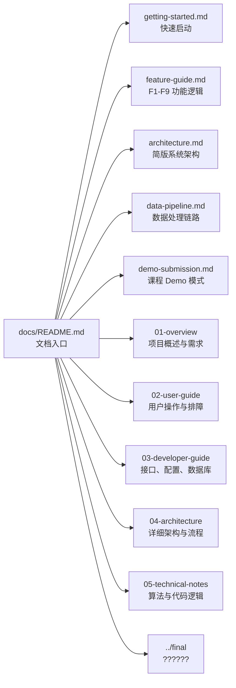

# Urban Taxi Vis 文档总览

本文档是 `docs/` 目录的入口，面向课程设计答辩、演示运行、代码维护和后续二次开发。当前口径以 2026-05-26 的真实代码为准：前端主工作台位于 `frontend/src/pages/GeoSpatialWorkbench.tsx`，后端 API 位于 `backend/app/api/`，数据处理脚本位于 `data_scripts/`。

> 重要口径：F9 当前不是“按早高峰/晚高峰/平峰等时间桶分类”的功能。旧的 F9 time-bucket 后端接口已经删除；现在 F9 直接基于 F8 的 A/B 候选走廊，在前端按 `fastest`、`stable`、`frequent_fast` 三种策略排序推荐一条路线。

## 文档导航图



## 顶层文档用途

| 文档 | 内容定位 | 适合什么时候读 |
|---|---|---|
| [getting-started.md](./getting-started.md) | 环境要求、`.env`、Docker Compose、前端启动、访问地址、常见启动问题。 | 第一次运行项目、演示前自检、切换 Demo/完整后端模式。 |
| [feature-guide.md](./feature-guide.md) | F1-F9 的真实功能逻辑、输入输出、接口链路、关键算法和当前限制。 | 答辩讲功能、核对旧文档口径、定位某个功能的数据来源。 |
| [architecture.md](./architecture.md) | React/Vite、FastAPI、PostGIS、Redis、数据脚本、Demo 层之间的关系。 | 讲系统设计、模块分工、接口与缓存边界。 |
| [data-pipeline.md](./data-pipeline.md) | 原始 GPS 清洗、导入 PostGIS、路网抽取、地图匹配、噪声处理、派生表构建。 | 重建数据、解释 F1-F9 的表来源、排查“有界面但没结果”。 |
| [demo-submission.md](./demo-submission.md) | 课程提交用前端-only Demo、只读样例、mock adapter、完整后端切换说明。 | 无法提交数据库/后端时展示系统；给老师或同学快速预览。 |

## docs 目录结构

```text
docs/
├─ README.md              # 本文档：总览、目录、阅读顺序、维护口径
├─ getting-started.md     # 快速启动：环境、.env、Docker、前端、访问地址
├─ feature-guide.md       # F1-F9 功能说明：轨迹、区域网格、路径挖掘
├─ architecture.md        # 简版架构：React/Vite、FastAPI、PostGIS、Redis、脚本
├─ data-pipeline.md       # 数据流程：清洗、导入、匹配、噪声、派生表
├─ demo-submission.md     # 课程提交用前端-only Demo 模式说明
├─ 01-overview/           # 项目介绍、需求规格、功能清单、术语
├─ 02-user-guide/         # 用户手册、FAQ、排障、AI 助手说明
├─ 03-developer-guide/    # 配置、构建运行、API、数据库、目录结构
├─ 04-architecture/       # 更详细的系统架构、核心流程、模块设计
├─ 05-technical-notes/    # PostGIS、RAG、F1-F9 后端代码逻辑、依赖链
└─ assets/                # 截图、图示和演示素材
```

最终交付材料放在仓库根目录的 `final/`，包括报告、PPT、演示视频等。

## 推荐阅读顺序

| 阶段 | 阅读文档 | 目的 |
|---|---|---|
| 1. 快速了解 | [项目介绍](./01-overview/project-introduction.md)、[功能说明](./feature-guide.md) | 先知道系统解决什么问题，以及 F1-F9 分别做什么。 |
| 2. 本地运行 | [快速启动](./getting-started.md)、[Demo 说明](./demo-submission.md) | 根据是否有后端和数据库选择只读 Demo、mock Demo 或完整模式。 |
| 3. 功能演示 | [功能说明](./feature-guide.md)、[用户操作说明](./02-user-guide/user-manual.md) | 按轨迹、区域网格、路径挖掘三组组织答辩演示。 |
| 4. 技术答辩 | [架构说明](./architecture.md)、[数据流程](./data-pipeline.md)、[F1-F9 后端代码逻辑](./05-technical-notes/f1-f9-code-logic.md) | 解释接口、表结构、算法、缓存、性能优化和限制。 |

## 当前真实代码口径

| 模块 | 当前真实状态 |
|---|---|
| F1-F2 轨迹 | F1 调 `GET /api/v1/trajectories/polylines` 从 `taxi_points` 取点，按时间间隔、跳变距离和速度阈值切分 segment，再用 `ST_MakeLine` 生成原始折线；F2 可叠加 `GET /api/trajectory/matched` 的 `matched_trips.matched_geom` 离线地图匹配结果。 |
| F3 区域 | F3 是多矩形区域并集统计，核心接口是 `POST /api/v1/analytics/active-vehicles-union-detail`；点击明细车辆时再取匹配轨迹或原始散点用于地图回放。 |
| F4 网格 | F4 当前主接口是 `GET /api/v1/analytics/f4-grid-density`，使用 PostGIS/SQL 做经纬度桶网格聚合，并配合前端热力图和分级着色；旧 H3 基础密度后端接口已删除，页面中 H3 worker 仅是前端聚合预览遗留结构。 |
| F5-F6 流动 | F5 是 A/B 区域状态机 OD 流向，接口为 `POST /api/v1/analytics/f5-ab-flow`；F6 支持 `strict_od` 和 `through_flow` 两种核心区辐射分析，接口为 `POST /api/v1/analytics/f6-radiation-flow`，外部区域用 H3 聚合展示。 |
| F7-F8 路径 | F7 优先读 `matched_road_group_hourly_counts` 和 `matched_road_hourly_counts`，必要时回退到 `matched_trip_road_passes` / `matched_trip_edges`；F8 基于 A/B 区域筛选候选 trip，构建道路 token、相似聚类、代表路线和质量指标。 |
| F9 推荐 | F9 无独立后端接口，直接复用 F8 返回的 `corridors` 或 `routes`，在 `GeoWorkbenchDecisionPanel.tsx` 中按 `fastest`、`stable`、`frequent_fast` 三种策略排序并高亮一条推荐路线。 |
| Demo | 工作台默认 `demoReadonly=true`，读取 `frontend/src/demo/readonlyFixture.json` 的真实导出样例；`VITE_DEMO_MODE=true` 是另一层 axios mock adapter，用于完全不访问后端。 |

## 当前主要 API 表面

| 分组 | 方法与路径 | 用途 |
|---|---|---|
| 健康检查 | `GET /health` | 检查后端、PostGIS、Redis 状态。 |
| 总览 | `GET /api/v1/analytics/dataset-summary`、`GET /api/v1/analytics/active-vehicles` | 工作台总览统计。 |
| F1 | `GET /api/v1/trajectories/polylines` | 原始轨迹折线、切段和抽稀。 |
| F2/F3 明细 | `GET /api/trajectory/matched`、`GET /api/trajectory/matched/spatial`、`GET /api/trajectory/{trip_id}` | 匹配轨迹、空间命中行程、原始点 fallback。 |
| F3 | `POST /api/v1/analytics/active-vehicles-union`、`POST /api/v1/analytics/active-vehicles-union-detail` | 多矩形并集车辆数与车辆明细。 |
| F4-F8 | `/f4-grid-density`、`/f5-ab-flow`、`/f5-transition-threshold-recommendation`、`/f6-radiation-flow`、`/f7-frequent-paths`、`/f7-road-detail`、`/f8-ab-frequent-routes` | 区域网格、OD、辐射、高频路段、A/B 高频路径。 |
| AI 助手 | `POST /api/v1/assistant/chat` | 基于本地 Markdown 检索和可选 OpenAI-compatible LLM 的问答。 |

## 维护规则

- 修改 F1-F9 实现后，至少同步更新 [feature-guide.md](./feature-guide.md) 和 [F1-F9 后端代码逻辑](./05-technical-notes/f1-f9-code-logic.md)。
- 修改接口路径、参数或返回字段后，同步更新 [API 接口说明](./03-developer-guide/api-reference.md)。
- 修改数据表、索引、缓存脚本后，同步更新 [data-pipeline.md](./data-pipeline.md) 和 [数据库设计说明](./03-developer-guide/database-design.md)。
- 修改 Demo 行为、环境变量或提交方式后，同步更新 [demo-submission.md](./demo-submission.md)。
- 特别注意：不要再把 F9 写成“分时段最优路径 / time-bucket best path”；当前 F9 是 F8 候选上的三策略排序推荐。
