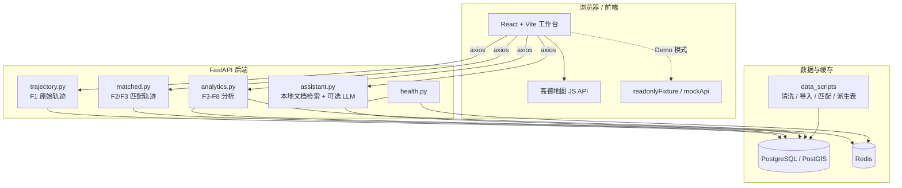
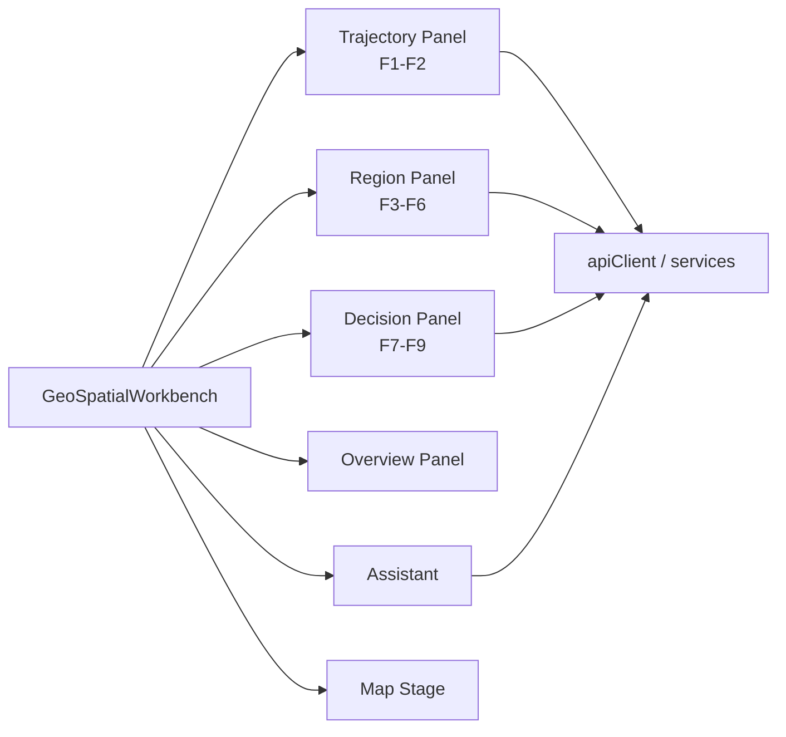
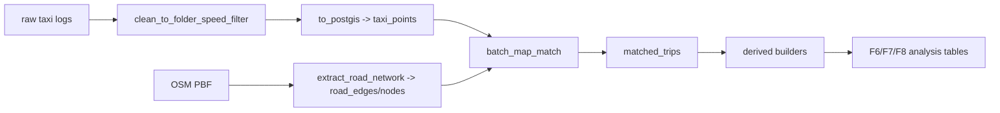

# 简版架构说明

Urban Taxi Vis 是一个前后端分离的出租车轨迹分析系统。前端负责地图交互、模式切换、图层绘制和 Demo 展示；后端负责轨迹查询、空间统计、路径挖掘和 AI 助手问答；PostGIS 存储空间数据和派生表；Redis 用于健康检查和后续缓存扩展；`data_scripts/` 承担离线数据清洗、地图匹配和派生表构建。

## 总体架构图



## 前端架构：React/Vite 工作台

| 项目 | 说明 |
|---|---|
| 技术栈 | React 18、Vite 5、TypeScript、Ant Design、Tailwind、lucide-react、axios。 |
| 主入口 | `frontend/src/index.tsx` 挂载 `GeoSpatialWorkbench`。 |
| 主页面 | `frontend/src/pages/GeoSpatialWorkbench.tsx`，当前仍是最大页面，包含大部分地图状态、模式状态和运行逻辑。 |
| 组件拆分 | `GeoWorkbenchMapStage`、`GeoWorkbenchOverviewPanel`、`GeoWorkbenchTrajectoryPanel`、`GeoWorkbenchRegionPanel`、`GeoWorkbenchDecisionPanel`、`GeoWorkbenchAssistant` 等。 |
| 接口封装 | `frontend/src/services/request.ts` 统一 axios；`trajectoryService.ts` 封装 F3-F8 与轨迹相关接口；`assistantService.ts` 封装 AI 助手。 |
| 配置 | `frontend/src/config/appConfig.ts` 读取 `VITE_API_BASE_URL`、`VITE_DEMO_MODE`、高德地图 Key。 |
| Demo | `demoReadonly` 默认打开，使用 `readonlyFixture.json`；`VITE_DEMO_MODE=true` 时 axios 使用 `demoAxiosAdapter`。 |

前端状态主要围绕四类对象展开：

1. 全局时间范围、模式和任务运行状态；
2. 高德地图实例、MouseTool、覆盖物 refs；
3. F1-F9 各功能的参数、结果和选中项；
4. Demo 与完整后端之间的切换状态。



## 后端架构：FastAPI API 层

`backend/app/main.py` 创建 FastAPI 应用，挂载以下路由：

| 文件 | 路由前缀 | 职责 |
|---|---|---|
| `health.py` | `/health` | 检查数据库和 Redis 是否可用。 |
| `trajectory.py` | `/api/v1/trajectories` | F1 原始轨迹折线查询、切段、抽稀。 |
| `matched.py` | `/api` | F2 匹配轨迹查询、F3 空间命中匹配轨迹、原始点 fallback。 |
| `analytics.py` | `/api/v1/analytics` | 数据集概览、F3 并集统计、F4-F8 分析。 |
| `assistant.py` | `/api/v1/assistant` | 本地 Markdown 检索问答，可接 OpenAI-compatible LLM。 |

当前主要分析接口包括：

```text
GET  /api/v1/analytics/dataset-summary
GET  /api/v1/analytics/active-vehicles
POST /api/v1/analytics/active-vehicles-union
POST /api/v1/analytics/active-vehicles-union-detail
GET  /api/v1/analytics/f4-grid-density
POST /api/v1/analytics/f5-transition-threshold-recommendation
POST /api/v1/analytics/f5-ab-flow
POST /api/v1/analytics/f6-radiation-flow
POST /api/v1/analytics/f7-frequent-paths
POST /api/v1/analytics/f7-road-detail
POST /api/v1/analytics/f8-ab-frequent-routes
POST /api/v1/assistant/chat
```

> 当前没有独立 F9 后端接口；F9 是前端对 F8 结果的策略化推荐。

## 数据库与 PostGIS

| 表/数据对象 | 来源 | 用途 |
|---|---|---|
| `taxi_points` | 清洗后的出租车 GPS 点导入 | F1 原始轨迹、F3/F4/F5 基础空间统计、F6 fallback。 |
| `road_edges`、`road_nodes` | OSM 路网抽取 | 地图匹配和道路属性。 |
| `matched_trips` | 离线地图匹配脚本 | F2 匹配轨迹、F3 命中轨迹、F7/F8 上游。 |
| `matched_trip_edges` | 从匹配轨迹展开道路边序列 | F7/F8 路径挖掘基础。 |
| `matched_trip_road_passes` | 按道路组/方向聚合 trip pass | F7 回退和详情。 |
| `matched_road_hourly_counts` | 道路边小时聚合 | F7 候选和拓扑重建。 |
| `matched_road_group_hourly_counts` | 道路组小时聚合 | F7 优先候选排序。 |
| `trip_od_cache` | trip 起终点缓存 | F6 `strict_od`。 |
| `trip_grid_points` | trip 点的网格索引 | F6 `through_flow`。 |
| `trip_token_sequence`、`trip_edge_sequence_cache`、`road_edge_feature_cache` | F8 支撑缓存 | F8 候选 token 化、路径聚类性能优化。 |

PostGIS 用于空间索引、bbox 过滤、几何相交、距离计算、线构建、GeoJSON 输出等。F4/F5/F6/F7/F8 中大量 SQL 都依赖 PostGIS 函数或 GiST 索引。

## Redis 与缓存

Redis 当前在运行环境中作为基础服务存在，并由 `/health` 检查连通性。分析接口的实际高频缓存主要在 `analytics.py` 内以内存字典形式实现：

| 缓存 | TTL | 说明 |
|---|---:|---|
| `F4_RESPONSE_CACHE` | 60 秒 | 相同 bbox、时间范围、grid size、返回格式的 F4 结果。 |
| `F6_RESPONSE_CACHE` | 45 秒 | 相同核心区、方向、模式、粒度的 F6 结果。 |
| `F7_RESPONSE_CACHE` | 45 秒 | 相同视窗/城市范围、Top-K、排序模式的 F7 结果。 |
| `F8_RESPONSE_CACHE` | 300 秒 | 相同 A/B 区域、候选模式、阈值和 Top-K 的 F8 结果。 |
| `F8_SAMPLED_TRIP_CACHE` | 300 秒 | F8 候选 trip stage 的中间结果。 |

前端也对 F4 网格密度做短时缓存，避免视窗和参数不变时重复请求。

## 数据脚本层

`data_scripts/` 是完整模式能跑出真实结果的前置条件。它负责：

- 清洗原始 GPS 日志，切分 trip；
- 建立 PostGIS schema 并导入 `taxi_points`；
- 抽取 OSM 路网；
- 对轨迹做离线地图匹配，生成 `matched_trips`；
- 构建 F6/F7/F8 所需派生表；
- 清理噪声点并分析重跑失败案例。



## Demo 架构

Demo 有两层，容易混淆：

| 层级 | 开关 | 数据来源 | 是否请求后端 |
|---|---|---|---|
| 只读 Demo | 页面状态 `demoReadonly=true`，默认开启 | `frontend/src/demo/readonlyFixture.json` | 不运行真实计算；个别基础请求仍可能由页面加载逻辑发起，但演示功能使用 fixture。 |
| axios mock Demo | `.env` 中 `VITE_DEMO_MODE=true` | `frontend/src/demo/mockApi.ts` | axios adapter 直接返回 mock 响应，不访问 FastAPI。 |

课程提交优先使用只读 Demo，因为它保留了真实导出的复杂样例，交互更接近完整系统。

## 当前进展与边界

- F1-F8 的真实后端接口仍保留并已与当前前端对齐。
- F9 已从后端 time-bucket 接口改为前端策略推荐，避免旧接口命名误导。
- 一些早期未被当前前端使用的接口已清理，例如旧 F9 time-bucket 接口、旧 H3 基础密度后端接口、未支撑的 `spatial_query` 前端 fallback。
- `GeoSpatialWorkbench.tsx` 仍较大，已有组件和工具拆分，但地图覆盖物、运行流程和部分工具函数仍集中在主页面中。
