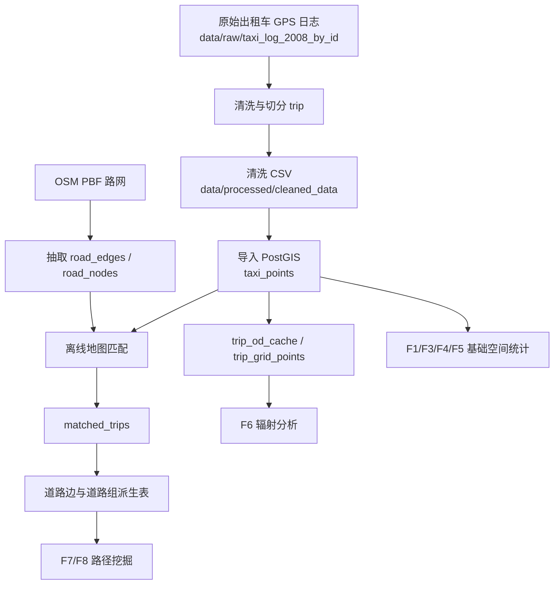
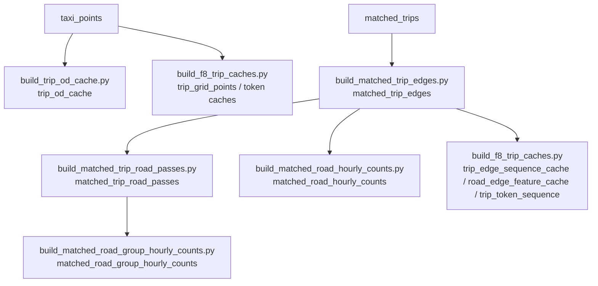

# 数据流程

本文说明 Urban Taxi Vis 从原始 GPS 日志到 PostGIS、地图匹配、噪声处理和派生表构建的完整数据链路。F1-F9 的多数功能不是直接读取原始文件，而是读取 PostGIS 中的基础表和派生表。



## 数据目录与脚本概览

| 路径 | 内容 |
|---|---|
| `data/raw/taxi_log_2008_by_id/` | 原始出租车 GPS 日志，按车辆或批次组织。 |
| `data/processed/cleaned_data/` | 清洗后的 CSV，通常包含 taxi_id、trip_id、时间、经纬度。 |
| `data_scripts/schema.sql` | PostGIS 表结构、索引和派生表定义。 |
| `data_scripts/clean_to_folder_speed_filter.py` | 清洗、trip 切分、速度异常点过滤的当前推荐版本。 |
| `data_scripts/to_postgis.py` | 将清洗结果导入 `taxi_points`。 |
| `data_scripts/extract_road_network.py` | 从 OSM PBF 抽取 `road_edges`、`road_nodes`。 |
| `data_scripts/map_match_taxi_id1.py` | 地图匹配核心算法文件，被 `batch_map_match.py` import。 |
| `data_scripts/batch_map_match.py` | 批量地图匹配，生成完整模式所需 `matched_trips`。 |
| `data_scripts/build_*.py` | 构建 F6/F7/F8 所需派生表和缓存表。 |

## 1. 清洗原始 GPS

目标：把原始日志转成结构稳定、可导入数据库的清洗 CSV，并按时间间隔切分 trip。

推荐脚本：旧版基础清洗脚本已删除，当前统一使用带速度过滤的版本：

```powershell
docker compose exec backend python data_scripts/clean_to_folder_speed_filter.py `
  --input-dir /app/taxi_log_2008_by_id `
  --output-dir /app/cleaned_data
```

清洗阶段关注：

- 时间字段能否解析为统一时区/格式；
- 经度、纬度是否在北京合理范围；
- 同一车辆连续点之间是否存在长时间断裂；
- trip_id 是否稳定生成，后续地图匹配和派生表都依赖它。

## 2. 初始化 schema 并导入 PostGIS

`data_scripts/schema.sql` 会创建基础表、空间索引和派生表结构。最核心的基础表是：

| 表 | 作用 |
|---|---|
| `taxi_points` | 清洗后的 GPS 点，是 F1/F3/F4/F5 和多种派生表的源头。 |
| `road_edges` | OSM 道路边，带 `edge_uid`、道路名、道路类型、几何。 |
| `road_nodes` | OSM 道路节点。 |
| `matched_trips` | 每个 taxi/trip 的路网匹配折线。 |

导入示例：

```powershell
docker compose exec backend python data_scripts/to_postgis.py `
  --input-dir /app/cleaned_data `
  --schema /app/data_scripts/schema.sql `
  --host postgis `
  --port 5432 `
  --db taxi_vis `
  --user taxi_user `
  --password taxi_pass
```

导入后建议检查：

```sql
SELECT COUNT(*) FROM taxi_points;
SELECT COUNT(DISTINCT taxi_id) FROM taxi_points;
SELECT MIN(gps_time), MAX(gps_time) FROM taxi_points;
```

## 3. 抽取路网

地图匹配依赖 OSM 路网。脚本会把 PBF 中可行驶道路转为 PostGIS 中的 `road_edges` 和 `road_nodes`。

示例：

```powershell
docker compose exec backend python data_scripts/extract_road_network.py
```

路网表中关键字段：

- `edge_uid`：稳定道路边标识，F7/F8 多数派生表使用；
- `u`、`v`：道路图节点；
- `name`、`highway`、`oneway`：道路属性；
- `geometry`：道路线几何，SRID 4326。

## 4. 离线地图匹配

地图匹配把 GPS 点序列投到道路网络上，生成 `matched_trips.matched_geom`，这是 F2、F3 明细、F7 和 F8 的关键上游。

批量处理示例：

```powershell
docker compose exec backend python data_scripts/batch_map_match.py
```

地图匹配输出：

| 表 | 用途 |
|---|---|
| `matched_trips` | 存 `matched_geom` 和 `distance_km`，F2 直接读取。 |
| `pipeline_build_status` | 记录部分派生构建状态，后端会检查这些状态决定是否使用某些缓存表。 |

## 5. 构建派生表

派生表是 F6/F7/F8 能快速响应的关键。建议在 `matched_trips` 稳定后按依赖顺序构建。



推荐顺序：

1. `build_trip_od_cache.py`：生成 trip 起终点缓存，支撑 F6 `strict_od`。
2. `build_matched_trip_edges.py`：把匹配轨迹展开为道路边序列，支撑 F7/F8。
3. `build_matched_trip_road_passes.py`：按道路组和方向聚合 trip pass，支撑 F7 回退和详情。
4. `build_matched_road_hourly_counts.py`：道路边小时聚合，支撑 F7 拓扑重建。
5. `build_matched_road_group_hourly_counts.py`：道路组小时聚合，支撑 F7 优先候选排序。
6. `build_f8_trip_caches.py`：构建 F8 token、edge sequence、road feature 和 grid point 缓存。

> 脚本参数会随本地数据位置变化，实际运行前请用 `python script.py --help` 查看当前参数。

## F1-F9 数据依赖速查

| 功能 | 主要依赖 | 没结果时优先检查 |
|---|---|---|
| F1 原始轨迹 | `taxi_points` | Taxi ID、时间范围、原始点是否导入。 |
| F2 匹配轨迹 | `matched_trips` | 是否完成地图匹配，trip_id 类型是否一致。 |
| F3 框选统计 | `taxi_points`、`matched_trips` | bbox 是否过小/过大，时间窗是否命中，匹配线是否存在。 |
| F4 网格密度 | `taxi_points` | 当前视窗是否有点，bbox 是否过大，空间索引是否存在。 |
| F5 A/B OD | `taxi_points` | A/B 区域是否绘制，最大转移时间是否过小。 |
| F6 辐射 | `trip_od_cache`、`trip_grid_points`、`taxi_points` | 是否构建 OD/cache，模式是否匹配数据。 |
| F7 高频路段 | `matched_road_group_hourly_counts`、`matched_road_hourly_counts`、`matched_trip_road_passes`、`matched_trip_edges` | 小时聚合表和 road passes 是否构建。 |
| F8 高频路径 | `matched_trip_edges`、`trip_edge_sequence_cache`、`road_edge_feature_cache`、`trip_token_sequence` | A/B 区域是否命中足够 trip，缓存是否构建。 |
| F9 策略推荐 | F8 返回的 `corridors` 或 `routes` | 先确认 F8 有候选；F9 本身没有后端派生表。 |

## 当前清理后的接口口径

已删除或不再使用的旧口径：

- F9 旧 `f9-ab-time-bucket-best-paths` 后端接口已删除；
- F4 旧 `f4-h3-base-density` 后端接口已删除；
- 前端旧 `/api/trajectory/spatial_query` fallback 已删除；
- `/api/v1/trajectories/map-match/latest`、`/api/v1/analytics/f3-region-analysis` 等当前前端不调用的旧接口已删除。

因此，重建数据时应围绕当前 API 和表依赖准备，不要再按旧文档为 F9 准备时间桶结果。

## 数据质量建议

- 导入前先抽样检查经纬度范围，避免海外/零点坐标进入 PostGIS。
- 地图匹配前确认 `road_edges` 覆盖分析区域，否则匹配线会缺失。
- 噪声清理后应删除或重建受影响的 `matched_trips` 和下游派生表。
- F7/F8 对派生表一致性敏感；如果重跑地图匹配，应同步重跑 `matched_trip_edges`、road passes、hourly counts 和 F8 caches。
- 演示用只读 fixture 应由稳定后端结果导出，避免每次演示统计值变化。
