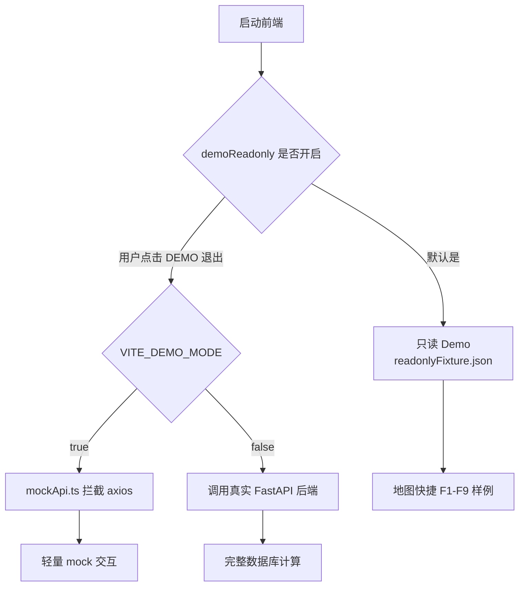
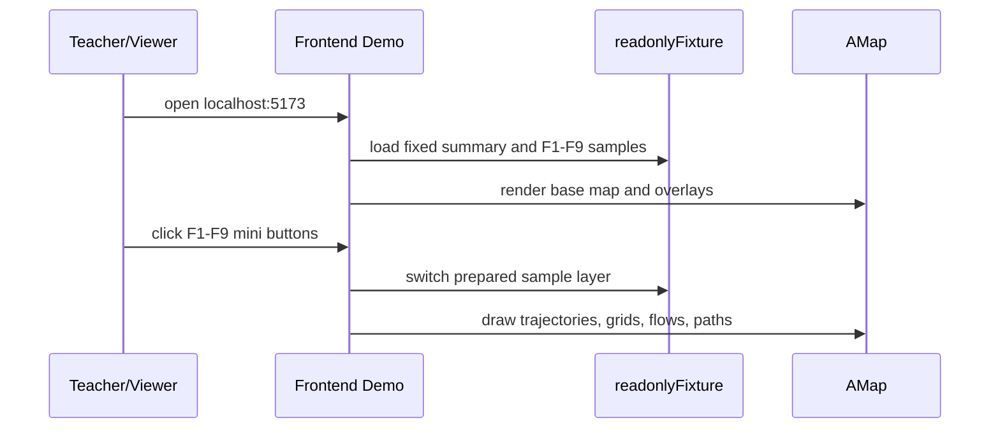

# 课程提交用前端-only Demo 模式说明

本文说明如何在不提交完整后端数据库、不暴露全量数据的情况下演示 Urban Taxi Vis。当前项目支持两种前端-only 展示方式：默认只读 Demo 和 axios mock Demo。课程提交优先使用默认只读 Demo。

## Demo 模式关系



## 推荐提交方式

| 项目 | 推荐值 | 原因 |
|---|---|---|
| 前端页面 | 使用原始完整工作台 `GeoSpatialWorkbench` | 不需要另做简化页面，演示与真实系统一致。 |
| 默认模式 | 保持 `demoReadonly=true` 默认开启 | 打开页面即可看到固定样例，避免老师环境没有后端。 |
| 数据来源 | `frontend/src/demo/readonlyFixture.json` | 来自本地真实后端导出的样例，结果比手写 mock 更可信。 |
| 后端 | 可不启动 | 课程演示时减少 Docker/PostGIS/数据卷依赖。 |
| 地图 Key | 仍需要高德 Web JS Key | 前端地图底图和覆盖物依赖高德 SDK。 |

## 快速启动

1. 复制环境变量模板：

```powershell
Copy-Item .env.example .env
```

2. 填写高德地图 Key：

```env
VITE_AMAP_KEY=your_amap_web_js_key_here
VITE_AMAP_SECURITY_JS_CODE=your_amap_security_js_code_here
```

AI 助手的大模型 Key 可选；`OPENAI_API_KEY` 留空时，助手只使用本地文档 RAG。

3. 安装并启动前端：

```powershell
cd frontend
npm install
npm run dev -- --host localhost --port 5173
```

或从根目录启动：

```powershell
./scripts/start-frontend.ps1
```

4. 打开：

```text
http://localhost:5173
```

页面打开后左侧 `DEMO` 状态默认激活。此时参数输入被锁定，功能演示使用固定样例，不要求后端服务在线。

## 只读 Demo 包含什么

`frontend/src/demo/readonlyFixture.json` 当前包含以下样例数据：

| 键 | 用途 |
|---|---|
| `summary`、`activeVehicles` | 总览卡片、时间范围、车辆数、点数等。 |
| `trajectory` | F1 原始轨迹样例。 |
| `matched` | F2 路网匹配轨迹样例。 |
| `areas` | F3/F5/F6/F8 的预设区域。 |
| `f3` | F3 框选命中轨迹与统计。 |
| `f4`、`f4Heatmap`、`f4Choropleth` | F4 网格热力和分级着色样例。 |
| `f5` | F5 A/B OD 流向样例。 |
| `f6`、`f6StrictOd`、`f6ThroughFlow` | F6 核心区辐射不同模式样例。 |
| `f7`、`f7Detail` | F7 高频道路走廊和道路详情样例。 |
| `f8` | F8 A/B 高频路线候选。 |
| `f9` | 历史导出字段仍可能存在，但当前 UI 的 F9 推荐以 F8 候选三策略排序为准，不再按时间桶读取。 |

> 当前 F9 演示逻辑：在 F8 候选里按 `fastest`、`stable`、`frequent_fast` 选择推荐路线。即使 fixture 里保留历史 `f9` 字段，当前前端不再调用旧 time-bucket F9 接口，也不应在答辩中按“时间桶最优路径”描述。

## 演示路线建议



建议演示顺序：

1. 总览：说明数据时间范围、车辆数量、点数量和北京地图视窗。
2. F1-F2：展示原始轨迹和路网匹配轨迹对比。
3. F3：展示区域框选、多矩形并集去重和车辆明细。
4. F4：展示热力图/分级着色，说明经纬度栅格密度。
5. F5：展示 A/B 区域流向和状态机 OD。
6. F6：展示核心区辐射，切换 `strict_od` 与 `through_flow` 的解释口径。
7. F7：展示高频道路走廊和详情。
8. F8：展示 A/B 高频路线候选。
9. F9：切换最快、最稳、高频且快三种策略，说明 F9 是基于 F8 的排序推荐。
10. AI 助手：询问“F8 怎么找 A/B 高频路线？”或“F9 的推荐策略是什么？”。

## 纯前端 mock Demo

如果希望退出只读 Demo 后也完全不访问后端，可以设置：

```env
VITE_DEMO_MODE=true
VITE_API_BASE_URL=http://localhost:8000
```

此时 `frontend/src/services/request.ts` 会给 axios 配置 `demoAxiosAdapter`，请求由 `frontend/src/demo/mockApi.ts` 返回手写 mock 数据。

适用场景：

- 只想确认页面布局和交互；
- 无法启动 Docker；
- 不关心统计数值真实性。

不适用场景：

- 讲算法结果；
- 讲派生表和 PostGIS 查询；
- 需要和报告里的真实截图数据一致。

## 切换到完整后端模式

若需要现场演示真实数据库计算：

1. `.env` 设置：

```env
VITE_DEMO_MODE=false
VITE_API_BASE_URL=http://localhost:8000
```

2. 启动后端：

```powershell
./scripts/start-dev.ps1 -Detach
```

3. 启动前端：

```powershell
./scripts/start-frontend.ps1
```

4. 页面打开后点击左侧 `DEMO` 退出只读模式。

完整模式还需要 PostGIS 中已有 `taxi_points`、`matched_trips`、F7/F8 派生表等数据，否则部分功能会返回空结果。

## 提交材料建议

| 材料 | 建议 |
|---|---|
| 前端代码 | 提交完整 `frontend/`，保留 `readonlyFixture.json` 和 `mockApi.ts`。 |
| 后端代码 | 可提交完整 `backend/` 和 `data_scripts/`，用于说明真实计算逻辑。 |
| 数据库 | 课程提交通常不建议提交完整 PostGIS 数据卷。 |
| `.env` | 提交 `.env.example`，不要提交本机 `.env` 或真实私钥。 |
| 截图/视频 | 使用只读 Demo 固定样例录制，避免现场计算波动。 |
| 文档 | 使用 `docs/README.md`、`docs/feature-guide.md`、`docs/architecture.md` 作为讲解入口。 |

## 常见问题

| 问题 | 解释与处理 |
|---|---|
| 为什么 Demo 也用 `.env.example`？ | 因为只读 Demo 由页面状态控制，不依赖单独的 env 模板；保留 `VITE_DEMO_MODE=false` 可以让你退出 Demo 后接真实后端。 |
| 只读 Demo 是否完全不需要后端？ | F1-F9 展示不需要后端；但如果你退出 `DEMO` 或设置完整模式，就需要后端。 |
| F9 为什么没有单独运行按钮？ | 当前 F9 是 F8 候选上的策略排序推荐，不再有独立后端计算。 |
| fixture 里的 `f9` 字段怎么办？ | 这是历史导出兼容字段；当前展示口径以 F8 候选和三策略排序为准。后续可以在导出脚本里移除该字段。 |
| 老师电脑没有 Docker 怎么办？ | 使用只读 Demo 或 `VITE_DEMO_MODE=true` 的 mock Demo，只需要 Node.js 和地图 Key。 |
| 地图底图不显示怎么办？ | 检查高德 Key、安全密钥、网络访问和浏览器控制台错误。 |
