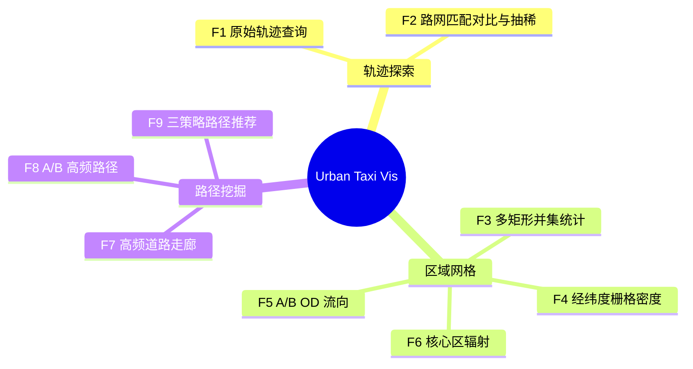
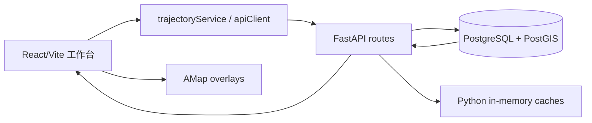
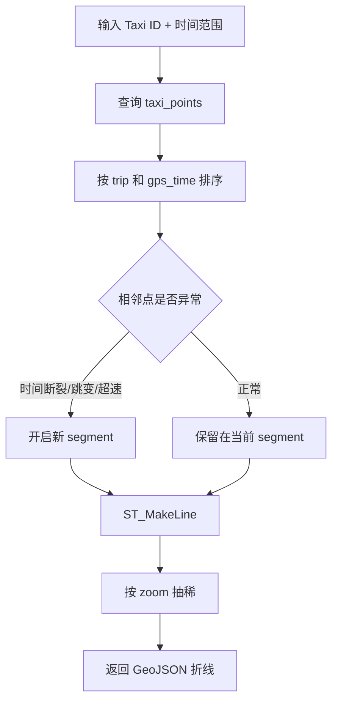
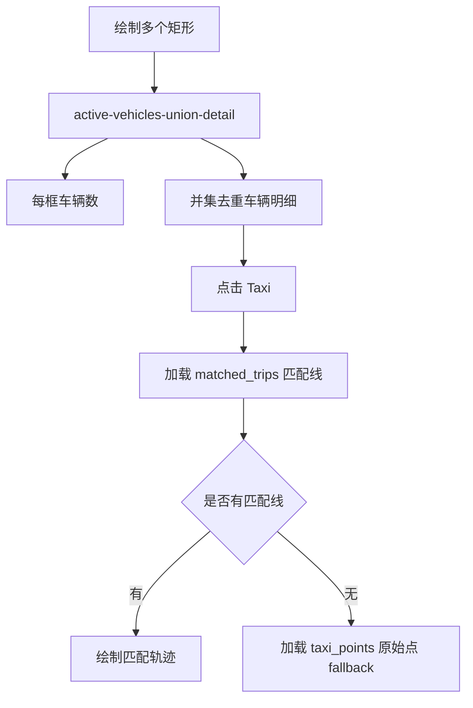
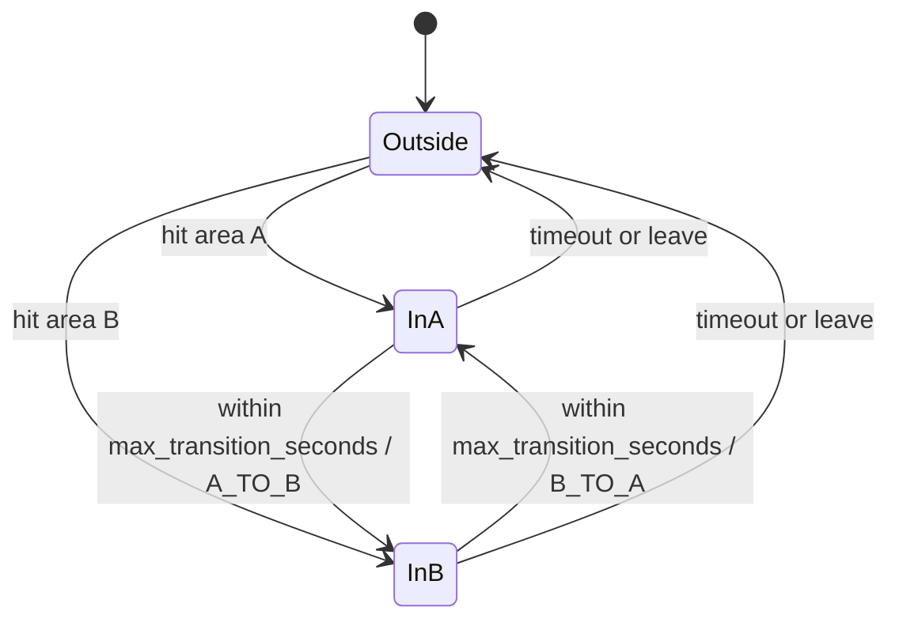
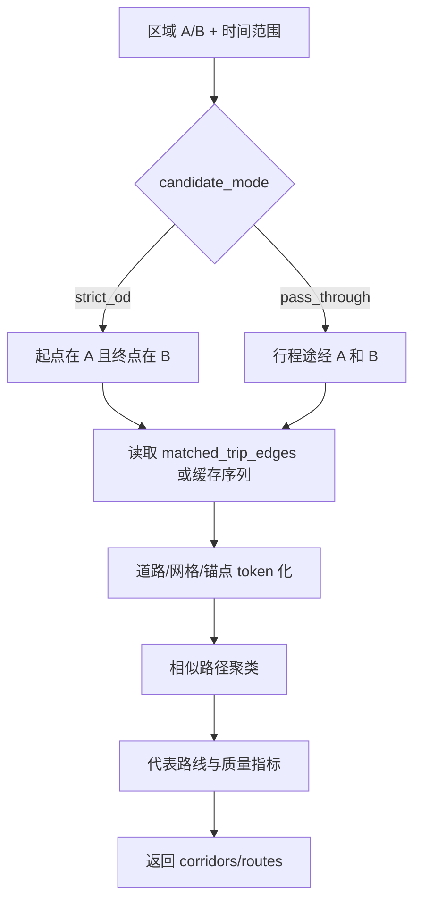
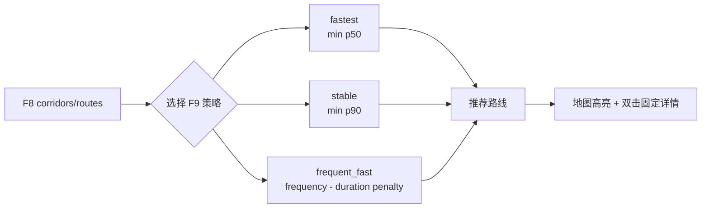

# F1-F9 功能说明

本文按当前真实代码说明 Urban Taxi Vis 的 F1-F9 功能。功能分为三组：轨迹探索、区域与网格分析、路径挖掘与推荐。

## 总体交互逻辑

主页面是 `frontend/src/pages/GeoSpatialWorkbench.tsx`。左侧工作台分为 `trajectory`、`region`、`decision` 三个模式，分别承载 F1-F2、F3-F6、F7-F9。全局时间范围会影响大部分查询；地图框选和侧栏参数共同决定请求参数。

## 轨迹探索：F1-F2

### F1 原始轨迹查询

| 项目 | 说明 |
|---|---|
| 前端入口 | 轨迹模式下输入 Taxi ID 和时间范围后运行查询。 |
| 后端接口 | `GET /api/v1/trajectories/polylines`。 |
| 主要表 | `taxi_points`。 |
| 核心输出 | GeoJSON `FeatureCollection`，每条 feature 是一个轨迹 segment。 |
| 关键参数 | `taxi_id`、`start_time`、`end_time`、可选 bbox、`zoom`、`max_trips`、`max_gap_minutes`、`max_jump_km`、`max_speed_kmh`。 |

后端并不是简单把点连成一条线，而是先做基础噪声和断点处理：

1. 在 `taxi_points` 中按时间范围、车辆 ID、可选 bbox 筛选候选 trip。
2. 对每个 trip 按 `gps_time` 排序。
3. 使用相邻点判断是否开启新 segment：
   - 时间间隔超过 `max_gap_minutes`；
   - 相邻点距离超过 `max_jump_km`；
   - 相邻点推算速度超过 `max_speed_kmh`；
   - 时间不递增或缺少前置点。
4. 每个 segment 至少保留 2 个点，用 `ST_MakeLine` 生成折线。
5. 根据 `zoom_to_tolerance(zoom)` 或显式 `simplify_tolerance` 用 `ST_Simplify` 做地图缩放抽稀。

### F2 路网匹配对比与缩放抽稀

| 项目 | 说明 |
|---|---|
| 前端入口 | 轨迹模式中的“路网匹配视图”切换。 |
| 后端接口 | `GET /api/trajectory/matched`。 |
| 主要表 | `matched_trips`。 |
| 核心输出 | 匹配后的 `matched_geom` 折线及 `distance_km`。 |

F2 的路网匹配结果不是实时在线导航，也不是在接口里现场跑最短路，而是由 `data_scripts/batch_map_match.py` 调用 `map_match_taxi_id1.py` 中的 HMM/Viterbi 核心算法提前生成并写入 `matched_trips`。前端会把匹配线方向与原始轨迹方向对齐，便于同屏比较原始 GPS 漂移与道路匹配结果。

F2 还体现在 F1 的缩放联动抽稀上：低 zoom 用更强简化以减少地图负担，高 zoom 保留更多细节。

## 区域与网格分析：F3-F6

### F3 多矩形并集统计

| 项目 | 说明 |
|---|---|
| 前端入口 | 区域模式，选择 F3，绘制一个或多个矩形后点击查询。 |
| 后端接口 | `POST /api/v1/analytics/active-vehicles-union-detail`。 |
| 明细接口 | 点击车辆时调用 `GET /api/trajectory/matched`，必要时 fallback 到 `GET /api/trajectory/{trip_id}` 原始点。 |
| 主要表 | `taxi_points`、`matched_trips`。 |
| 核心输出 | 多矩形并集去重后的车辆数、每个框单独命中车辆数、命中 Taxi 与 trip 明细。 |

F3 的统计口径是“多矩形并集去重”：同一辆车同时命中多个框时，在总活跃车辆数中只计一次；但明细中会记录该车命中的框编号。前端支持两种轨迹显示模式：只显示框内命中部分，或显示该车完整匹配行程。

### F4 经纬度栅格密度

| 项目 | 说明 |
|---|---|
| 前端入口 | 区域模式，选择 F4，按当前地图视窗生成热力或分级着色。 |
| 后端接口 | `GET /api/v1/analytics/f4-grid-density`。 |
| 主要表 | `taxi_points`。 |
| 缓存 | 后端 60 秒内存缓存；前端也对相同参数做短时缓存。 |
| 核心输出 | `cells`，每个网格包含边界、中心、点数、可选车辆数、density。 |

F4 当前主路径是经纬度/投影桶网格聚合，不再依赖已删除的后端 H3 基础密度接口。后端会把当前 bbox 投影到 Web Mercator 近似平面，以 `grid_size_m` 计算网格编号，再聚合点数。前端根据渲染模式决定是否请求 `vehicle_count`：热力图偏向点密度，分级着色可展示车辆数和等级。

F4 对过大视窗会直接返回错误，提示用户缩小范围。这是为了避免一次性生成过多网格导致交互卡顿。

### F5 A/B OD 流向

| 项目 | 说明 |
|---|---|
| 前端入口 | 区域模式，选择 F5，绘制区域 A 和区域 B。 |
| 后端接口 | `POST /api/v1/analytics/f5-ab-flow`。 |
| 阈值推荐 | `POST /api/v1/analytics/f5-transition-threshold-recommendation`。 |
| 主要表 | `taxi_points`。 |
| 核心输出 | A→B、B→A 的时间序列流量、总量、平均耗时。 |

F5 用状态机判断车辆在 A/B 区域之间的转移。后端根据点是否进入 A 或 B，找出满足最大转移时间的方向性流动，并按 `hour` 或 `day` 聚合。阈值推荐接口会根据 A/B 中心距离、绕行系数和悲观速度估算一个合理的最大直达耗时，前端再允许用户调整。

### F6 核心区辐射分析

| 项目 | 说明 |
|---|---|
| 前端入口 | 区域模式，选择 F6，绘制核心区并选择方向和模式。 |
| 后端接口 | `POST /api/v1/analytics/f6-radiation-flow`。 |
| 主要表 | `trip_od_cache`、`trip_grid_points`、`taxi_points`。 |
| 模式 | `strict_od`、`through_flow`。 |
| 核心输出 | 入向/出向/双向统计、外部 H3 区域、流量线、平均耗时。 |

F6 有两种分析语义：

- `strict_od`：基于 `trip_od_cache` 的起终点判断，适合分析“从核心区出发到外部”或“从外部到核心区结束”的行程。
- `through_flow`：优先使用 `trip_grid_points` 判断行程是否经过核心区，再寻找核心区外部的首次/末次关联点，适合分析穿越或途经核心区的流动。

外部区域会聚合成 H3 单元，前端用六边形、连线和动态图层展示辐射方向与强度。

## 路径挖掘与推荐：F7-F9

### F7 高频道路走廊

| 项目 | 说明 |
|---|---|
| 前端入口 | 决策模式，选择 F7，按当前视窗和时间范围运行。 |
| 后端接口 | `POST /api/v1/analytics/f7-frequent-paths`。 |
| 详情接口 | `POST /api/v1/analytics/f7-road-detail`。 |
| 优先数据 | `matched_road_group_hourly_counts`、`matched_road_hourly_counts`。 |
| 回退数据 | `matched_trip_road_passes`、`matched_trip_edges`。 |
| 核心输出 | 高频道路组/方向/组件、trip_count、vehicle_count、拓扑骨架、分支和置信度。 |

F7 不是简单统计单条 road edge，而是尽量把道路组、方向和拓扑连续性结合起来。当前优先使用道路组小时聚合表做候选排序，再对 Top-K 候选重建方向拓扑骨架；如果没有聚合表，则回退到更细粒度的 road hourly 或 trip road passes。

排序支持：

- `frequency`：按通过行程数优先；
- `length_weighted`：兼顾频次与道路长度，避免短路段因高频过度占优。

### F8 A/B 高频路径

| 项目 | 说明 |
|---|---|
| 前端入口 | 决策模式，绘制区域 A/B 后运行 F8。 |
| 后端接口 | `POST /api/v1/analytics/f8-ab-frequent-routes`。 |
| 主要表 | `matched_trip_edges`，可利用 `trip_edge_sequence_cache`、`road_edge_feature_cache` 等缓存。 |
| 候选模式 | `strict_od`、`pass_through`。 |
| 核心输出 | `corridors` 和兼容 `routes`，包含路径签名、频次、车辆数、p20/p50/p90/avg 耗时、几何、质量指标。 |

F8 的关键逻辑是从 A/B 区域筛选候选 trip，再把匹配道路序列转为 token 序列，做相似路径聚类与代表路线抽取。它不是只看某一条完全相同的道路序列，而是允许相似走廊归并，从而得到更稳定的 A/B 高频候选。

### F9 三策略路径推荐

| 项目 | 说明 |
|---|---|
| 前端入口 | 决策模式 F8/F9 面板中选择策略。 |
| 后端接口 | 无独立 F9 后端接口。旧 `f9-ab-time-bucket-best-paths` 已删除。 |
| 数据来源 | F8 返回的 `corridors`，若无则使用兼容字段 `routes`。 |
| 策略 | `fastest`、`stable`、`frequent_fast`。 |
| 核心输出 | 当前策略下推荐的一条 A/B 路线，并在地图上复用 F8 几何高亮。 |

F9 当前只做前端排序推荐，不再按固定时间桶分类。三种策略如下：

| 策略 | 排序逻辑 | 适合解释 |
|---|---|---|
| `fastest` | p50 耗时最低优先；p50 相同则 trip_count 高者优先。 | 典型情况下最快。 |
| `stable` | p90 耗时最低优先；再比较 p50。 | 高尾部耗时更低，稳定性更好。 |
| `frequent_fast` | `tripScore * 1.35 - timePenalty`，其中 tripScore 是相对频次，timePenalty 由 p50 与 avg 组成。 | 兼顾常用程度和速度，避免低样本偶然最快。 |

## Demo 与完整模式差异

| 项目 | 只读 Demo | 完整后端模式 |
|---|---|---|
| F1-F8 数据 | `readonlyFixture.json` 固定样例 | FastAPI + PostGIS 实时查询 |
| F9 推荐 | 仍基于 F8 样例候选做策略排序 | 基于真实 F8 返回结果做策略排序 |
| 参数 | 多数锁定，便于演示复现 | 可绘制区域、调整 Top-K、时间范围和模式 |
| 后端依赖 | 不需要 | 需要 backend、PostGIS、Redis 和派生表 |

## 常见误区

- F9 不是时间桶接口，不要再描述为“早高峰/晚高峰/平峰最优路径”。
- F2 不是在线实时地图匹配；匹配结果来自离线脚本写入的 `matched_trips`。
- F4 当前真实后端主路径是 `f4-grid-density` 经纬度栅格，不是已删除的 `f4-h3-base-density`。
- F7/F8 没结果通常不是前端问题，优先检查地图匹配结果和派生表是否构建完成。
